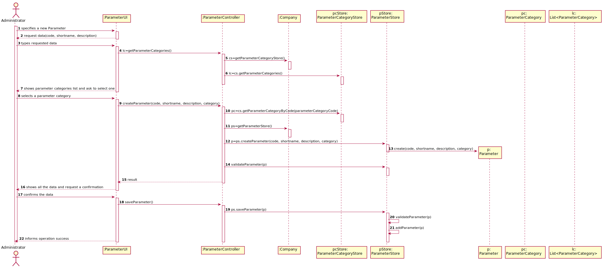

# US 010 - Specify a new parameter and categorize it

## 1. Requirements Engineering

### 1.1. User Story Description

*As an administrator, I want to specify a new parameter and categorize it.*

### 1.2. Customer Specifications and Clarifications 

**From the specifications document**

"Blood tests are frequently characterized by measuring several parameters which for
presentation/reporting purposes are organized by categories. For example, parameters such
as the number of Red Blood Cells (RBC), White Blood Cells (WBC) and Platelets (PLT) are
usually presented under the blood count (Hemogram) category."

"Covid tests are characterized by measuring a single parameter stating whether it is a positive
or a negative result."

"Regardless, such tests rely on measuring one
or more parameters that can be grouped/organized by categories."

**From the client clarifications**

**Q1:** What is the data that characterize a parameter? Should we follow the same data as the parameter category, for example, would each parameter have its own code, description and NHS identifier?

**A1:** Each parameter is associated with one category. Each parameter has a Code, a Short Name and a Description. The Code are five alphanumeric characters. The Short Name is a String with no more than 8 characters. The Description is a String with no more than 20 characters.

**Q2:** Does the client want to specify more than one new parameter at a time?

**A2:** Yes.

**Q3:** Can a parameter be classified in more than one parameter category?

**A3:** No. Each parameter has only one category. There are no subcategories.

**Q4:** The administrator needs to be logged in to execute his role?

**A4:** Yes.

### 1.3. Acceptance Criteria

**AC1:** The Code are five alphanumeric characters.

**AC2:** The Short Name is a String with no more than 8 characters.

**AC3:** The Description is a String with no more than 20 characters.

### 1.4. Found out Dependencies

This US has dependency with the US 11 - As an administrator, I want to specify a new parameter category, because isn't possible to create a new parameter and categorize it, if a (new) parameter category is not already specified.

### 1.5 Input and Output Data

**Input Data**

Typed Data (code, shortname, description).

Selected Data (parametercategory).

**Output Data**

(In)Success of the operation.

### 1.6. System Sequence Diagram (SSD)

### 1.7 Other Relevant Remarks

There is no other relevant remarks.

## 2. OO Analysis

### 2.1. Relevant Domain Model Excerpt 
 

### 2.2. Other Remarks

There is no other remarks.

## 3. Design - User Story Realization 

### 3.1. Rationale

**The rationale grounds on the SSD interactions and the identified input/output data.**

| Interaction ID | Question: Which class is responsible for... | Answer  | Justification (with patterns)  |
|:-------------  |:--------------------- |:------------|:---------------------------- |
| Step 1  		 |	...interacting with the actor? | ParameterUI   |  Pure Fabrication: there is no reason to assign this responsibility to any existing class in the Domain Model.           |
| 			  	 |	...coordinating the US? | ParameterController | Controller                             |
| 			  	 |	...specifying a new Parameter? | ParameterStore | Creator: in the DM Company has a ParameterStore and the store has the Parameter.   |
|				 |			                       | Company   | IE: knows/has its own ParameterStore|
| Step 2  		 | 	...requesting the needed data?|	ParameterUI | Interacts with the actor.	  |
| Step 3 		 |	...saving the inputed data? | Parameter  | IE: object created in step 1 has its own data.  |
| Step 4  		 |	...knowing the Parameters categories to show? | ParameterCategoryStore  | IE: Parameter Category is defined by the ParameterCategoryStore. |
| Step 5  		 |	...saving the selected category? | Parameter | IE: object created in step 1 is classified in one Category.  |
| Step 6         |  ...confirmating | ParameterUI | Interacts with the actor.|
| Step 7  		 |	...validating all data (local validation)? | Parameter | IE: owns its data.| 
| 			  	 |	...validating all data (global validation)? | ParameterStore | IE: knows all its Parameters.| 
| 	             |	...saving the created Parameter? | ParameterStore | IE: owns all its Parameters.| 
| Step 8  		 |	...informing operation success?| ParameterUI  | Interacts with the actor.  |              

### Systematization ##

According to the taken rationale, the conceptual classes promoted to software classes are: 

 * Company
 * ParameterStore
 * ParameterCategoryStore
 * Parameter
 * ParameterCategory

Other software classes (i.e. Pure Fabrication) identified:

 * ParameterUI  
 * ParameterController

## 3.2. Sequence Diagram (SD)

## 3.3. Class Diagram (CD)

# 4. Tests 
	
 **Test 1:** Check that it is possible to get the description of a Parameter.

    @Test
    public void getDescription() {
        String description = "RED BLOOD CELLS";

        List<ParameterCategory> parameterCategories = new ArrayList<>();
        ParameterCategory p1 = new ParameterCategory("54321","HEMOGRAM");
        parameterCategories.add(p1);

        Parameter p = new Parameter("12345","RBC", "RED BLOOD CELLS", parameterCategories);

        assertEquals(description,p.getDescription());
    } 
    
**Test 2:** Check that it is not possible to create an instance of the Parameter class with a code lenght diferent from 5 chars (4 chars in this example) (AC1).

	@Test (expected = IllegalArgumentException.class)
    public void checkCodeRules() {
        ParameterStore ps = new ParameterStore();

        List<ParameterCategory> parameterCategories = new ArrayList<>();
        ParameterCategory pc = new ParameterCategory("5421","HEMOGRAM");
        parameterCategories.add(pc);

        Parameter p1 = ps.createParameter("1234","RBC","RED BLOOD CELLS",parameterCategories);

        ps.checkCodeRules(p1.getCode());
    }
    
    
**Test 3:** Check that is possible to verify if a Parameter is listed.
    
       @Test
        public void isParameterInList(){
        ParameterStore ps = new ParameterStore();

        List<ParameterCategory> parameterCategories = new ArrayList<>();
        ParameterCategory pc = new ParameterCategory("54321","HEMOGRAM");
        parameterCategories.add(pc);

        Parameter p2 = ps.createParameter("23a51","RBC","RED BLOOD CELLS",parameterCategories);
        Parameter p1 = ps.createParameter("54871","RBC","RED BLOOD CELLS",parameterCategories);

        ps.saveParameter(p2);
        ps.isParameterInList(p2);

        boolean actual1 = ps.isParameterInList(p2);
        boolean actual2 = ps.isParameterInList(p1);
        boolean expected = true;

        assertEquals(expected,actual1);
        assertNotEquals(expected,actual2);
        assertNotEquals(null,actual1);
    }
    
    *Only somes examples have been exposed in this section.*
    
# 5. Construction (Implementation)

## class Parameter
    
    public class Parameter {

    private String code;
    private String shortname;
    private String description;
    private List<ParameterCategory> pc;

    public Parameter(String code, String shortname, String description, List<ParameterCategory>  pc) {
        this.code = code;
        this.shortname = shortname;
        this.description = description;
        this.pc = pc;
    }
    ...
    } 
    
## class ParameterStore    
    
    public class ParameterStore {

    private List <Parameter> parameter;

    public ParameterStore() {
        this.parameter = new ArrayList<Parameter>();
    }

    public Parameter createParameter(String code, String shortname, String description,
            List<ParameterCategory> parameterCategories) {
        return new Parameter(code,shortname,description, parameterCategories);
    }

    public void validateParameter(Parameter p) throws IllegalArgumentException {
        checkCodeRules(p.getCode());
        checkShortnameRules(p.getShortname());
        checkDescriptionRules(p.getDescription());
        checkParameterCategoryRules(p.getPc());
    }
    
    public void saveParameter(Parameter p) throws IllegalArgumentException {
        validateParameter(p);
        addParameter(p);
    }

    private void addParameter(Parameter p) {
        this.parameter.add(p);
    }
    ...
    }
    
## class ParameterController

    public class ParameterController {
    private Company company;
    private Parameter parameter ;

    public ParameterController() {
        this.company = App.getInstance().getCompany();
    }
    ...
    }
    
# 6. Integration and Demo 

*A new option on the Admin menu options was added.*

*Parameter needed to be linked with ParameterCategory in some way, in order to categorize it.*

# 7. Observations

*Most likely, some changes to this US will have to be made when JavaFX is introduced.*

*I am sure that the code is in accordance with the requested*

