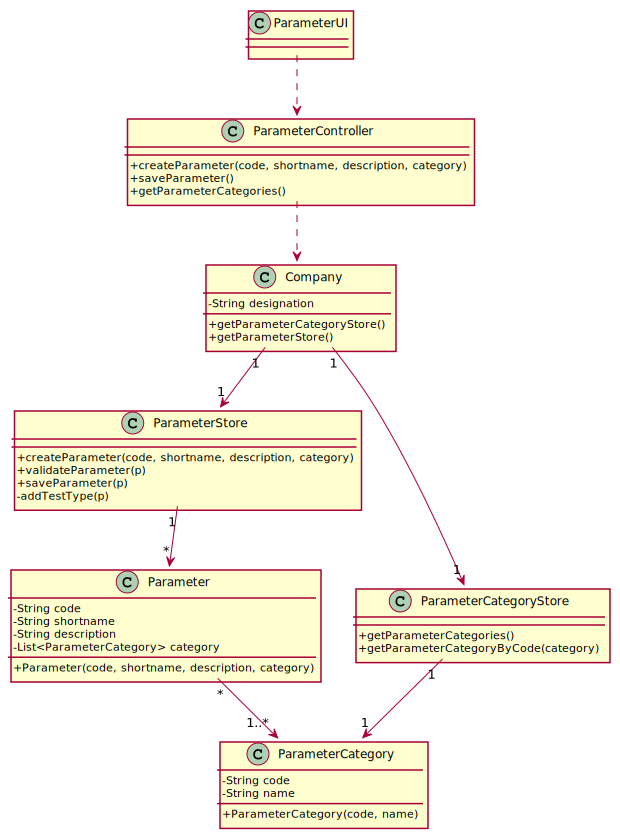

# US 010 - Specify a new parameter and categorize it

## 1. Requirements Engineering

### 1.1. User Story Description

*As an administrator, I want to specify a new parameter and categorize it.*

### 1.2. Customer Specifications and Clarifications 

**From the specifications document**

"Blood tests are frequently characterized by measuring several parameters which for
presentation/reporting purposes are organized by categories. For example, parameters such
as the number of Red Blood Cells (RBC), White Blood Cells (WBC) and Platelets (PLT) are
usually presented under the blood count (Hemogram) category."

"Covid tests are characterized by measuring a single parameter stating whether it is a positive
or a negative result."

"Regardless, such tests rely on measuring one
or more parameters that can be grouped/organized by categories."

**From the client clarifications**

Q1: What is the data that characterize a parameter? Should we follow the same data as the parameter category, for example, would each parameter have its own code, description and NHS identifier?

A1: Each parameter is associated with one category. Each parameter has a Code, a Short Name and a Description. The Code are five alphanumeric characters. The Short Name is a String with no more than 8 characters. The Description is a String with no more than 20 characters.

Q2: Does the client want to specify more than one new parameter at a time?

A2: Yes.

Q3: Can a parameter be classified in more than one parameter category?

A3: No. Each parameter has only one category. There are no subcategories.

Q4: The administrator needs to be logged in to execute his role?

A4: Yes.

### 1.3. Acceptance Criteria

AC1: The Code are five alphanumeric characters.

AC2: The Short Name is a String with no more than 8 characters.

AC3: The Description is a String with no more than 20 characters.

### 1.4. Found out Dependencies

This US has dependency with the US 11 - As an administrator, I want to specify a new parameter category, because isn't possible to create a new parameter and categorize it, if a (new) parameter category is not already specified.

### 1.5 Input and Output Data

**Input Data**

Typed Data (code, shortname, description).

Selected Data (parametercategory).

**Output Data**

(In)Success of the operation.

### 1.6. System Sequence Diagram (SSD)

### 1.7 Other Relevant Remarks

There is no other relevant remarks.

## 2. OO Analysis

### 2.1. Relevant Domain Model Excerpt 
 

### 2.2. Other Remarks

There is no other remarks.

## 3. Design - User Story Realization 

### 3.1. Rationale

**The rationale grounds on the SSD interactions and the identified input/output data.**

| Interaction ID | Question: Which class is responsible for... | Answer  | Justification (with patterns)  |
|:-------------  |:--------------------- |:------------|:---------------------------- |
| Step 1  		|	... interacting with the actor?	| ParameterUI | Pure Fabrication: there is no reason to assign this responsibility to any existing class in the Domain Model. |
|               |   ... coordinating the US? | ParameterController |  Controller |
| Step 2 		 |  ...requesting the needed data? | ParameterUI |  IE: run method |
| Step 3        |   ... create parameter?   |  ParameterStore     | IE : has creator method |                      
| Step 4  		 | ... saving the inputed data? | ParameterStore |  IE: has its own data |
| Step 5 		 | ... validating all data (local validation)	| ParameterStore / Parameter | IE: owns its data | 
| Step 6         | ... confirmation | Parameter | IE: has its data |
| Step 7  		 |	... validating all data (global validation)	| Parameter | IE: knows all Parameters |
| Step 8  		 |	... informing operation success?| ParameterUI |	Has the responsability to interact with the actor |           

### Systematization ##

According to the taken rationale, the conceptual classes promoted to software classes are:

* Parameter
* ParameterStore

Other software classes (i.e. Pure Fabrication) identified:

* ParameterUI
* ParameterController

## 3.2. Sequence Diagram (SD)

## 3.3. Class Diagram (CD)

# 4. Tests 

**Test 1:** Check that it is not possible to create an instance of the Parameter class with null values. 

	@Test(expected = IllegalArgumentException.class)
    public void ensureNullIsNotAllowed() {
        Parameter p = new Parameter(null, null, null, null);
    }
	
	
**Test 2:** Check that it is not possible to create an instance of the Parameter class with a code lenght diferent from 5 chars (AC1).

	@Test(expected = IllegalArgumentException.class)
    public void checkcoderules(){
        String code = "123";
        Parameter p = new Parameter(code,"RBC","RED BLOOD CELLS","HEMOGRAM");
    }	
	
   *Only somes examples have been exposed in this section.*
    
# 5. Construction (Implementation)

## Class Parameter

		public Parameter(String code, String shortname, String description, List<ParameterCategory>  pc) {
        this.code = code;
        this.shortname = shortname;
        this.description = description;
        this.pc = pc;
    }
    
   *(working...)*

# 6. Integration and Demo 

*A new option on the Admin menu options was added.*

*Parameter needs to be linked with Parameter Category in some way.*

# 7. Observations

*Most likely, some changes to this US will have to be made when JavaFX is introduced.*

