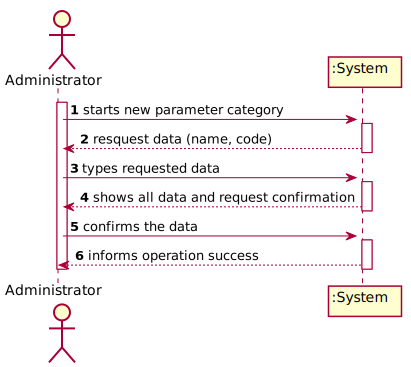
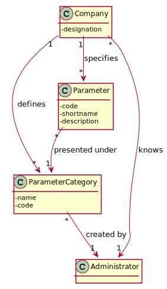
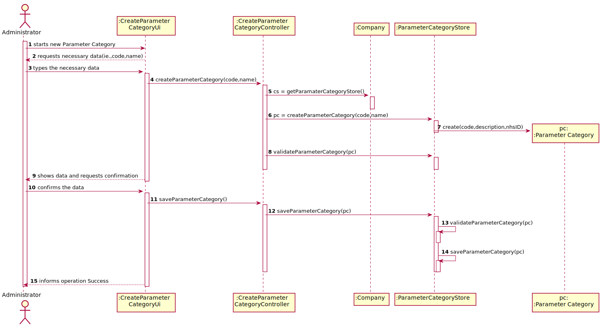
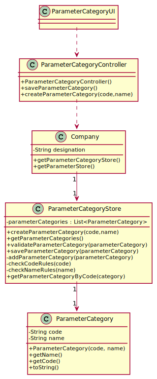

# US 011 - Specify a new parameter category

## 1. Requirements Engineering

### 1.1. User Story Description

As an administrator, I want to specify a new parameter category.

### 1.2. Customer Specifications and Clarifications 

**From the specifications document**

“Blood tests are frequently characterized by measuring several parameters which for presentation/reporting purposes are organized
by categories. For example, parameters such as the number of Red Blood Cells (RBC), White Blood Cells (RBC) and Platelets (PLT) are
usually presented under the blood count (Hemogram) category.”

“Regardless, such tests rely on measuring one or more parameters that can be grouped/organized by categories.”

**From the client clarifications**

**Q1:** Regarding the creation of a new category, what should be the format of the code in terms of length, should it be alphanumeric or numbers only? Also, can we assume that both attributes are mandatory?

**A1:** The format of the attributes of one category are:
    
   Name: is a string with no more than 10 characters;
    
   Code: are five alphanumeric characters. The code is unique and is not automatically generated.
    
   Both attributes are mandatory.
    
   There are no subcategories.
    
**Q2:** What are the information related to a Parameter Category?

**A2:** Each category has a name and a unique code. There are no subcategories.

### 1.3. Acceptance Criteria

**AC1:** Name is a string with no more than 10 characters.

**AC2:** Code are five alphanumeric characters. The code is unique and is not automatically generated.

**AC3:** Name and code are mandatory.

### 1.4. Found out Dependencies

This US has dependency with US10 (Specify a new parameter and categorize it), because a parameter is always related to a (parameter) category.

### 1.5 Input and Output Data

**Input Data**

Typed Data (name, code).

**Output Data**

(In)Success of the operation.

### 1.6. System Sequence Diagram (SSD)

### 1.7 Other Relevant Remarks

There is no other relevant remarks.

## 2. OO Analysis

### 2.1. Relevant Domain Model Excerpt 

### 2.2. Other Remarks

There is no other remarks.

## 3. Design - User Story Realization 

### 3.1. Rationale

**The rationale grounds on the SSD interactions and the identified input/output data.**

| Interaction ID | Question: Which class is responsible for... | Answer  | Justification (with patterns)  |
|:-------------  |:--------------------- |:------------|:---------------------------- |
| Step 1  		 |	... interacting with the actor?						 | ParameterCategoryUI            | Pure Fabrication: there is no reason to assign this responsibility to any existing class in the Domain Model.          | 
|   		 |	... coordinating the US?					 | ParameterCategoryController            | Controller          |
|   		 |	... knowing the user using the system?					 | UserSession            | IE: User Authentication & Authorization Documentation       |
| Step 2  		 |	... requesting the needed data?						 |           |                              |
| Step 3  		 |	... saving the inputed data?						 | ParameterCategory           | IE:Object created in step 1 has its own data.                          |
| Step 4  		 |	... validating all data (local validation)(i.e the compliance with the acceptance criteria, the existance of the mandatory data)?						 | ParameterCategory            | IE: knows about its data       |
|   		 |	... validating all data (global validation)?)(i.e Duplicated information)						 | ParameterCategory           | 	IE: knows all its Parameter Categories.        |
| Step 5  		 |	... saving the created Parameter Category?						 | ParameterCategoryStore            | IE: owns all its Parameter Category                          |
| Step 6  		 |	... informing operation success?						 | ParameterCategoryUI            | Has the responsability to interact with the actor                             |                    

### Systematization ##

According to the taken rationale, the conceptual classes promoted to software classes are: 

 * ParameterCategory
 * ParameterCategoryStore
 * Company

Other software classes (i.e. Pure Fabrication) identified: 

 * ParameterCategoryUI  
 * ParameterCategoryController

## 3.2. Sequence Diagram (SD)

*In this section, it is suggested to present an UML dynamic view stating the sequence of domain related software objects' interactions that allows to fulfill the requirement.* 

## 3.3. Class Diagram (CD)

# 4. Tests 

**Test 1:** Check that it's possible to get the name of a parameter category.

       @Test
	public void getName() {
        	ParameterCategory pc1 = new ParameterCategory("54321","HEMOGRAM");
        	String name = "HEMOGRAM";
        	assertEquals(pc1.getName(),name);
    	}

**Test 2:** Check that it's not possible to enter a code with more or less than 5 chars.

       @Test
    	public void invalidCodeLength() {
		Company cmp = App.getInstance().getCompany();
		ParameterCategoryStore csStore = cmp.getParameterCategoryStore();
		
		String code = "AB19";
		String name = "alguma";
		
		ParameterCategoryController pcController = new ParameterCategoryController();
		Exception exception = null;
		try {
			pcController.createParameterCategory(code, name);
		} catch (Exception ex) {
			exception = ex;
		}

		assertNotNull(exception);
		assertEquals("Code must have 5 chars.", exception.getMessage());
    	}

**Test 3:** Check that it's possible to create and save a new parameter category.

       @Test
    	public void createAndSaveParameterCategory() {
		Company cmp = App.getInstance().getCompany();
		ParameterCategoryStore csStore = cmp.getParameterCategoryStore();
		
		String code = "ABD19";
		String name = "alguma";
		
		int count = csStore.getParameterCategories().size();
		
		ParameterCategoryController pcController = new ParameterCategoryController();
		pcController.createParameterCategory(code, name);
		pcController.saveParameterCategory();
    	
		List<ParameterCategory> parameterCategories = csStore.getParameterCategories();
		
        	assertEquals(count + 1, parameterCategories.size());
        
        	ParameterCategory pc = parameterCategories.get(count);        
        	assertEquals(code, pc.getCode());
        	assertEquals(name, pc.getName());
    	}

# 5. Construction (Implementation)

## Class ParameterCategory

	public class ParameterCategory {

    		private String code;
		private String name;
	
    		public ParameterCategory(String code, String name) {
        	this.code = code;
        	this.name = name;
    	}
	...
	}

## Class ParameterCategoryStore

	public class ParameterCategoryStore {

		private List<ParameterCategory> parameterCategories;
	
		public ParameterCategoryStore() {
			this.parameterCategories = new ArrayList<ParameterCategory>();
		}
	
		public ParameterCategory createParameterCategory(String code, String name) {
			return new ParameterCategory(code, name);
		}
	
		public List<ParameterCategory> getParameterCategories() {
			List<ParameterCategory> pc = new ArrayList<>();
			pc.addAll(this.parameterCategories);
			return pc;
		}
	
		public void validateParameterCategory(ParameterCategory pc) throws IllegalArgumentException {
			checkCodeRules(pc.getCode());
			checkNameRules(pc.getName());
		}
	...
	}

## Class ParameterCategoryController

	public class ParameterCategoryController {

		private Company company;
		private ParameterCategory parameterCategory;
	
		public ParameterCategoryController() {
			this.company = App.getInstance().getCompany();
		}
	
		public ParameterCategory createParameterCategory(String code, String name) throws IllegalArgumentException {
			ParameterCategoryStore cs = this.company.getParameterCategoryStore();
			ParameterCategory pc = cs.createParameterCategory(code, name);
			cs.validateParameterCategory(pc);
		
			this.parameterCategory = pc;
			return this.parameterCategory;
		}
	...
	}

## Class ParameterCategoryUI

	public class ParameterCategoryUI implements Runnable {

		private ParameterCategoryController parameterCategoryController;
	
		public ParameterCategoryUI() {
			this.parameterCategoryController = new ParameterCategoryController();
		}
	
		public void run() {
			Scanner x = new Scanner(System.in);
			System.out.println("Beginning to register a new Parameter Category.\n");
			System.out.println("Insert the code of the parameter category.");
			String code = x.nextLine();
			System.out.println("Insert the name of the parameter category.");
			String name = x.nextLine();
        
        		ParameterCategory pc;
			...
		}
		}

# 6. Integration and Demo 

A new option on the Admin menu was added.

A generic parameter category was added in bootstrap (for testing reasons).

# 7. Observations

I believe that this US is well developed and is in accordance with the requested. It can be easily changed in future sprints if needed.

