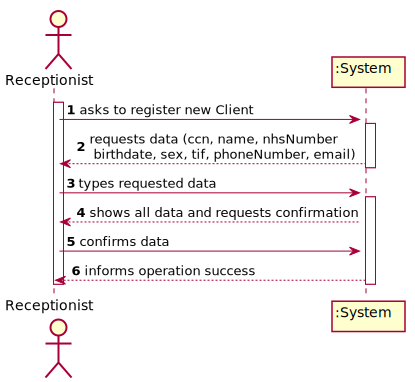
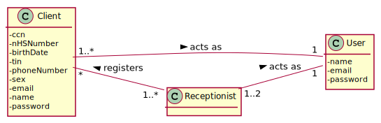
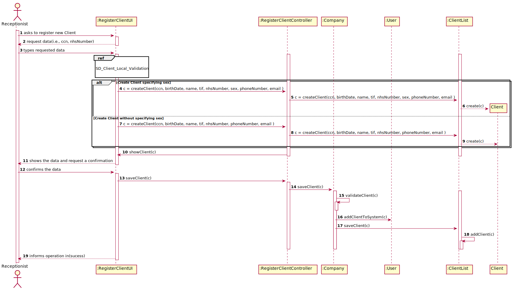
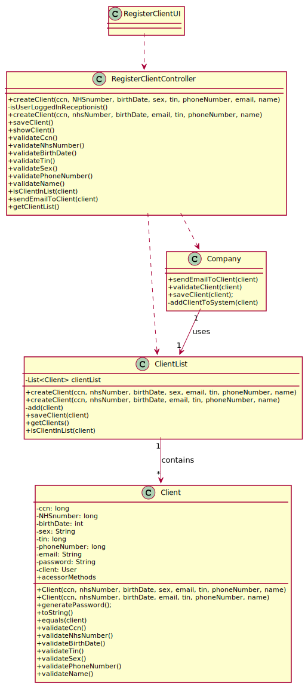

# US 003 - Register Client

## 1. Requirements Engineering

### 1.1. User Story Description

*US3: As a receptionist of the laboratory, I want to register a client*

### 1.2. Customer Specifications and Clarifications 

**From the specifications document:**

>   "When a new client comes, the receptionist needs to register them in the application. In order to do so the receptionist needs the following information: In case of a new client, the receptionist registers the client in the application."

>    "To register a client, the receptionist needs the following information : client's citizen card number, National Healthcare Service (NHS) number, birth date, sex, Tax Identification number (TIF), phone number, e-mail and name."

>   My interpretation:

>	For non registered clients that arrive at a clinical analysis laboratories, there is the need to register them in the application.

> 	To make this registration, the receptionist needs all the information described above.

**From the client clarifications:**

> **Question1:** What parameter (asked by the receptionist) should the system use to create the password of the new client?  
> [Link](https://moodle.isep.ipp.pt/mod/forum/discuss.php?d=7462)
> > **Answer:** The password should be randomly generated. It should have ten alphanumeric characters.

> **Question2:** After being registered by the receptionist, should the client receive some kind of confirmation e-mail in order to finish his registration?
> [Link](https://moodle.isep.ipp.pt/mod/forum/discuss.php?d=7736)
> > ** Answer:** The client only receives an e-mail informing that the registration was successful and that he can start to use the system. The e-mail includes the client password.

> **Question3:** When it comes to the registry of a client, the number for log in should be sequential (first client number 1, etc) or should it be one of the numbers he had to give in order to register (Citizenship Number, NHSid, TIF, etc) in order to be easier to later client memorize?
> [Link](https://moodle.isep.ipp.pt/mod/forum/discuss.php?d=7744)
> > ** Answer:** Please read carefully the acceptance criteria of user story number 3. Please study the "auth" component.

> **Question4:**: Do clients have to change their password after registration? (first login)
> [Link](https://moodle.isep.ipp.pt/mod/forum/discuss.php?d=7849)
> > ** Answer:** No.

> **Question5:**: Can they change their password whenever they want?
> [Link](https://moodle.isep.ipp.pt/mod/forum/discuss.php?d=7849)
> > ** Answer:** No. For now, there are no user story or use case to update the password.

> **Question6:**: What are exactly the optional attributes when creating a client? In a previous post you've stated that it was only the phone number, and in another that it was only the sex.
> [Link](https://moodle.isep.ipp.pt/mod/forum/discuss.php?d=7906)
> > ** Answer:** The sex is optional. All other fields are required.

> **Question7:**: Does the email have to be validated as a valid address or do we just accept whatever input the receptionist writes?
> [Link](https://moodle.isep.ipp.pt/mod/forum/discuss.php?d=7906)
> > ** Answer:** You should use a regular expression to validate the e-mail address.

> **Question8:**: Also, does the phone number has to be validated as a valid phone number? And can it be registered with a prefix (+44) or just the number?
> [Link](https://moodle.isep.ipp.pt/mod/forum/discuss.php?d=7906)
> > ** Answer:** This lab only operates in England, there is no need to use the prefix.

> **Question9:**: Is there any restrictions to the client age?
> [Link](https://moodle.isep.ipp.pt/mod/forum/discuss.php?d=7918)
> > ** Answer:** A client should not have more than 150 years of age. Although there are important developments in the pursuit of eternal youth, for now this value is ok.

> **Question10:**: What should be the maximum length of the String with the name of the Client?
> [Link](https://moodle.isep.ipp.pt/mod/forum/discuss.php?d=7945)
> > ** Answer:** A string with no more than 35 characters.

> **Question11:**: Does the client need to tell his age to the recepcionist. Im asking because before you didnt especified that that would be a parameter?
> [Link](https://moodle.isep.ipp.pt/mod/forum/discuss.php?d=7954)
> > ** Answer:** No, only needs to tell the birth day (from a previous post). The application must validate and should not accept clients who have more than 150 years of age.

> **Question12:**:  Should each client have an unique ID, generated during their creation?
> [Link](https://moodle.isep.ipp.pt/mod/forum/discuss.php?d=7955)
> > ** Answer:**  No.

> **Question13:**:  Should some data of the client (phone number and e-mail address, for example) be edited in the future?
> [Link](https://moodle.isep.ipp.pt/mod/forum/discuss.php?d=7959)
> > ** Answer:**  For now there is no need to have such feature.

> **Question14:**: Recently you said that the maximum acceptable age is 150 years old, so the client can be born in 1870 and the data format is DD/MM/YY, this format can be tricky because, for example, if the data is DD/MM/70 the data can indicate that he born on 1870 or 1970. How can we solve this? Or I am understanding wrong?
> [Link](https://moodle.isep.ipp.pt/mod/forum/discuss.php?d=7962)
> > ** Answer:** Thank you for identifying this issue. Please consider DD / MM / YYYY format for all dates.

### 1.3. Acceptance Criteria

* AC1: The client must become a system user. The "auth" component available on the repository must be reused (without modifications).
* AC2: The password should have ten alphanumeric characters.
* AC3: Citizen Card: 16 digit number
* AC4: NHS number: 10 digit number
* AC5: TIN: 10 digit number
* AC6: Birth day - in which format: DD/MM/YY
* AC7: Sex - Male/Female.
* AC8: Phone number: 11 digit number
* AC9: The sex is optional. All other fields are required.
* AC10: The name has at maximum 35 characters.
* AC11: The client can't be 150 years old.

### 1.4. Found out Dependencies

*This US has dependency with the US7- As an administrator, I want to register a new employee, since you can't register a client if you don't have a receptionist (which can be created using the US7).*

### 1.5 Input and Output Data

**Input Data:**

* Typed data:
	* ccn, 
	* NHS Number, 
	* Birth Date
	* Sex
	* Tax Identification number(TIF)
	* Phone Number
	* E-mail
	* Name
	
* Selected data:
	*(none)*

**Output Data:**

* (In)Success of the operation

### 1.6. System Sequence Diagram (SSD)

*Insert here a SSD depicting the envisioned Actor-System interactions and throughout which data is inputted and outputted to fulfill the requirement. All interactions must be numbered.*

### 1.7 Other Relevant Remarks

* This US will be held quite frequently.

## 2. OO Analysis

### 2.1. Relevant Domain Model Excerpt 

### 2.2. Other Remarks

none.

## 3. Design - User Story Realization 

### 3.1. Rationale

**The rationale grounds on the SSD interactions and the identified input/output data.**

| Interaction ID | Question: Which class is responsible for... | Answer  | Justification (with patterns)  |
|:-------------  |:--------------------- |:------------|:---------------------------- |
| Step 1  		 |	... interacting with the actor?						 | RegisterClientUI            | Pure Fabrication: there is no reason to assign this responsibility to any existing class in the Domain Model.          | 
|   		 |	... coordinating the US?					 | RegisterClientController            | Controller          |
|   		 |	... knowing the user using the system?					 | UserSession            | IE: User Authentication & Authorization Documentation       |
| Step 2  		 |	... requesting the needed data?						 | none            |                              |
| Step 3  		 |	... saving the inputed data?						 | Client            | IE:The client object has its own data   .                          |
| Step 4  		 |	... validating all data (local validation)(i.e the compliance with the acceptance criteria, the existance of the mandatory data)?						 | Client            | IE: knows about its data       |
|   		 |	... validating all data (global validation)?)(i.e Duplicated information)						 | Company           | IE: knows all its global validation criteria         |
| Step 5  		 |	... saving the created client?						 | ClientList            | IE: owns all its Clients                             |
| Step 6  		 |	... informing operation success?						 | RegisterClientUI            | Has the responsability to interact with the actor                             |  

### Systematization ##

According to the taken rationale, the conceptual classes promoted to software classes are: 

 * Client
 * ClientList
 * Company

Other software classes (i.e. Pure Fabrication) identified: 

 * RegisterClientUI  
 * RegisterClientController

## 3.2. Sequence Diagram (SD)

## 3.3. Class Diagram (CD)

# 4. Tests 
___________________________________

**Class Client:**

     **Test 1:** Check that the Client has been become a system user. AC-1

    @Test(expected = true)
    public void checkClientAuthenticated(){
    AuthFacade authFacade = new AuthFacade();
        Client client = new Client(987654321092,1234567890,10-02-02,"Male","jorgesousa@gmail.com",7658490321,99876543941,"Jorge Sousa");
        authFacade.existsUser("jorgesousa@gmail.com");
    }	
    
    
    **Test 2:** Check that the password created has always 10 characters. AC-2

    @Test(expected = true)
    public void checkPasswordRules(){
        Client client = new Client(ccn,1234567890,10-02-02,"Male","jorgesousa@gmail.com",7658490321,99876543941,"Jorge Sousa")
        client.generatePassword().length()==10;
    }	
	
    
    **Test 3:** Check that it is not possible to create a CCN that has less/more characters than 16. AC-3

     @Test(expected = IllegalArgumentException.class)
    public void checkCcnRules(){
        long ccn = 987654321092;
        Client client = new Client(ccn,1234567890,10-02-02,"Male","jorgesousa@gmail.com",7658490321,99876543941,"Jorge Sousa");
        
    }	
    
    **Test 4:** Check that it is not possible to create a  NHS number that has less/more characters than 10. AC-4

     @Test(expected = IllegalArgumentException.class)
    public void checkNhsNumberRules(){
        long nhsNumber = 35123;
        Client client = new Client(123456789012345678,nhsNumber,10-02-02,"Male","jorgesousa@gmail.com",7658490321,99876543941,"Jorge Sousa");
        
    }
    
    **Test 5:** Check that it is not possible to create a Tax Identification Number that less/more characters than 10. AC-5

     @Test(expected = IllegalArgumentException.class)
    public void checkTifRules(){
        long tin = 5783219;
        Client client = new Client(123456789012345678,1234567890,"10-02-02","Male","jorgesousa@gmail.com",tin,99876543941,"Jorge Sousa");
        
    }	
    
    **Test 6:** Check that it is not possible to create birth date that is not in the order DD-MM-YY. AC-6

     @Test(expected = IllegalArgumentException.class)
    public void checkBirthDateRules(){
        String birthDate = "13-02";
        Client client = new Client(123456789012345678,1234567890,birthDate,"Male","jorgesousa@gmail.com",7658490321,99876543941,"Jorge Sousa");
        
    }
    
    **Test 7:** Check that it is not possible to create a sex that is not male nor female. AC-7

     @Test(expected = IllegalArgumentException.class)
    public void checkSexRules(){
        String sex = "Table"
        
        Client client = new Client(123456789012345678,1234567890,"10-02-02",sex,"jorgesousa@gmail.com",7658490321,99876543941,"Jorge Sousa");
        
    }
    
    **Test 8:** Check that it is impossible to create a phone Number with more/less than 10 integers. AC-8

     @Test(expected = IllegalArgumentException.class)
    public void checkPhoneNumberRules(){
        long phoneNumber = 1302;
        Client client = new Client(123456789012345678,1234567890,"10-02-02","Male","jorgesousa@gmail.com",7658490321,phoneNumber,"Jorge Sousa");
        
    }
    **Test 9:** Check that it is possible to create a Client without the sex. AC-9

     @Test(expected = true)
    public void checkWithoutSex(){
        Client client = new Client(123456789012345678,1234567890,"07-02-12","jorgesousa@gmail.com",7658490321,99876543941,"Jorge Sousa");
        
    }
    
    **Test 10:** Check that it is impossible to create a name with more tham 35 characters. AC-9

     @Test(expected = IllegalArgumentException.class)
    public void checkNameRules(){
        String name = "Hippopotomonstrosesquippedaliophobia";
        Client client = new Client(123456789012345678,1234567890,"07-02-12","jorgesousa@gmail.com",7658490321,99876543941,name);
        
    }
    
    **Test 11:** Check that it is impossible to create a Client more than 150 years. AC-11

     @Test(expected = IllegalArgumentException.class)
    public void checkAgeRules(){
        String birthDate = "04-05-1820"  // Awaiting Client's response on the DD/MM/YY format since a person with more 150 years can be confused with the most recent century.
        
        Client client = new Client(123456789012345678,1234567890,birthDate,"jorgesousa@gmail.com",7658490321,99876543941,"Jorge Sousa);
        
    }

	

# 5. Construction (Implementation)

_______________________

## class Client
    
    public class Client {
    private long ccn;
    private long nhsNumber;
    private String birthDate;
    private long tin;
    private long phoneNumber;
    private String sex;
    private String email;
    private String name;
    private String password;

    LocalDate currentDate = LocalDate.now();

    /**
     * Creates an empty Client.
     */
    public Client() {

    }

    /**
     * Another constructor for class Client
     * It is here that is generated the password.
     *
     * @param ccn         The Citizen card number of the client
     * @param nhsNumber   National Health Service number of the client
     * @param birthDate   The birth date of the client
     * @param sex         The sex of the client
     * @param email       The email of the client
     * @param tin         The tax identification number of the client
     * @param phoneNumber Phone number of the client
     * @param name        The name of the client
     */

    public Client(long ccn, long nhsNumber, String birthDate, String sex, String email, long tin, long phoneNumber, String name) {
        this.ccn = ccn;
        this.tin = tin;
        this.nhsNumber = nhsNumber;
        this.birthDate = birthDate;
        this.sex = sex;
        this.phoneNumber = phoneNumber;
        this.email = email;
        this.name = name;
        this.password = generatePassword();

    }
    
## Class ClientList  
    
    public class ClientList {
    private List<Client> clientList;

    /**
     * empty constructor of the class ClientList which initializes the arraylist.
     */
    public ClientList() {
        this.clientList = new ArrayList<>();
    }

    /**Create an instance of the Class Client using the constructor from the class Client.
     *
     * @param ccn         The Citizen card number of the client
     * @param nhsNumber   National Health Service number of the client
     * @param birthDate   The birth date of the client
     * @param sex         The sex of the client
     * @param email       The email of the client
     * @param tin         The tax identification number of the client
     * @param phoneNumber Phone number of the client
     * @param name        The name of the client
     * @return the object Client containing the information passed through parameters.
     */
    public Client createClient(long ccn, long nhsNumber, String birthDate, String sex, String email, long tin, long phoneNumber, String name) {
        return new Client(ccn, nhsNumber, birthDate, sex, email, tin, phoneNumber, name);
    }
    ...
    }
    
## Class RegisterClientController

    public class RegisterClientController {

    Client clt;
    Company cmp;
    AuthFacade authFacade = new AuthFacade();

    /**
     * Constructor of the Class RegisterClientController
     */
    public RegisterClientController() {
        if (!isUserLoggedInReceptionist()) {
            System.out.println("You are not a receptionist and therefore can't access this menu");
        }
        this.clt = new Client();
        this.cmp = App.getInstance().getCompany();
    }

    /**
     * Brings the method from the class ClientList so that there's less coupling between the UI and domain layers.
     *
     * @param ccn         The client's Citizen card number
     * @param nhsNumber   National Health Service number of the client
     * @param birthDate   The birth date of the client
     * @param sex         The sex of the client
     * @param email       The email of the client
     * @param tin         The tax identification number of the client
     * @param phoneNumber Phone number of the client
     * @param name        The name of the client
     * @return an instance of the class Client containing the information passed by parameters
     */

    public Client createClient(long ccn, long nhsNumber, String birthDate, String sex,
                               long tin, long phoneNumber, String email, String name) {
        ClientList cl = this.cmp.getClientList();

        this.clt = cl.createClient(ccn, nhsNumber, birthDate, sex,
                email, phoneNumber, tin, name);
        return this.clt;

    }
    ...
    }
    
   

# 6. Integration and Demo 

  It is linked with the Auth package since it makes the Client an active User of the system.
  
  To register a new Client it is necessary to have at least one receptionist, therefore it is tightly related to the creation of receptionists.

  When in the RegisterClient UI it has to be guaranteed that it is the Receptionist that is managing the System.

# 7. Observations

In this sprint it wasn't used the DTOs yet, since there isn't a complete understanding of the topic yet. It is imperative to implement it in the next Sprint, as it ensures low coupling.

This User Story will have to be adapted to be fitted into a GUI.

