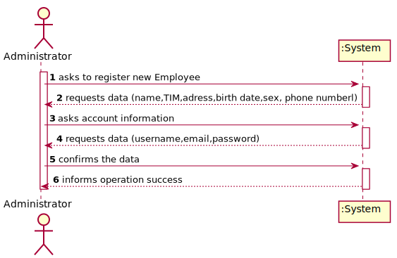
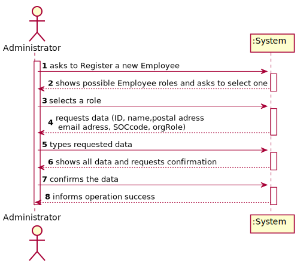
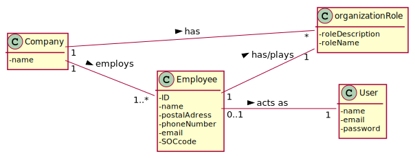
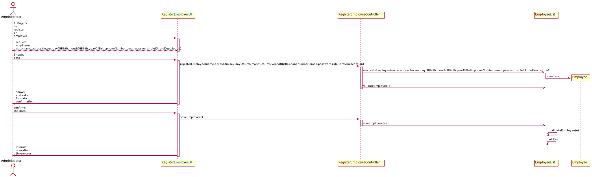
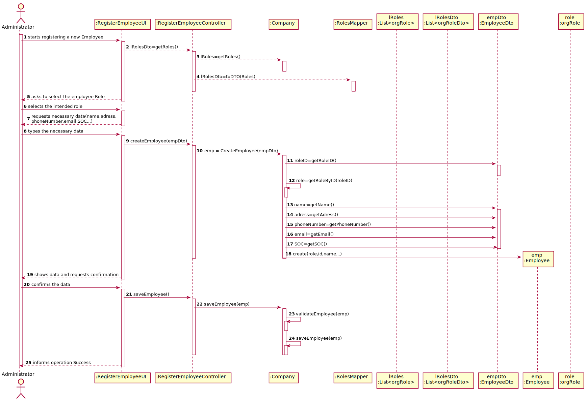
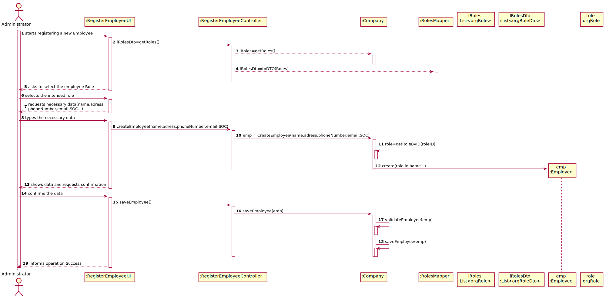
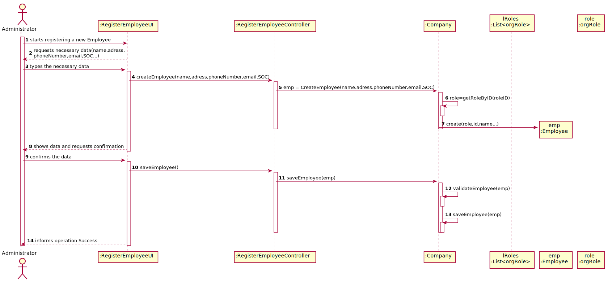
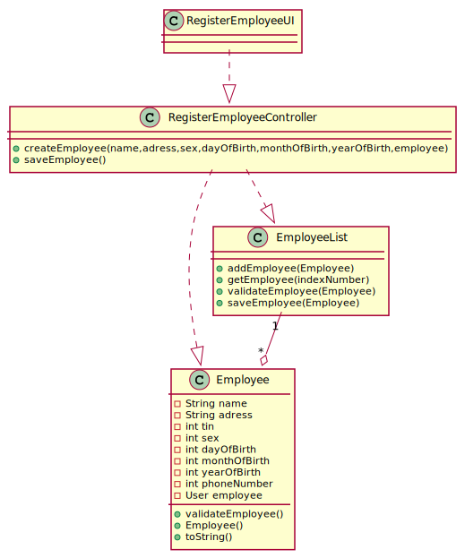
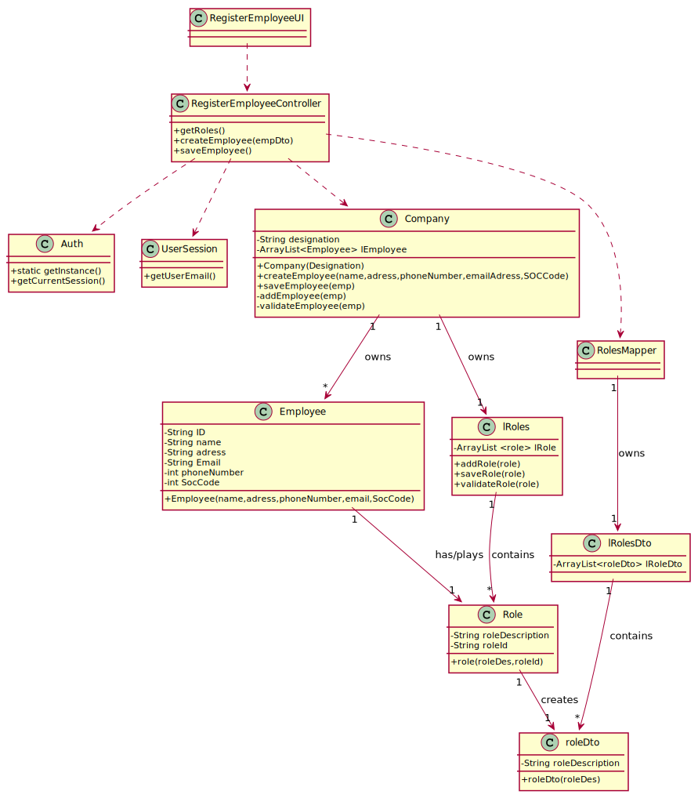
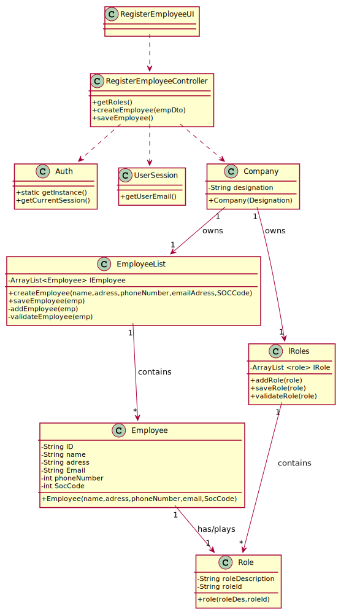

# US 007 - To Register an employee

## 1. Requirements Engineering

### 1.1. User Story Description

As an administrator, I want to register a new employee.

### 1.2. Customer Specifications and Clarifications 

**From the specifications document:**

>	All those who wish to use theapplication must be authenticated with a password holding seven alphanumeric characters,including three capital letters and two digits.

**From the client clarifications:**

> **Question:**  When creating a new employee, the attributes "Employee ID" and "Doctor Index Number", are implemented by the administrator or incremented by the system?
>  
> **Answer:** Only the employee ID should be generated from the initials of the employee name and should include a number. The number has 5 digits and is increases automatically when a new employee is registered in the system. For instance, if the company has 20 employees and wants to register a specialist doctor having the name Ana Maria Santos Moura, then the the employee ID for this specialist doctor should be AMSM00021.

The Doctor Index Number should be introduced by the administrator.

-

> **Question:** Should we vallidate if a new employee is the same as one that there is already inside the system ? Do we need to vallidate same atributes to check similarities ?
>  
> **Answer:** Yes.

-

> **Question:** How should we generate the SOC number , employee ID and the doctor index number ? What type and length they should have ?
>  
> **Answer:** The employee ID should be generated from the initials of the employee name and should include a number. The number should have 5 digits and it increases automatically when a new employee is registered in the system. For instance, if the company has 20 employees and the administrator wants to register a specialist doctor with the name Ana Maria Santos Moura, then the the employee ID for this specialist doctor should be AMSM00021.

-

> **Question:** What kind of information does the company store about their employees and owned laboratories?
>  
> **Answer:** All the roles that exist in the Many Labs company are characterized by the following attributes:
Employee ID;
Organization Role;
Name;
Address;
Phone Number;
E-Mail;
Standard Occupational Classification (SOC) code.

The Specialist Doctor has an additional attribute:
Doctor Index Number.

### 1.3. Acceptance Criteria

* **AC1:** Each user must have a single role defined in the system.
* **AC2:** The "auth" component available on the repository must be reused (without modifications)
* **AC3:** When creating a task with an already existing reference, the system must reject such operation and the user must have the change to modify the typed reference.

### 1.4. Found out Dependencies

* There is a dependency to the auth component, since each employee will have a corresponding user.

### 1.5 Input and Output Data

**Input Data:**

* Typed data:
	* a name
	* a postal adress
	* a phone number
	* an email
	* a SOC (Standard Occupational Code
	* a doctor index number( if the Specialist Doctor Role is selected).
	
* Selected data:
	* Organization Role attributed to the new Employee

**Output Data:**

* List of existing Roles.
* (In)Success of the operation

### 1.6. System Sequence Diagram (SSD)

**Alternative 1**

**Alternative 2**

**Other alternatives might exist.**

### 1.7 Other Relevant Remarks

* The created task stays in a "not published" state in order to distinguish from "published" tasks.

## 2. OO Analysis

### 2.1. Relevant Domain Model Excerpt 

### 2.2. Other Remarks

The design of this US is heavily inspired by the example provided on TP08 of ESOFT ,present in the ISEP moodle for 1st year LEI Students.
An attempt at using DTO (Data Transfer Objects) will be made.

## 3. Design - User Story Realization 

### 3.1. Rationale

**SSD - Alternative 1 is adopted.**

| Interaction ID | Question: Which class is responsible for... | Answer  | Justification (with patterns)  |
|:-------------  |:--------------------- |:------------|:---------------------------- |
| Step 1  		 |	... interacting with the administrator? | RegisterEmployeeUI|  Pure Fabrication: there is no reason to assign this responsibility to any existing class in the Domain Model.           |
| 			  		 |	... coordinating the US? | RegisterEmployeeController| Controller
| 			  		 |	... instantiating a new Employee? | Company   | Creator (Rule 1): in the DM Company has an Employee.   |
| 			  		 | ... knowing the user using the system?  | UserSession  | IE: Auth component documentation.  |
| Step 2  		 |							 |             |                              |
| Step 3  		 |	...saving the inputted data? | Employee  | IE: object created in step 1 has its own data.  |
| Step 4  		 |	...knowing the roles to show? | Company  | IE: Company contains a list of all the available roles. |
| Step 5  		 |	... saving the selected Role? | Employee  | IE: object created in step 1 contains a role.  |
| Step 6  		 |							 |             |                              |              
| Step 7  		 |	... validating all data (local validation)? | Employee | IE: owns its data.| 
| 			  		 |	... validating all data (global validation)? | Company(EmployeeList | IE: knows all its Employees.| 
| 			  		 |	... saving the created task? | Company | IE: owns all its Employees.| 
| Step 8  		 |	... informing operation success?| RegisterEmployeeUI  | IE: is responsible for user interactions.  | 

### Systematization ##

According to the taken rationale, the conceptual classes promoted to software classes are: 

 * Employee
 * Company
 * Role

Other software classes (i.e. Pure Fabrication) identified: 

 * RegisterEmployeeUI
 * RegisterEmployeeController
 * RoleDto
 * lRoleDto
## 3.2. Sequence Diagram (SD)

**Alternative 1**

**Alternative 2**

**Alternative 3**

**Alternative 4**

## 3.3. Class Diagram (CD)

**From alternative 1**

**From alternative 3**

**From alternative 4**

# 4. Tests 

# 4.1 Method Tests
**Test 1.1:** Check to see if the user ID is being correctly generated

	@Test(expectedID = RML00001)
		public void generateID() {
		Employee e = new Employee("Rafael Mendes Leite,.., 2);
	}
	
# 4.2 Validation Tests
**Test 2.1:** Check that it is not possible to create an instance of the Employee class with a SOC containing more than with more or less than 4 digits.

	@Test(expected = IllegalArgumentException.class)
		public void validateEmployeeSOC() {
		Employee e = new Emplyee("Nome da pessoa","endereço da pessoa",123245,"email@emailsite.com",934537899,Role,);
	}

 

# 5. Construction (Implementation)

## Class RegisterEmployeeController

public class RegisterEmployeeController {
    private Company company;

    public RegisterEmployeeController() {
        this.company = App.getInstance().getCompany();
    }
	...
    }

## Class Employee

		ppublic class Employee {

    private static final int PASSWORD_DIGIT_AMOUNT=2;
    private static final int PASSWORD_UPPERCASE_AMOUNT=3;
    private static final int PASSWORD_LOWERCASE_AMOUNT=2;
    private String userName;
    private String password;
    private String email;
    private String name;
    private String ID;
    private String adress;
    private String SOC;
    private long phoneNumber;
    private Role role;
    private String specialistDoctorIndexNumber;

    public Employee(String name, String adress, String SOC, long phoneNumber, String email, String userName, int nEmployees, Role role, String specialistDoctorIndexNumber){
        this.name=name;
        this.adress=adress;
        this.SOC = SOC;
        this.phoneNumber=phoneNumber;
        this.userName=userName;
        this.email=email;
        this.password=generateEmployeePassword();
        this.ID=generateID(nEmployees);
        this.role= role;
        this.specialistDoctorIndexNumber=specialistDoctorIndexNumber;
    }
	...
	}

## Class Role 
    private String roleDescription;
    private String roleID;
    private String roleShortname;
    public Role( String roleDescription, String roleID,String roleShortname){
        this.roleDescription=roleDescription;
        this.roleID=roleID;
        this.roleShortname=roleShortname;
    }
	...
	}
## Class EmployeeStore
    public class EmployeeStore {
    private ArrayList<Employee> lEmployee ;
	public boolean addEmployee(Employee e){
        if (e!=null){
            if (!exists(e)){
                return this.lEmployee.add(e);
            }
        }
        return false;

    }
    public boolean removeEmployee(Employee e)
    {
        if (e != null)
            return this.lEmployee.remove(e);
        return false;
    }
    public Employee get(int index){
        return lEmployee.get(index);
    }
    public boolean exists(Employee e){
    return this.lEmployee.contains(e);
    }
    public void saveEmployee(Employee e){
        if (e.validateEmployee()==true){
            addEmployee(e);
            App.getInstance().getCompany().getAuthFacade().addUserWithRole(e.getUserName(),e.getEmail(),e.getPassword(),e.getRole().getRoleID());
        }else throw new IllegalArgumentException("You have made a mistake in typing your employee's data.The employee was not added.");

    }
## Class RoleStore
    public class RoleStore {
    private List<Role> lRole;
    public RoleStore(){
        this.lRole= new ArrayList<>();
    }

    public  Role create (String roleDescription,String roleID,String roleShortname){
        return new Role(roleDescription,roleID,roleShortname);
    }

    public List<Role> getlRole() {
        ArrayList<Role> lRole= new ArrayList<>();
        lRole.addAll(this.lRole);
        return lRole;
    }

    public void setlRole(List<Role> lRole) {
        this.lRole = lRole;
    }

    public boolean add(Role r){
        if (r!=null){
            if (!exists(r)&&r.validateRole()){
                return this.lRole.add(r);
            }
        }
        return false;

    }
    public boolean remove(Role r)
    {
        if (r != null)
            return this.lRole.remove(r);
        return false;
    }
	...
	}
# 6. Integration and Demo 

* A new option on the Admin menu was added

* Roles are currently added in bootstrap

# 7. Observations

I attempted to use DTOs, however i did not manage to understand how to use them properly.

