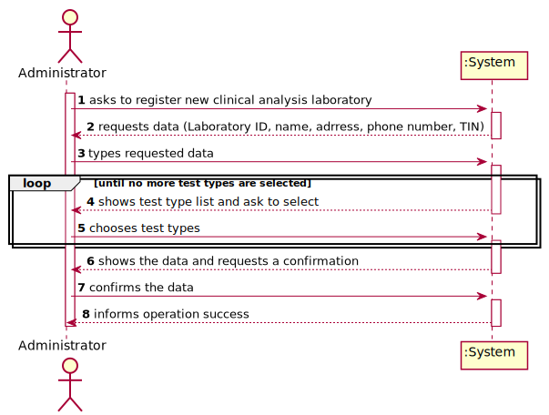
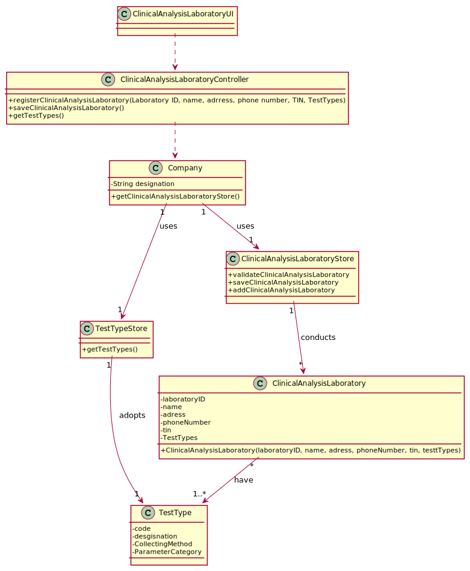

# US 8 - Register a new clinical analysis laboratory

## 1. Requirements Engineering

### 1.1. User Story Description

As an administrator, I want to register a new clinical  analysis laboratory stating which kind of test(s) it operates.

### 1.2. Customer Specifications and Clarifications 

**From the specifications document**

"Many Labs...has a network of clinical analysis laboratories in England where analysis of blood (samples are collected) are performed, as well as Covid 19 tests."

**From the client clarifications**

* **Question1:** Of all the information that we have about the CLA, what would be the bare minimum to be able to successfully register a new CLA?
[Link](https://moodle.isep.ipp.pt/mod/forum/discuss.php?d=7536)
	* **Answer:** All information is required.

* **Question2:** Should information regarding the execution or not of covid-19 tests in the CLA be recorded or is it preferable that it is by default that it does not?
[Link](https://moodle.isep.ipp.pt/mod/forum/discuss.php?d=7536)
	* **Answer2:** From the Project Description we get: "All Many Labs clinical analysis laboratories perform clinical blood tests, and a subset of these laboratories also performs Covid-19 tests".
From Sprint B requirements we get: "US8: As an administrator, I want to register a new clinical analysis laboratory stating which kind of test(s) it operates."

* **Question3:** Is there a maximum limit of types of tests a clinical analysis laboratory can operate?
[Link](https://moodle.isep.ipp.pt/mod/forum/discuss.php?d=7553)
	* **Answer3:** No.

* **Question4:** We know through the specifications document that "All Many Labs clinical analysis laboratories perform clinical blood tests".
[Link](https://moodle.isep.ipp.pt/mod/forum/discuss.php?d=7553)
My question therefore is: When creating a new Clinical Analysis Laboratory, should the system automatically record that it operates that type of test or should the person who is creating it select it manually while selecting other types of tests? Or other option?
	* **Answer4:** The administrator should select, manually, all the types of tests to be performed by the Clinical Analysis Laboratory.

* **Question5:** Which type/format has LaboratoryID, address, name, phone number, and TIN number on Clinical Analysis Laboratory?
[Link](https://moodle.isep.ipp.pt/mod/forum/discuss.php?d=7636)
	* **Answer5:** Each Clinical Analysis Laboratory is characterized by the following attributes: 
		* Laboratory ID: five alphanumeric characters; 
		* Name: A string with no more than 20 characters;
		* Address: A string with no more than 30 characters;
		* Phone Number: 11 digit number;
		* TIN number: 10 digit number;
		* Type of tests performed by the lab.
	 All information is required.

* **Question6:** Does Chemical Laboratory have the same type/format of the attributes of Clinical Analysis Laboratory?
[Link](https://moodle.isep.ipp.pt/mod/forum/discuss.php?d=7636)
	* **Answer6:** For the Chemical Laboratory there is no need to specify the type of tests to be performed. Other than this, the attributes and their type/format are the ones presented in my previous answer.

* **Question7:** Are the test types typed in or selected from those that the program has? 
[Link](https://moodle.isep.ipp.pt/mod/forum/discuss.php?d=7707)
	* **Answer7:** The test types are selected from a list.

* **Question8:** The creation of new parameters, parameter categories, test types, the client data introduced during the client registration and basically all the data that is registered in the application has to remain after the closing of the application (saved on the disk)?
[Link](https://moodle.isep.ipp.pt/mod/forum/discuss.php?d=7707)
	* **Answer8:** For now there is no need to save the data. In the following sprints we will introduce new requirements that will clarify this point.

* **Question9:** What information is associated with a clinical Analysis laboratory?(e.g. designation, localization...)What rules are applicable to such data?
[Link](https://moodle.isep.ipp.pt/mod/forum/discuss.php?d=7749)
	* **Answer9:** I already answered this question. It is not a good approach to ask the same question two times.

		"Each Clinical Analysis Laboratory is characterized by the following attributes:

		* Laboratory ID;
		* Name;
		* Address;
		* Phone Number;
		* TIN number.

		The Chemical Laboratory is characterized by the following attributes:

		* Name;
		* Address;
		* Phone Number;
		* TIN number.

		Many Labs company has only one chemical lab."

* **Question10:** When registering a new laboratory does the administrator selects or write the type of tests performed by a clinical Analysis laboratory?
[Link](https://moodle.isep.ipp.pt/mod/forum/discuss.php?d=7749)
	* **Answer10:** Yes. In Sprint B requirements we get: "US8: As an administrator, I want to register a new clinical analysis laboratory stating which kind of test(s) it operates".

* **Question11:** According to US8 "As an administrator, I want to register a new clinical analysis laboratory stating which kind of test(s) it operates" its supposed to create a new clinical analysis laboratory. However, in several previous posts awnsers you mentioned the Chemical Laboratory. Are both of labs connected to this sprint?
[Link](https://moodle.isep.ipp.pt/mod/forum/discuss.php?d=7859)
	* **Answer11:** Please read carefully the Project Description and Sprint B requirements.

* **Question12:** When the administrator is registering a Clinical Analysis Laboratory and typing the information does he type the laboratory ID or is it generated by the system afterwards?
[Link](https://moodle.isep.ipp.pt/mod/forum/discuss.php?d=7862)
	* **Answer12:** The Laboratory ID is introduced manually.

* **Question13:** When starting a new clinical analysis laboratory registration, should the entered requested data be showed to the user for confirmation purposes?
[Link](https://moodle.isep.ipp.pt/mod/forum/discuss.php?d=7873)
	* **Answer13:** It is always a good practice to validate and ask for confirmation.

* **Question14:** Are two Clinical Analysis Laboratories with the same:
	* Laboratory ID OR
	* name OR
	* address OR
	* phone Number OR
	* TIN number

	allowed to exist?
[Link](https://moodle.isep.ipp.pt/mod/forum/discuss.php?d=7911)

	* **Answer14:** Only the name of two CAL can be same.

### 1.3. Acceptance Criteria

* AC1: Laboratory ID should have five alphanumeric characters;
* AC2: Name should be a string with no more than 20 characters;
* AC3: Address should be a string with no more than 30 characters;
* AC4: Phone Number should be a 11 digit number;
* AC5: TIN number should be a 10 digit number;
* AC6: Two Clinical Analysis Laboratories can't have the same data (except the name).

### 1.4. Found out Dependencies

This US has dependency with the US9- As an administrator, I want to specify a new type of test and its collecting methods, because the administrator needs to know what type of tests the clinical analysis laboratory performs in order to register it. 

### 1.5 Input and Output Data

**Input Data**

* Typed data (Laboratory ID, Name, Adress, Phone Number, TIN number)
	
* Selected data(Test types)

**Output data:**

* (In)Success of the operation.

### 1.6. System Sequence Diagram (SSD)

### 1.7 Other Relevant Remarks

There is no other relevant remarks.

## 2. OO Analysis

### 2.1. Relevant Domain Model Excerpt 

### 2.2. Other Remarks

There is no other remarks.

## 3. Design - User Story Realization 

### 3.1. Rationale

**The rationale grounds on the SSD interactions and the identified input/output data.**

| Interaction ID | Question: Which class is responsible for... | Answer  | Justification (with patterns)  |
|:-------------  |:--------------------- |:------------|:---------------------------- |
| Step 1		 |...interacting with the actor |ClinicalAnalysisLaboratoryUI |Pure Fabrication: there is no reason to assign this responsability to any existing class in the Domain Model. |
|			 |...coordenating the US        |ClinicalAnalysisLaboratoryController |Controller |
| 			  		 | ... knowing the user using the system?  | UserSession  | IE: knows who is logged in.  |
| Step 2  		 |...requesting the needed data? |ClinicalAnalysisLaboratoryUI |IE: run method |
| Step 3  		 |	...saving the inputted data? | ClinicalAnalysisLaboratory| IE: object created in step 1 has its own data.  |
| Step 4  		 |	...knowing the task categories to show? | TestType| IE: Test types are defined by the TestType. |
| Step 5  		 |	... saving the test types? | ClinicalAnalysisLaboratory  | IE: object created in step 1 is classified in one or more test types.  |
| Step 6  		 |	... asking for a confirmation	|ClinicalAnalysisLaboratoryUI              |IE: is responsible for user interactions.                              |              
| Step 7  		 |	... validating all data (local validation)? | ClinicalAnalysisLaboratory | IE: owns its data.| 
| 			  		 |	... validating all data (global validation)? | ClinicalAnalysisLaboratoryStore | IE: knows all its tasks.| 
| 			  		 |	... saving the created task? | ClinicalAnalysisLaboratoryStore | IE: owns all its tasks.| 
| Step 8  		 |	... informing operation success?| ClinicalAnalysisLaboratoryUI | IE: is responsible for user interactions.  |             

### Systematization ##

According to the taken rationale, the conceptual classes promoted to software classes are: 
	
* ClinicalAnalysisLaboratory
* ClinicalAnalysisLaboratoryStore
* TestType
* TestTypeStore
* Company

Other software classes (i.e. Pure Fabrication) identified:

* ClinicalAnalysisLaboratoryUI  
* ClinicalAnalysisLaboratoryController

## 3.2. Sequence Diagram (SD)

## 3.3. Class Diagram (CD)

# 4. Tests 

**Test 1:** Check that it's possible to get the name of a Clinical analysis laboratory introduced by the Admin.
	
	@Test
    	 public void getName() {
         List<ParameterCategory> parameterCategories = new ArrayList<>();
         ParameterCategory p1 = new ParameterCategory("54321","HEMOGRAM");
         parameterCategories.add(p1);

         List<TestType> testTypes = new ArrayList<>();
         TestType t1 = new TestType("13579","TESTDESCRIPTION", "abcde", parameterCategories);
         testTypes.add(t1);

         ClinicalAnalysisLaboratory cal= new ClinicalAnalysisLaboratory("123ab", "LABORATORY",
                                "LabADRESS", 99999999999L, 1234567890L, testTypes);

         String name = "LABORATORY";
         String wrongName = "LAB";

         assertEquals(name,cal.getName());
         assertNotEquals(wrongName, cal.getName());

    }

**Test 2:** Check if laboratoryID follows the rules indicated by the Client. (AC-1)

	@Test(expected = IllegalArgumentException.class)
         public void checkLaboratoryIDRules() {
         List<ParameterCategory> parameterCategories = new ArrayList<>();
         ParameterCategory p1 = new ParameterCategory("54321", "HEMOGRAM");
         parameterCategories.add(p1);

         List<TestType> testTypes = new ArrayList<>();
         TestType t1 = new TestType("13579", "TESTDESCRIPTION", "abcde", parameterCategories);
         testTypes.add(t1);

         ClinicalAnalysisLaboratoryStore calStore = new ClinicalAnalysisLaboratoryStore();

         ClinicalAnalysisLaboratory cal = calStore.registerClinicalAnalysisLaboratory("", "LABORATORY",
                "LabADRESS", 99999999999L, 1234567890L, testTypes);

         calStore.checkLaboratoryIDRules(cal.getLaboratoryID());

    }

**Test 3:** Check that it's possible to get all type of tests registered in the application.

	@Test
         public void getTestTypes() {
         List<TestType> tt = App.getInstance().getCompany().getTestTypeStore().getTestTypes();
         ClinicalAnalysisLaboratoryController clinicalAnalysisLaboratoryController = new ClinicalAnalysisLaboratoryController();

         List<TestType> ts = clinicalAnalysisLaboratoryController.getTestTypes();

         assertArrayEquals(tt.toArray(), ts.toArray());
    }

		

# 5. Construction (Implementation)

## Class ClinicalAnalysisLaboratory

	public class ClinicalAnalysisLaboratory {
	private String laboratoryID;
   	private String name;
    	private String adress;
    	private long phoneNumber;
    	private long tin;
    	private List<TestType> testTypes;

    	public ClinicalAnalysisLaboratory(String laboratoryID, String name, String adress, long phoneNumber, long tin, List<TestType> testTypes) {
        	this.laboratoryID = laboratoryID;
        	this.name = name;
        	this.adress = adress;
        	this.tin = tin;
        	this.phoneNumber = phoneNumber;
        	this.testTypes = testTypes;

    		}
	...
	}

## Class ClinicalAnalysisLaboratoryStore

	public class ClinicalAnalysisLaboratoryStore {
    	private List<ClinicalAnalysisLaboratory> clinicalAnalysisLaboratories;

    	public ClinicalAnalysisLaboratoryStore() {
        	this.clinicalAnalysisLaboratories = new ArrayList<>();
    	}

    	public ClinicalAnalysisLaboratory registerClinicalAnalysisLaboratory(String laboratoryID, String name, String adress, long phoneNumber, long tin, List<TestType> testTypes) {
        	return new ClinicalAnalysisLaboratory(laboratoryID, name, adress, phoneNumber, tin, testTypes);
    	}

    	public void validateClinicalAnalysisLaboratory(ClinicalAnalysisLaboratory cal) throws IllegalArgumentException {
        	checkNameRules(cal.getName());
        	checkLaboratoryIDRules(cal.getLaboratoryID());
        	checkAdressRules(cal.getAdress());
        	checkPhoneNumberRules(cal.getPhoneNumber());
        	checkTINRules(cal.getTin());
        	checkTestTypesRules(cal.getTestTypes());
    		}
	...
	}

## Class ClinicalAnalysisLaboratoryController

	public class ClinicalAnalysisLaboratoryController {
    	private Company company;
    	private ClinicalAnalysisLaboratory clinicalAnalysisLaboratory;

    	public ClinicalAnalysisLaboratoryController(){
        	this.company =App.getInstance().getCompany();
    	}

    	public List<TestType> getTestTypes() {
        	TestTypeStore ts = this.company.getTestTypeStore();
        	return ts.getTestTypes();
    		}
	...
	}

## Class ClinicalAnalysisLaboratoryUI

	public class ClinicalAnalysisLaboratoryUI implements Runnable {

    	private ClinicalAnalysisLaboratoryController clinicalAnalysisLaboratoryController;

    	public ClinicalAnalysisLaboratoryUI() {
        	this.clinicalAnalysisLaboratoryController = new ClinicalAnalysisLaboratoryController();
    	}

    	public void run() {
        	Scanner x = new Scanner(System.in);
        	System.out.println("Beginning to register a new clinical analysis laboratory.\n");
        	System.out.println("Insert the laboratoryID.");
        	String laboratoryID=x.nextLine();
        	System.out.println("Insert name.");
        	String name=x.nextLine();
        	System.out.println("Insert adress.");
        	String adress=x.nextLine();
        	System.out.println("Insert phone number.");
        	long phoneNumber=x.nextLong();
        	System.out.println("Insert TIN number.");
        	long tin=x.nextLong();
		...
		}
	}
	

# 6. Integration and Demo 

A new option was added to the Admin menu.

This option works if any type fo tests is registered in the application

# 7. Observations

In the next sprint, due to the implementation of javaFx, there will certainly be changes in this user story.

