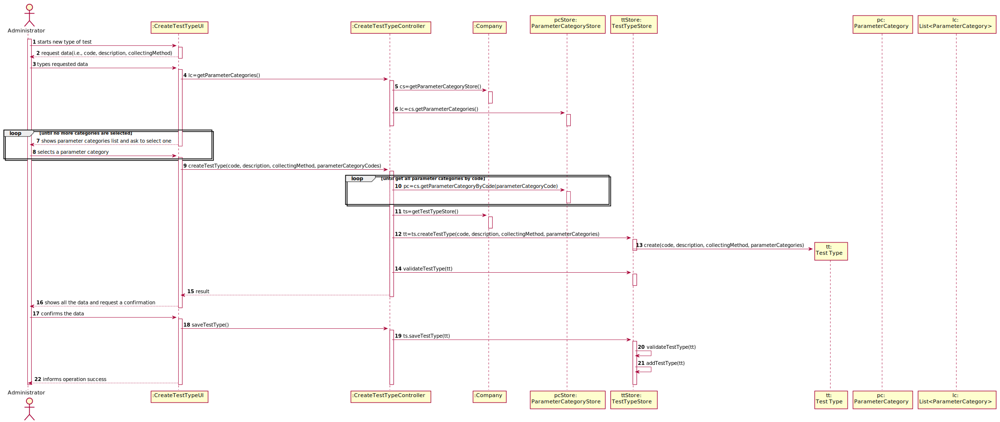

# US 9  - Create a Type of Test

## 1. Requirements Engineering

### 1.1. User Story Description

As an administrator, I want to specify a new type of test and its collecting methods.

### 1.2. Customer Specifications and Clarifications 

### From the Specifications Document:

* "Many Labs performs two types of tests. (…) (whether it is blood test or Covid test)."   
* "Despite being out of scope, the system should be developed having in mind the need to easily support other kinds of tests (e.g., urine)."

### From the client clarifications:

> * Question: What are the data that characterize a test type?  
  > 	* Answer: Simply consider a code, a description, the collecting method and a list of parameter categories.  
>
> * Question: What are the business rules applicable to such data?  
  > 	* Answer: Code should be a alphanumeric code, description a text, the collecting method a text and the parameter category. 

### 1.3. Acceptance Criteria

* AC1: Code must be an alphanumeric code with 5 chars.
* AC2: Description cannot be empty and has, at maximum, 15 chars.
* AC3: Collecting method cannot be empty and has, at maximum, 20 chars.

### 1.4. Found out Dependencies

No dependencies were found.

### 1.5 Input and Output Data

* ### Input Data
	* Typed data: code, description and collecting method.
	* Selected data: parameter category.
* ### Output Data
	* (In)Success of the operation


### 1.6. System Sequence Diagram (SSD)




### 1.7 Other Relevant Remarks

No relevant remarks.


## 2. OO Analysis

### 2.1. Relevant Domain Model Excerpt 



### 2.2. Other Remarks

No relevant remarks.



## 3. Design - User Story Realization 

### 3.1. Rationale

**The rationale grounds on the SSD interactions and the identified input/output data.**

| Interaction ID | Question: Which class is responsible for... | Answer  | Justification (with patterns)  |
|:-------------  |:--------------------- |:------------|:---------------------------- |
| Step 1  		 |	... interacting with the actor? | TestTypeUI   |  Pure Fabrication: there is no reason to assign this responsibility to any existing class in the Domain Model.           |
| 			  		 |	... coordinating the US? | TestTypeController | Controller                             |
| 			  		 |	... instantiating a new TestType? | TestTypeStore | Creator: in the DM Company has a TestTypeStore and the store as the TestType.   |
| 			  		 | ... knowing the user using the system?  | UserSession  | IE: cf. A&A component documentation.  |
| 			  		 |	... knowing to which company the user belongs to? | App  | IE: has registed all Companies  |
| 			  		 |							 | Company   | IE: knows/has its own Employees|
| 			  		 |							 | Employee  | IE: knows its own data (e.g. name) |
| Step 2  		 | 	|	 |	  |
| Step 3 		 |	...saving the inputted data? | TesType  | IE: object created in step 1 has its own data.  |
| Step 4  		 |	...knowing the TestTypes categories to show? | ParameterCategoryStore  | IE: TestTypes Categories are defined by the ParameterCategoryStore. |
| Step 5  		 |	... saving the selected category? | TestType  | IE: object created in step 1 is classified in one or more Categories.  |          
| Step 6  		 |	... validating all data (local validation)? | TestType | IE: owns its data.| 
| 			  		 |	... validating all data (global validation)? | TestTypeStore | IE: knows all its TestTypes.| 
| 			  		 |	... saving the created TestType? | TestTypeStore | IE: owns all its TestTypes.| 
| Step 7  		 |	| 	| 	|
| Step 8  		 |	... informing operation success?| TestTypeUI  | IE: is responsible for user interactions.  |              

### Systematization ##

According to the taken rationale, the conceptual classes promoted to software classes are: 

 * Company
 * TestTypeStore
 * ParameterCategoryStore
 * TestType
 * ParameterCategory

Other software classes (i.e. Pure Fabrication) identified:

 * TestTypeUI  
 * TesTypeController

## 3.2. Sequence Diagram (SD)



## 3.3. Class Diagram (CD)



# 4. Tests 
**Test 1:** Check that it is possible to create an instance of TestType. 

	@Test
	public void createAndSaveTestType() {
		Company cmp = App.getInstance().getCompany();
		TestTypeStore tsStore = cmp.getTestTypeStore();
		ParameterCategoryStore csStore = cmp.getParameterCategoryStore();
		ParameterCategory pc = new ParameterCategory("12345", "Um nome");
		csStore.saveParameterCategory(pc);
		
		String code = "54321";
		String description = "uma descricao";
		String collectingMethod = "colheita";
		String categoryCode = pc.getCode();
		List<String> parameterCategoryCodes = new ArrayList<String>();
		parameterCategoryCodes.add(categoryCode);
		
		int count = tsStore.getTestTypes().size();
		
		TestTypeController ttController = new TestTypeController();
		ttController.createTestType(code, description, collectingMethod, parameterCategoryCodes);
		ttController.saveTestType();
    	
		List<TestType> testTypes = tsStore.getTestTypes();
		
        assertEquals(count + 1, testTypes.size());
        
	 	TestType tt = testTypes.get(count);        
        assertEquals(code, tt.getCode());
        assertEquals(description, tt.getDescription());
        assertEquals(collectingMethod, tt.getCollectingMethod());
        
        List<ParameterCategory> pcList = tt.getParameterCategories();
        assertEquals(1, pcList.size());
        assertEquals(categoryCode, pcList.get(0).getCode());
   	}

Also have been implemente methods related to the TestType, the controller and the store:

**Test 2:** Check that it is possible to get the code of TestType.

    @Test
    public void getCode() {

        List<ParameterCategory> parameterCategories = new ArrayList<ParameterCategory>();
        ParameterCategory pc = new ParameterCategory("54321","HEMOGRAM");
        parameterCategories.add(pc);
        
        TestType tt = new TestType("54321","uma descrição", "colheita", parameterCategories);
        String code = "54321";
        assertEquals(tt.getCode(), code);
    } 

**Test 3:** Check that it is possible to get the paremeter categories for the TestType. 

    @Test
    public void getParameterCategories() {

        ParameterCategoryStore categoryStore = new ParameterCategoryStore();
        ParameterCategory pc = new ParameterCategory("54321","HEMOGRAM");
        categoryStore.saveParameterCategory(pc);
    	
        List<ParameterCategory> pcList = categoryStore.getParameterCategories();
    	
        assertEquals(pcList.size(), 1);
        assertEquals(pcList.get(0), pc);
    }

# 5. Construction (Implementation)

## Class TestType

public class TestType {

	/**
     * Object oriented Class to the specification of a test type in a company context.
     */
	
	private String code;
	private String description;
	private String collectingMethod;
	private List<ParameterCategory> parameterCategories;
	
	/**
     * Constructor for the test type.
     * @param code - code of test type.
     * @param description - description of test type.
     * @param collectingMethod - collecting method of test type.
     * @param parameterCategories - list of parameter categories.
     */
	public TestType(String code, String description, String collectingMethod, 
			List<ParameterCategory> parameterCategories) {		
		this.code = code;
		this.description = description;
		this.collectingMethod = collectingMethod;
		this.parameterCategories = parameterCategories;

...	
}

## Class TestTypeStore

public class TestTypeStore {
	/**
     * Object oriented class used to Store the test types within the company.
     */
	private List<TestType> testTypes;

	/**
     * TestTypeStore constructor.
     */
	public TestTypeStore() {
		this.testTypes = new ArrayList<TestType>();
	}
	
	/**
     * Creates an object of TestType class.
     * @param code - code of the test type.
     * @param description - description of the test type.
     * @param collectingMethod - the collecting method of the test type.
     * @param parameterCategories - list of parameter category.
     * @return Object of TestType class.
     */
	public TestType createTestType(String code, String description, String collectingMethod, 
			List<ParameterCategory> parameterCategories) {
		return new TestType(code, description, collectingMethod, parameterCategories);
	
…
}

## Class TestTypeController

public class TestTypeController {

	/**
     * Controller Class for the Specify a new Test Type [US-9 of the integrative project of 1st year ISEP DEI students].
     */
	
	private Company company;
	private TestType testType;
	
	/**
     * Constructor of the Controller Class. Gets the company that is using the software.
     */
	public TestTypeController() {
		this.company = App.getInstance().getCompany();
	
…
}
# 6. Integration and Demo 

This use case is related to the US11 in which categories are created. There had to be a relationship in which TestType could access category data in order to select them. In addition, he said, a way had to be created afterwards, if necessary, there is the possibility to come and get the TestTypes. 


# 7. Observations

I believe that the code is well developed and according to the request. However, in the future there is the possibility of improvement making everything more cohesive. Certain methods at the moment may be being overloaded without simplifying it in the future. 



















