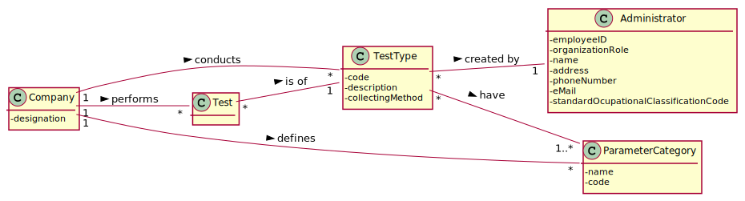
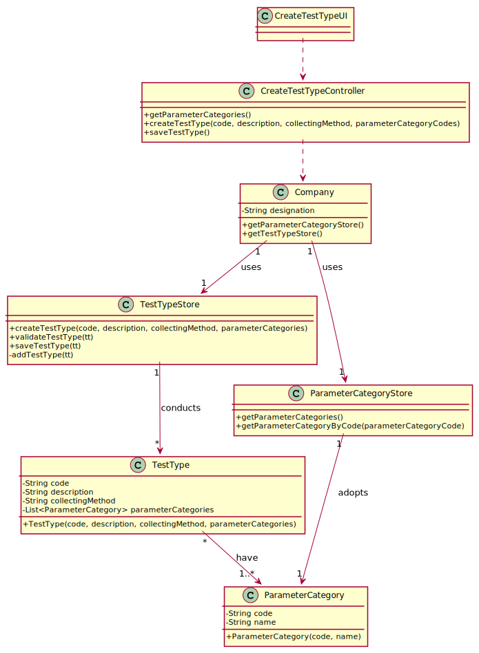

# US 9  - Create a Type of Test

## 1. Requirements Engineering

### 1.1. User Story Description

As an administrator, I want to specify a new type of test and its collecting methods.

### 1.2. Customer Specifications and Clarifications 

### From the Specifications Document:

* "Many Labs performs two types of tests. (…) (whether it is blood test or Covid test)."   
* "Despite being out of scope, the system should be developed having in mind the need to easily support other kinds of tests (e.g., urine)."

### From the client clarifications:

* Question: What are the data that characterize a test type?  
	* Answer: Simply consider a code, a description, the collecting method and a list of parameter categories.  

* Question: What are the business rules applicable to such data?  
	* Answer: Code should be a alphanumeric code, description a text, the collecting method a text and the parameter category. 

### 1.3. Acceptance Criteria

* AC1: Code must be a alphanumeric code.
* AC2: Description cannot be empty and has, at maximum, 15 chars.
* AC3: Collecting method cannot be empty and has, at maximum, 20 chars.

### 1.4. Found out Dependencies

No dependencies were found.

### 1.5 Input and Output Data

* ### Input Data
	* Typed data: code, description and collecting method.
	* Selected data: parameter category.
* ### Output Data
	* (In)Success of the operation

### 1.6. System Sequence Diagram (SSD)

### 1.7 Other Relevant Remarks

No relevant remarks.

## 2. OO Analysis

### 2.1. Relevant Domain Model Excerpt 

### 2.2. Other Remarks

No relevant remarks.

## 3. Design - User Story Realization 

### 3.1. Rationale

**The rationale grounds on the SSD interactions and the identified input/output data.**

| Interaction ID | Question: Which class is responsible for... | Answer  | Justification (with patterns)  |
|:-------------  |:--------------------- |:------------|:---------------------------- |
| Step 1  		 |							 |             |                              |
| Step 2  		 |							 |             |                              |
| Step 3  		 |							 |             |                              |
| Step 4  		 |							 |             |                              |
| Step 5  		 |							 |             |                              |
| Step 6  		 |							 |             |                              |              

### Systematization ##

According to the taken rationale, the conceptual classes promoted to software classes are: 

 * Company
 * TestTypeStore
 * ParameterCategoryStore
 * TestType
 * ParameterCategory

Other software classes (i.e. Pure Fabrication) identified:

 * TestTypeUI  
 * TesTypeController

## 3.2. Sequence Diagram (SD)

*In this section, it is suggested to present an UML dynamic view stating the sequence of domain related software objects' interactions that allows to fulfill the requirement.* 

## 3.3. Class Diagram (CD)

*In this section, it is suggested to present an UML static view representing the main domain related software classes that are involved in fulfilling the requirement as well as and their relations, attributes and methods.*

# 4. Tests 
*In this section, it is suggested to systematize how the tests were designed to allow a correct measurement of requirements fulfilling.* 

**_DO NOT COPY ALL DEVELOPED TESTS HERE_**

**Test 1:** Check that it is not possible to create an instance of the Example class with null values. 

	@Test(expected = IllegalArgumentException.class)
		public void ensureNullIsNotAllowed() {
		Exemplo instance = new Exemplo(null, null);
	}

*It is also recommended to organize this content by subsections.* 

# 5. Construction (Implementation)

No relevant remarks.

# 6. Integration and Demo 

*In this section, it is suggested to describe the efforts made to integrate this functionality with the other features of the system.*

# 7. Observations

*In this section, it is suggested to present a critical perspective on the developed work, pointing, for example, to other alternatives and or future related work.*

