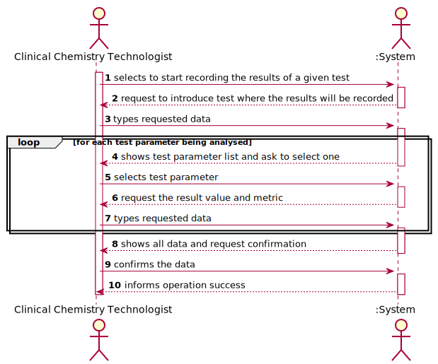
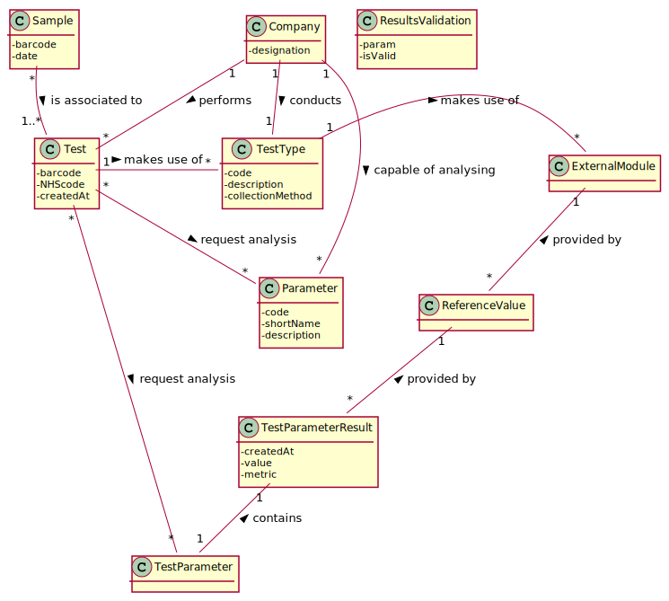

# US 012 - Record the Results of a given test

## 1. Requirements Engineering

### 1.1. User Story Description

"As a clinical chemistry technologist, I intend to record the results of a given test."

### 1.2. Customer Specifications and Clarifications 

**From the specifications document:**

> "At the company's headquarters, the clinical chemistry technologist receives the samples (delivered by a courier) and performs the chemical analysis, recording the results in the software application. (...)"
> "To facilitate and simplify the validation work performed by the specialist doctor, the application uses an external module that is responsible for doing an automatic validation using test reference values." 

> My interpretation:

> Basically, after performing the chemical analysis to the samples received, there is the need for the clinical chemistry technologist to record the results of it in the application. Furthermore, the application must automatically validate the results "pushed" to the application by the technologist taking into account the test reference values for each parameter. The automatic validation is done using an external module. Lastly, the automatic validation is done with the intention of facilitating the tasks performed by the Specialist Doctor (which is validating the tests).

**From the client clarifications:**

> **Question1:** When the Clinical Chemistry Technologist wants to record the results of a test, how does he has access to that test? By internal code, NHS code?.
> [Link](https://moodle.isep.ipp.pt/mod/forum/discuss.php?d=8301)
> > **Answer:** Each sample has a unique barcode. The clinical chemistry technologist should use the sample barcode number to find the test for which the sample was collected.

> **Question2:** Should the system present a result for each test parameter or a single result for the test to be recorded?
> [Link](https://moodle.isep.ipp.pt/mod/forum/discuss.php?d=8301)
> > **Answer:** The Clinical Chemistry Technologist should register a value/result for each parameter of the test.

> **Question3:** Does this "at most" express that there are some parameters of the API request that are optional? If so, could you clarify the parameters that are optional?
> [Link](https://moodle.isep.ipp.pt/mod/forum/discuss.php?d=8301)
> > **Answer:** "At most" means the maximum number of parameters that will be used. Depending on the API being used, all parameters above may be required or some may be optional. Did you already studied ESOFT (Protected Variations) and the APIs provided in moodle? Important: The number of parameters depends on the API that is being used.

> **Question4:** When the Clinical Chemistry Technologist wants to record the results of a test, how does he has access to that test? By internal code, NHS code?
> [Link] (https://moodle.isep.ipp.pt/mod/forum/discuss.php?d=8272)
> > **Answer:** Each sample has a unique barcode. The clinical chemistry technologist should use the sample barcode number to find the test for which the sample was collected.

> **Question5:** Should the system present a result for each test parameter or a single result for the test to be recorded?
> [Link] (https://moodle.isep.ipp.pt/mod/forum/discuss.php?d=8272)
> > **Answer:** The Clinical Chemistry Technologist should register a value/result for each parameter of the test.

### 1.3. Acceptance Criteria

The application should use an external module that is responsible for providing the test reference values. The application can use an external module for each type of test. For instance, when the results are for blood tests parameters, the externalmodule BloodReferenceValues1API can be used. When the results are for Covid-19 tests parameters, the external module CovidReferenceValues1API can be used. In any case, the API request should include, at most: (i) a key to access the module (e.g.:  “KEY1234”); (ii) a parameter identifier; (iii) the reference date; and (iv) reference measurement unit (e.g. "mg").

### 1.4. Found out Dependencies

There is a dependency on the US-10: "As an administrator, I want to specify a new parameter and categorize it.", since the automatic validation can't be done without the definition of a parameter. Moreover, the fact that it is needed to check for which test the resuls will be introduced, the Clinical Chemistry Technologist needs to scan a barcode that is contained in a sample, therefore there is a dependency with US-5: "As a medical lab technician, I want to record the samples collected in the scope of a given test", since the samples needs to have a barcode which is defined in this US.  Furthermore, there is a dependency with the US-4 "As a receptionist of the laboratory, I intend to register a test to be performed to a registered client", since it is only possible to record the results of a test if the test as been registered to a client, containing the parameters that were tested. Adittionally there is a dependency on the external module, since without it is impossible to validate the tests.

### 1.5 Input and Output Data

**Input Data:**

* Typed data:
	* Test Result value
	* API KEY
	* Reference date  

	
	
* Selected data:
	*Test parameter identifier*

**Output Data:**

*  List containing Parameters to be selected
* (In)Success of the operation

### 1.6. System Sequence Diagram (SSD)

*Insert here a SSD depicting the envisioned Actor-System interactions and throughout which data is inputted and outputted to fulfill the requirement. All interactions must be numbered.*

### 1.7 Other Relevant Remarks

In this User Story it is necessary to use an external module to automatically validate the tests given the parameters of which one of them. Aditionally it is natural to say that this US will be held quite frequently, since recording the test results is one of the core activities of this company.

## 2. OO Analysis

### 2.1. Relevant Domain Model Excerpt 

### 2.2. Other Remarks

none.

## 3. Design - User Story Realization 

### 3.1. Rationale

**The rationale grounds on the SSD interactions and the identified input/output data.**

| Interaction ID | Question: Which class is responsible for... | Answer  | Justification (with patterns)  |
|:-------------  |:--------------------- |:------------|:---------------------------- |
| Step 1  		 |	... interacting with the actor? | RecordTestResultUI   |  **Pure Fabrication**: there is no reason to assign this responsibility to any existing class in the Domain Model.           |
| 			  		 |	... coordinating the US? | RecordTestResultController | **Controller**                             |
| 			  		 |	... instantiating a new TestResult? | TestResultStore | **Creator (R1)** and **HC+LC**: By the application of the Creator (R1) it would be the "Company". But, by applying HC + LC to the "Company", this delegates that responsibility to the "TestResultStore"   |
| 			  		 | ... knowing the user using the system?  | AuthFacade  | **IE:** cf. A&A component documentation.  |
| 			  		 |	... knowing to which company the user belongs to? | App  | **IE:** has registed all Companies  |
| Step 2  		 | 	|	 |	  |
| Step 3 		 |	...saving the inputted data? | Test  | **IE:** the object Test has knows its own barcode.  |
| 			  		 | ... knowing if the test exists?  | TestStore | **IE:** knows all the tests in the system and therefore all the barcodes.  |
| Step 4  		 |	...knowing the Test Parameter list to show? | TestParameterStore  | **IE:** Test Parameter are defined by the ParameterStore, which are associated to a certain test. |
| Step 5  		 |	... saving the selected parameter? | TestParameterStore  | **IE:** TestParameterStore knows all the TestParameters and therefore knows the test parameters.  | 
| Step 6  		 |  |  | | 
| Step 7  		 |	...saving the inputted data?  | TestResult | **IE:** owns its data.|          
| Step 8  		 |	... validating all data (local validation)? | TestResult | **IE:** owns its data.| 
| 			  		 |	... validating all data (global validation)? | TestResultStore | **IE:** knows all its Test Results.| 
| 			  		 |	... saving the created Test Result? | TestResult | **IE:** owns all its TestResult.| 
| Step 9  		 |	| 	| 	|
| Step 10  		 |	... informing operation success?| RecordTestResultUI  | **IE:** is responsible for user interactions.  |               

### Systematization ##

According to the taken rationale, the conceptual classes promoted to software classes are: 

 * Test
 * TestResult

Other software classes (i.e. Pure Fabrication) identified: 

 * RecordTestResultUI  
 * RecordTestResultController
 * TestResultStore
 * TestStore
 * TestParameterStore
 
 Other software classes of external systems/components:

* AuthFacade
* ValidationAPI

## 3.2. Sequence Diagram (SD)

*In this section, it is suggested to present an UML dynamic view stating the sequence of domain related software objects' interactions that allows to fulfill the requirement.* 

## 3.3. Class Diagram (CD)

*In this section, it is suggested to present an UML static view representing the main domain related software classes that are involved in fulfilling the requirement as well as and their relations, attributes and methods.*

# 4. Tests 
*In this section, it is suggested to systematize how the tests were designed to allow a correct measurement of requirements fulfilling.* 

**_DO NOT COPY ALL DEVELOPED TESTS HERE_**

**Test 1:** Check that it is not possible to create an instance of the Example class with null values. 

	@Test(expected = IllegalArgumentException.class)
		public void ensureNullIsNotAllowed() {
		Exemplo instance = new Exemplo(null, null);
	}

*It is also recommended to organize this content by subsections.* 

# 5. Construction (Implementation)

*In this section, it is suggested to provide, if necessary, some evidence that the construction/implementation is in accordance with the previously carried out design. Furthermore, it is recommeded to mention/describe the existence of other relevant (e.g. configuration) files and highlight relevant commits.*

*It is also recommended to organize this content by subsections.* 

# 6. Integration and Demo 

*In this section, it is suggested to describe the efforts made to integrate this functionality with the other features of the system.*

# 7. Observations

*In this section, it is suggested to present a critical perspective on the developed work, pointing, for example, to other alternatives and or future related work.*

