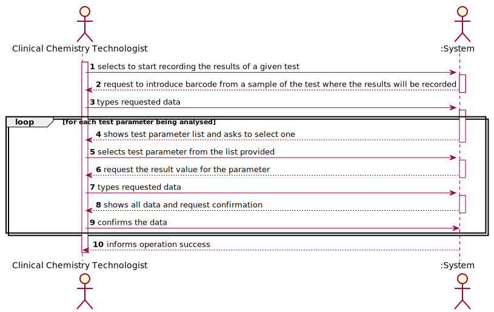
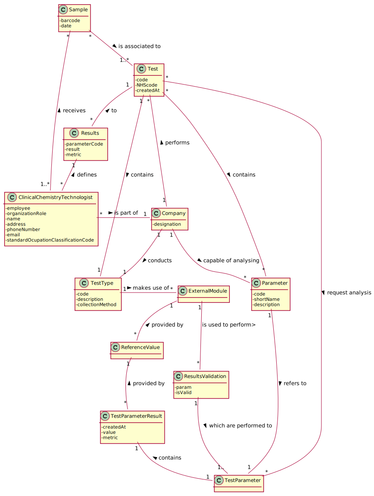
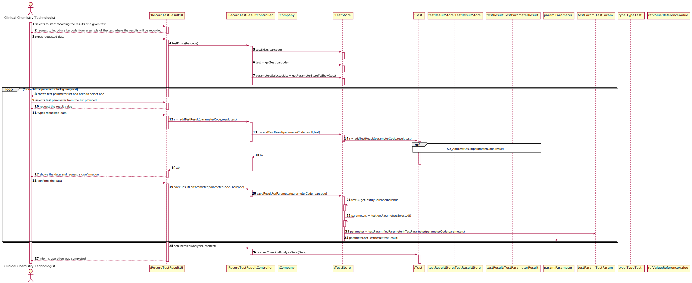
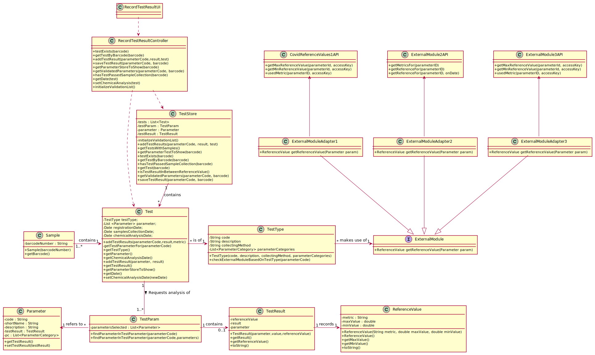

# US 012 - Record the Results of a given test

## 1. Requirements Engineering

### 1.1. User Story Description

"As a clinical chemistry technologist, I intend to record the results of a given test."

### 1.2. Customer Specifications and Clarifications 

**From the specifications document:**

> "At the company's headquarters, the clinical chemistry technologist receives the samples (delivered by a courier) and performs the chemical analysis, recording the results in the software application. (...)"
> "To facilitate and simplify the validation work performed by the specialist doctor, the application uses an external module that is responsible for doing an automatic validation using test reference values." 

> My interpretation:

> Basically, after performing the chemical analysis to the samples received, there is the need for the clinical chemistry technologist to record the results of it in the application. Furthermore, the application must automatically validate the results recorded to the application by the Clinical Chemistry Technologist taking into account the test reference values for each parameter. The automatic validation is done using an external module. Lastly, the automatic validation is done with the intention of facilitating the tasks performed by the Specialist Doctor (which is validating the tests).

**From the client clarifications:**

> **Question1:** When the Clinical Chemistry Technologist wants to record the results of a test, how does he has access to that test? By internal code, NHS code?.
> [Link](https://moodle.isep.ipp.pt/mod/forum/discuss.php?d=8301)
> > **Answer:** Each sample has a unique barcode. The clinical chemistry technologist should use the sample barcode number to find the test for which the sample was collected.

> **Question2:** Should the system present a result for each test parameter or a single result for the test to be recorded?
> [Link](https://moodle.isep.ipp.pt/mod/forum/discuss.php?d=8301)
> > **Answer:** The Clinical Chemistry Technologist should register a value/result for each parameter of the test.

> **Question3:** Does this "at most" express that there are some parameters of the API request that are optional? If so, could you clarify the parameters that are optional?
> [Link](https://moodle.isep.ipp.pt/mod/forum/discuss.php?d=8301)
> > **Answer:** "At most" means the maximum number of parameters that will be used. Depending on the API being used, all parameters above may be required or some may be optional. Did you already studied ESOFT (Protected Variations) and the APIs provided in moodle? Important: The number of parameters depends on the API that is being used.

> **Question4:** When the Clinical Chemistry Technologist wants to record the results of a test, how does he has access to that test? By internal code, NHS code?
> [Link](https://moodle.isep.ipp.pt/mod/forum/discuss.php?d=8272)
> > **Answer:** Each sample has a unique barcode. The clinical chemistry technologist should use the sample barcode number to find the test for which the sample was collected.

> **Question5:** Should the system present a result for each test parameter or a single result for the test to be recorded?
> [Link](https://moodle.isep.ipp.pt/mod/forum/discuss.php?d=8272)
> > **Answer:** The Clinical Chemistry Technologist should register a value/result for each parameter of the test.

> **Question6:** Wouldn't you prefer to choose a test to make the results from a list, instead of doing it by entering a barcode for that test? The interaction would be more direct clear and intuitive, but what is your decision?
> [Link](https://moodle.isep.ipp.pt/mod/forum/discuss.php?d=8475)
> > **Answer:** Please check my previous answer: https://moodle.isep.ipp.pt/mod/forum/discuss.php?d=8301#p10894

> **Question7:** What information is the system going to have to ask the clinical chemistry technologist to be able to create the test results?
> [Link](https://moodle.isep.ipp.pt/mod/forum/discuss.php?d=8272)
> > **Answer:** A1:The clinical chemistry technologist should use the sample barcode number to find (in the system) the test for which the sample was collected. A2: The Clinical Chemistry Technologist should register a value/result for each parameter of the (selected) test. All parameter values of the test should be filled/defined (by the Clinical Chemistry Technologist) when the use case finishes.

> **Question8:** When you intend to record the results of the Blood Test, do you want to introduce all results for all parameters or just only one?
> [Link](https://moodle.isep.ipp.pt/mod/forum/discuss.php?d=8607)
> > **Answer:** The clinical chemistry technologist should record all results related to a test at a given time/moment.

> **Question9:** The results of the tests can be negative or there are any restriction in this particular variable?
> [Link](https://moodle.isep.ipp.pt/mod/forum/discuss.php?d=8647)
> > **Answer:** The result/value of one parameter is related with the type of parameter we are measuring. To get an idea, please check the values returned by the external modules (jar APIs).

### 1.3. Acceptance Criteria

The application should use an external module that is responsible for providing the test reference values. The application can use an external module for each type of test. For instance, when the results are for blood tests parameters, the externalmodule BloodReferenceValues1API can be used. When the results are for Covid-19 tests parameters, the external module CovidReferenceValues1API can be used. In any case, the API request should include, at most: (i) a key to access the module (e.g.:  “KEY1234”); (ii) a parameter identifier; (iii) the reference date; and (iv) reference measurement unit (e.g. "mg").

### 1.4. Found out Dependencies

There is a dependency on the US-10: "As an administrator, I want to specify a new parameter and categorize it.", since the automatic validation can't be done without the definition of a parameter. Moreover, the fact that it is needed to check for which test the resuls will be introduced, the Clinical Chemistry Technologist needs to scan a barcode that is contained in a sample, therefore there is a dependency with US-5: "As a medical lab technician, I want to record the samples collected in the scope of a given test", since the samples needs to have a barcode which is defined in this US.  Furthermore, there is a dependency with the US-4 "As a receptionist of the laboratory, I intend to register a test to be performed to a registered client", since it is only possible to record the results of a test if the test as been registered to a client, containing the parameters that were tested. Adittionally there is a dependency on the external module, since without it is impossible to validate the tests.

### 1.5 Input and Output Data

**Input Data:**

* Typed data:
	* Test Result value
	* Barcode

	
* Selected data:
	*Test parameter identifier*

**Output Data:**

*  List containing Parameters to be selected
* (In)Success of the operation

### 1.6. System Sequence Diagram (SSD)

### 1.7 Other Relevant Remarks

In this User Story it is necessary to use an external module to automatically validate the tests given the parameters of which one of them. Aditionally it is natural to say that this US will be held quite frequently, since recording the test results is one of the core activities of this company.

## 2. OO Analysis

### 2.1. Relevant Domain Model Excerpt 

### 2.2. Other Remarks

none.

## 3. Design - User Story Realization 

### 3.1. Rationale

**The rationale grounds on the SSD interactions and the identified input/output data.**

| Interaction ID | Question: Which class is responsible for... | Answer  | Justification (with patterns)  |
|:-------------  |:--------------------- |:------------|:---------------------------- |
| Step 1  		 |	... interacting with the actor? | RecordTestResultUI   |  **Pure Fabrication**: there is no reason to assign this responsibility to any existing class in the Domain Model.           |
| 			  		 |	... coordinating the US? | RecordTestResultController | **Controller**                             |
| 			  		 |	... instantiating a new TestResult? | TestResultStore | **Creator (R1)** and **HC+LC**: By the application of the Creator (R1) it would be the "Company". But, by applying HC + LC to the "Company", this delegates that responsibility to the "TestResultStore"   |
| 			  		 | ... knowing the user using the system?  | AuthFacade  | **IE:** cf. A&A component documentation.  |
| 			  		 |	... knowing to which company the user belongs to? | App  | **IE:** has registed all Companies  |
| Step 2  		 | 	|	 |	  |
| Step 3 		 |	...saving the inputted data? | Test  | **IE:** the object Test has knows its own barcode.  |
| 			  		 | ... knowing if the test with the barcode inputted exists?  | TestStore | **IE:** knows all the tests in the system and therefore all the barcodes.  |
| Step 4  		 |	...knowing the Test Parameter Selected list to show? | TestStore  | **IE:** A test has associated to itself the test parameters that were selected beforehand, therefore it is him who is the IE |
| Step 5  		 |	... saving the selected parameter? | Test  | **IE:** The test knows all its selected parameters  | 
| Step 6  		 |  |  | | 
| Step 7  		 |	...saving the inputted data?  | TestResult | **IE:** owns its data.|  
| 		 |	...knowing the test type of the Test?  | Test | **IE:** owns its data.|    
|  		 |	...knowing what API to use according the testType?  | ExternalModule | **Protected Variation:** There is a point of variation at this point, therefore it is necessary to implement a stable interface to reduce possible undesirable impact on other system' elements .|               
| Step 8  		 |	... validating all data (local validation)? | TestResult | **IE:** owns its data.| 
| 			  		 |	... validating all data (global validation)? | TestResultStore | **IE:** knows all its Test Results.| 
| 			  		 |	... saving the created Test Result? | TestResultStore | **IE:** owns all its TestResult.| 
| 			  		 |	... associating the TestResult to the Test? | TestResultStore | **IE:** owns all its TestResult.| 
| 			  		 |	... adding the Chemical Analysis Date ? | TestStore | **IE:** owns all its tests and therefore all its business transition dates.| 
| Step 9  		 |	| 	| 	|
| Step 10  		 |	... informing operation success?| RecordTestResultUI  | **IE:** is responsible for user interactions.  |               

### Systematization ##

According to the taken rationale, the conceptual classes promoted to software classes are: 

 * Test
 * TestResult

Other software classes (i.e. Pure Fabrication) identified: 

 * RecordTestResultUI  
 * RecordTestResultController
 * TestResultStore
 * TestStore
 * App
 
 Other software classes of external systems/components:

* AuthFacade
* ExternalModule

## 3.2. Sequence Diagram (SD)

## 3.3. Class Diagram (CD)

# 4. Tests 

**Class TestResult**

**Test 1:** Check that it is not possible to create an instance of the Test class with null values. 

	@Test(expected = IllegalArgumentException.class)
		public void ensureNullIsNotAllowed() {
		TestResult instance = new TestResult(null, null, null);
	}
**Test 2:** Check that the test result is created correctly.
	@Test
    public void getResult() {
       
        double result = 170;
        TestResult testResult = new TestResult(parameter, result, referenceValue);
        double actual = testResult.getResult();
        double expected = 170;
        assertEquals(expected, actual, 0.01);
    }
**Test 3:** Check that the test result when the testtype is from blood is created correctly.
    @Test
    public void getResultForBlood() {
        ParameterCategory parameterCategory = new ParameterCategory("CAT02", "Category02");
        List<ParameterCategory> pcl = new ArrayList<>();
        pcl.add(parameterCategory);
        Parameter parameter = new Parameter("IgGAN", "IgC", "Antibodies", pcl);
        double result = 1;
        ReferenceValue referenceValue = new ReferenceValue("10e9L", 1.4D, 0);
        TestResult testResult = new TestResult(parameter, result, referenceValue);
        double actual = testResult.getResult();
        ReferenceValue actualReferenceValue = testResult.getReferenceValue();
        double expected = 1;
        ReferenceValue expectedReferenceValue = referenceValue;
        assertEquals(expected, actual, 0.01);
        assertEquals(expectedReferenceValue, actualReferenceValue);
    }
**Test 4:** Check that the test result when the reference value from a test with a blood testtype is created correctly.
    @Test
    public void getReferenceValue() {
        ParameterCategory parameterCategory = new ParameterCategory("PLT00", "plalets");
        List<ParameterCategory> pcl = new ArrayList<>();
        pcl.add(parameterCategory);
        Parameter parameter = new Parameter("PLT00", "plalets", "Plalets", pcl);
        double result = 170;
        ReferenceValue referenceValue = new ReferenceValue("10e9L", 450, 150);
        TestResult testResult = new TestResult(parameter, result, referenceValue);
        ReferenceValue actual = testResult.getReferenceValue();
        ReferenceValue expected = referenceValue;
        assertEquals(expected, actual);
    }
	
	
	**Class ReferenceValue**

**Test 5:** Check that that the Reference Maximum Value for a test is created. 

 @Test
    public void getMaxValue() {
        ReferenceValue referenceValue = new ReferenceValue("10e9L", 450, 150);
        double actual = referenceValue.getMaxValue();
        double expected = 450;
        assertEquals(expected,actual,0.01);
    }
**Test 6:** Check that that the Reference Minimum Value for a test is created. 
    @Test
    public void getMinValue() {
        ReferenceValue referenceValue = new ReferenceValue("10e9L", 450, 150);
        double actual = referenceValue.getMinValue();
        double expected = 150;
        assertEquals(expected,actual,0.01);
    }
	
	
	
		**Class TestStore**

**Test 7:** Check that when a test is created it can find it using its barcode.

@Test
    public void getTestByBarcode() {
        TestStore ts = new TestStore();
        app.domain.model.Test t = ts.createTest("abcdefghijkl", "900000000000", c, tt1, pc, par, data);
        ts.saveTest(t);
        TestType testType = new TestType("aaaaa","aaaaa","aab",cat);
        Sample sample = new Sample("11111117112");
        List<Sample> sampleList = new ArrayList<>();
        sampleList.add(sample);
        t.setSamples(sampleList);
        app.domain.model.Test actual = ts.getTestByBarcode("11111117112");
        app.domain.model.Test expected = t;
        assertEquals(expected,actual);

    }
	
	**Test 8:** Check that it can not find a test that does not exist.

@Test
    public void getTestByBarcodeNull() {
        TestStore ts = new TestStore();
        app.domain.model.Test t = ts.createTest("abcdefghijkl", "900000000000", c, tt1, pc, par, data);
        ts.saveTest(t);
        TestType testType = new TestType("aaaaa","aaaaa","aab",cat);
        Sample sample = new Sample("11111117112");
        List<Sample> sampleList = new ArrayList<>();
        sampleList.add(sample);
        t.setSamples(sampleList);
        app.domain.model.Test actualNull = ts.getTestByBarcode("11131117112");
        assertNull(actualNull);
    }
	
	
	**Test 9:** Check that it only finds the tests with samples and not the others.
	
	@Test 
    public void getTestsWithSamples() {
        
        TestStore ts = new TestStore();
        app.domain.model.Test t = ts.createTest("abcdefghijkl", "900000000000", c, tt1, pc, par, data);
        ts.saveTest(t);
        TestType testType = new TestType("aaaaa","aaaaa","aab",cat);
        Sample sample = new Sample("11111117112");
        List<Sample> sampleList = new ArrayList<>();
        sampleList.add(sample);
        t.setSamplesCollectionDate(data);
        t.setSamples(sampleList);
        List<app.domain.model.Test> actual = ts.getTestsWithSamples();
        List<app.domain.model.Test> expected = ts.getTests();
        assertEquals(expected,actual);

    }
	
	**Test 10:** Check that it can get all the tests available from all the clinical analysis laboratories.
	@Test
    public void getTests() {
		TestStore ts = new TestStore();
        app.domain.model.Test t = ts.createTest("abcdefghijkl", "900000000000", c, tt1, pc, par, data);
        ts.saveTest(t);
        TestType testType = new TestType("aaaaa","aaaaa","aab",cat);
        Sample sample = new Sample("11111117112");
        List<Sample> sampleList = new ArrayList<>();
        sampleList.add(sample);
        t.setSamples(sampleList);
        app.domain.model.Test actual = ts.getTest("11111117112");
        app.domain.model.Test actualNull = ts.getTest("11131117112");
        app.domain.model.Test expected = t;
        assertEquals(expected,actual);
        assertNull(actualNull);

    }
	
		**Class ResultOfTestStore**
		
		**Test 11:** Check that that it adds the testResult to the respect TestResultStore.
	
	@Test
    public void addTestResult() {
       
        TestStore ts = new TestStore();
        app.domain.model.Test t = ts.createTest("abcdefghijkl", "900000000000", c, tt1, pc, par, data);
        ts.saveTest(t);
        TestType testType = new TestType("aaaaa","aaaaa","aab",cat);
        Sample sample = new Sample("11111117112");
        List<Sample> sampleList = new ArrayList<>();
        sampleList.add(sample);
        t.setSamples(sampleList);
        ResultOfTestStore resultOfTestStore = new ResultOfTestStore();

        TestResult actual = resultOfTestStore.addTestResult(par1,170,new ReferenceValue("cm3",180,130));
        List<app.domain.model.TestResult> expected = resultOfTestStore.getResultOfTest();
        TestResult testResultexpected = expected.get(0);

        assertEquals(testResultexpected,actual);
    }
	

(...)

# 5. Construction (Implementation)

**Class TestResult**

public class TestResult {
	ReferenceValue referenceValue;
    double result;
    Parameter parameter;

    public TestResult(Parameter parameter, double result, ReferenceValue referenceValue) {
        this.parameter = parameter;
        this.result = result;
        this.referenceValue = referenceValue;
    }

    public double getResult() {
        return result;
    }

    public ReferenceValue getReferenceValue() {
        return referenceValue;
    }

    @Override
    public String toString() {
        return "ResultOfTest{" +
                "result=" + result +
                ", refValue=" + referenceValue +
                '}';
    }

}

**Class ResultOfTestStore**

public class ResultOfTestStore {
 private final List<TestResult> resultOfTestsStore;
    private List<Test> test;

    /**
     * empty constructor of the class ClientList which initializes the arraylist.
     */
    public ResultOfTestStore() {
        this.resultOfTestsStore = new ArrayList<>();
    }

    public TestResult addTestResult(Parameter parameter, double result, ReferenceValue referenceValue) {
        TestResult testResult = new TestResult(parameter, result, referenceValue);
        resultOfTestsStore.add(testResult);
        return testResult;
    }

    public List<TestResult> getResultOfTest() {
        return new ArrayList<>(this.resultOfTestsStore);
    }
}

**Class TestStore**   

 public class TestStore {  
    public boolean testExists(String barcode) {
        for (Test t : this.tests) {
            for (Sample samplesOfATest : t.getSamples()) {
                if (samplesOfATest.getBarcode().equals(barcode)) {
                    return true;
                }
            }
        }
        return false;
    }

    public Test getTestByBarcode(String barcode) {
        for (Test t : this.tests) {
            for (Sample samplesOfATest : t.getSamples()) {
                if (samplesOfATest.getBarcode().equals(barcode)) {
                    return t;
                }
            }
        }
        return null;
    }

    public List<Parameter> getParameterTestToShow(String barcode) {
        Test test = getTestByBarcode(barcode);
        return test.getParameterStoreToShow();
    }

     public void saveTestResult(String parameterCode,String barcode) {
        Test test = getTestByBarcode(barcode);
        List<Parameter> parameters = test.getParameter();
        parameter = testParam.findParameterInTestParameter(parameterCode,parameters);
        parameter.setTestResult(testResult);
    }

    ...
    }
	
	
	**Class Test**   
	
 public class Test {  
 
    private final TestType testType;
    private List<Parameter> parameter = new ArrayList<>();
    private Date chemicalAnalysisDate;
    private final ResultOfTestStore resultOfTestStore = new ResultOfTestStore();
 
 public TestResult addTestResult(Parameter parameter, double result) {

        ReferenceValue referenceValue = testType.checkExternalModuleBasedOnTestType(parameter);

        return resultOfTestStore.addTestResult(parameter, result, referenceValue);
    }
 
 public List<TestResult> getTestResult() {
        return resultOfTestStore.getResultOfTest();
    }
	
    public List<Parameter> getParameterStoreToShow() {
        List<Parameter> parametersToShow = new ArrayList<>();
            parametersToShow.addAll(this.parameter);
        return parametersToShow;
    }

    public void setChemicalAnalysisDate(Date newDate){
        this.chemicalAnalysisDate=newDate;
    }
	
	public Date getChemicalAnalysisDate() {
        return chemicalAnalysisDate;
    }
	
	
	
	
}

	**Class TestParam**   
	
public class TestParam {
    List<Parameter> parametersSelected;
    public TestParam(Test test) {
        this.parametersSelected = test.getParameter();
    }

    public Parameter findParameterInTestParameter(String parameterCode) {
        for (Parameter parameter : parametersSelected) {
            if (parameter.getCode().equals(parameterCode)) {
                return parameter;
            }
        }
        return null; // not found
    }
    public Parameter findParameterInTestParameter(String parameterCode,List<Parameter> parameters) {
        for (Parameter parameter : parameters) {
            if (parameter.getCode().equals(parameterCode)) {
                return parameter;
            }
        }
        return null; // not found
    }

}

	**Class ReferenceValue** 

public class ReferenceValue {
    private final String metric;
    private final double maxValue;
    private final double minValue;

    private static final String METRIC_DEFAULT = "No metric";
    private static final double MAXVALUE_DEFAULT = 0;
    private static final double MINVALUE_DEFAULT = 0;

    public double getMaxValue() {
        return maxValue;
    }

    public double getMinValue() {
        return minValue;
    }

    public ReferenceValue() {
        metric = METRIC_DEFAULT;
        maxValue = MAXVALUE_DEFAULT;
        minValue = MINVALUE_DEFAULT;
    }

    public ReferenceValue(String metric, double maxValue, double minValue) {
        this.metric = metric;
        this.maxValue = maxValue;
        this.minValue = minValue;
    }

    @Override
    public String toString() {
        return "ReferenceValue{" +
                "metric='" + metric + '\'' +
                ", maxValue=" + maxValue +
                ", minValue=" + minValue +
                '}';
    }
}

# 6. Integration and Demo 

This US contains a lot of integrations with other US whether it is from Sprint B or C. With that being said, there were efforts to integrate this US12 - "As a clinical chemistry technologist, I intend to record the results of a given test." with the US-4 and US-5 which have critical information for the implementation of the US-12. Aditionally, there is the need to automatically validate the test results added in this US by using an external module to handle this. This external module contains 3 automatic validation API at the moment, but there is room for more API when needed, that can be add using the Protected Variation pattern and using the configuration file available on the src folder.

# 7. Observations

This US will have to be integrated in the GUI aftwards and at the moment it wasn't used DTO since the number of attributes behind handled with is quite small. The integration of DTOs is a route for further improving this US which will be taken into account in the next Sprint.

