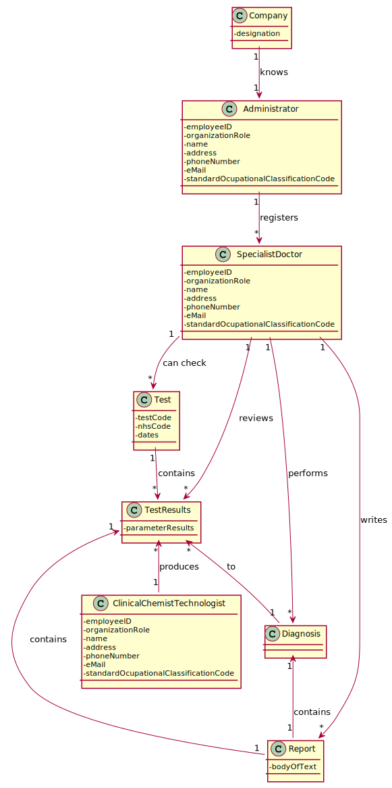
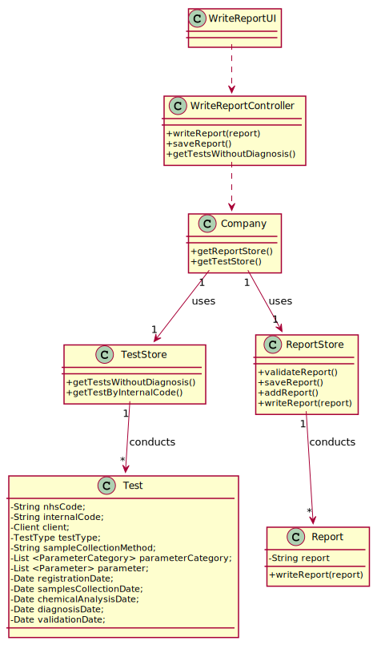

# US 14 - Make the diagnosis and write a report for a given test

## 1. Requirements Engineering

### 1.1. User Story Description

As a specialist  doctor, I intend to make the diagnosis  and write a report for a given test.

### 1.2. Customer Specifications and Clarifications 

**From the specifications document**

"After completing the chemical analysis, the results of all chemical analyses are analysed by a
specialist doctor who makes a diagnosis and writes a report that afterwards will be delivered to the
client"

**From the client clarifications**

* **Question1:** Is there a limit of characters for the report and the diagnosis that will be made by the Specialist Doctor?
[Link](https://moodle.isep.ipp.pt/mod/forum/discuss.php?d=8182)
	* **Answer1:** Yes, at most 400 words.

* **Question2:** Regarding the tests that the Specialist Doctor can write a report about. Should the SD chose from a list of tests? and Should him only receive a list of test that have completed all the previous steps?
[Link](https://moodle.isep.ipp.pt/mod/forum/discuss.php?d=8250)
	* **Answer2:** The system shows all tests ready (that have completed all the previous steps) to make the diagnosys and the Specialist Doctor selects one test. 
Then, the Specialist Doctor writes the report for the selected test. 

* **Question3:** Can the Specialist Doctor edit a report once it has already been written? If yes, in what occasion should he be able to edit? Can he edit after the Laboratory Coordinator has already approved the report?
[Link](https://moodle.isep.ipp.pt/mod/forum/discuss.php?d=8268)
	* **Answer3:** No. No.

* **Question4:** Once the specialist doctor decides to write the report for a given test, should the results of the chemical analysis and the reference values be presented on the screen? If not, how should the specialist doctor access the data related to the diagnosis he needs to make?
[Link](https://moodle.isep.ipp.pt/mod/forum/discuss.php?d=8497)
	* **Answer4:** After selecting a test (to make the diagnosis/report) the results of the chemical analysis and the reference values should be presented on the screen. Then the Specialist Doctor should write the report.

* **Question5:** While in the "Make a diagnosis and write a report" option of the main menu, should the specialist doctor be able to make a diagnosis and write a report for more than one test? Or does he need to exit and enter the "Make a diagnosis and write a report" option every time he wants to make a new diagnosis and write a new report?
[Link](https://moodle.isep.ipp.pt/mod/forum/discuss.php?d=8497)
	* **Answer5:** After writing a report the SD can choose to write other reports without leaving the use case.

* **Question6:** Although it was not asked for, should we order the list of tests to be displayed by date of chemical analysis older to newer?
[Link](https://moodle.isep.ipp.pt/mod/forum/discuss.php?d=8571)
	* **Answer6:** Sorting is not required in this sprint.

### 1.3. Acceptance Criteria

AC1: The report must be at most 400 words.

### 1.4. Found out Dependencies

This US has dependency with the US04 - (As a receptionist  of the  laboratory,  I intend  to  register  a test  to  be performed  to a registered  client.), US05 - (As a medical lab technician,  I want to record the samples collected  in the scope of a given test.) and US12 - (As a clinical chemistry technologist, I intend to record the results of a given test.), because the specialist doctor needs to access the tests that have completed all the previous steps to make a diagnosis.

### 1.5 Input and Output Data

**Input Data**

* Selected data(Test to be analysed)

* Typed data (report)
	

**Output data:**

* (In)Success of the operation.

### 1.6. System Sequence Diagram (SSD)

### 1.7 Other Relevant Remarks

*Use this section to capture other relevant information that is related with this US such as (i) special requirements ; (ii) data and/or technology variations; (iii) how often this US is held.* 

## 2. OO Analysis

### 2.1. Relevant Domain Model Excerpt 

### 2.2. Other Remarks

*Use this section to capture some aditional notes/remarks that must be taken into consideration into the design activity. In some case, it might be usefull to add other analysis artifacts (e.g. activity or state diagrams).* 

## 3. Design - User Story Realization 

### 3.1. Rationale

| Interaction ID | Question: Which class is responsible for... | Answer  | Justification (with patterns)  |
|:-------------  |:--------------------- |:------------|:---------------------------- |
| Step 1		 |...interacting with the actor |WriteReportUI|Pure Fabrication: there is no reason to assign this responsability to any existing class in the Domain Model. |
|			 |...coordenating the US        |WriteReportController |Controller |
| 			  		 | ... knowing the user using the system?  | UserSession  | IE: knows who is logged in.  |
| Step 2  		 |...knowing the tests to be analysed? |TestResult|IE: Test has the list of tests ready to be analysed. |
| Step 3  		 |	...saving the test chosen? | Report| IE: object created in step 1 has its own data.  |
| Step 4  		 |	...knowing the test to show? | TestRusult| IE: Test has the list of tests ready to be analysed. |
| 			 |	... requesting the needed data? |WriteReportUI| IE: run method. | 
| Step 5  		 |	... saving the typed data? | Report| IE: object created in step 1 is classified in one or more test types.  |
| Step 6  		 |	... asking for a confirmation	|WriteReportUI|IE: is responsible for user interactions.                              |              
| Step 7  		 |	... validating all data (local validation)? | Report| IE: owns its data.| 
| 			  		 |	... validating all data (global validation)? | ReportStore | IE: knows all its tasks.| 
| 			  		 |	... saving the created task? | ReportStore| IE: owns all its tasks.| 
| Step 8  		 |	... informing operation success?| WriteReportUI| IE: is responsible for user interactions.  |              

### Systematization ##

According to the taken rationale, the conceptual classes promoted to software classes are: 

 * Report
 * ReportStore
 * TestResult
 * Company

Other software classes (i.e. Pure Fabrication) identified: 

 * WriteReportUI  
 * WriteReportController

## 3.2. Sequence Diagram (SD)

## 3.3. Class Diagram (CD)

*In this section, it is suggested to present an UML static view representing the main domain related software classes that are involved in fulfilling the requirement as well as and their relations, attributes and methods.*

# 4. Tests 
*In this section, it is suggested to systematize how the tests were designed to allow a correct measurement of requirements fulfilling.* 

**_DO NOT COPY ALL DEVELOPED TESTS HERE_**

**Test 1:** Check that it is not possible to create an instance of the Example class with null values. 

	@Test(expected = IllegalArgumentException.class)
		public void ensureNullIsNotAllowed() {
		Exemplo instance = new Exemplo(null, null);
	}

*It is also recommended to organize this content by subsections.* 

# 5. Construction (Implementation)

*In this section, it is suggested to provide, if necessary, some evidence that the construction/implementation is in accordance with the previously carried out design. Furthermore, it is recommeded to mention/describe the existence of other relevant (e.g. configuration) files and highlight relevant commits.*

*It is also recommended to organize this content by subsections.* 

# 6. Integration and Demo 

*In this section, it is suggested to describe the efforts made to integrate this functionality with the other features of the system.*

# 7. Observations

*In this section, it is suggested to present a critical perspective on the developed work, pointing, for example, to other alternatives and or future related work.*

