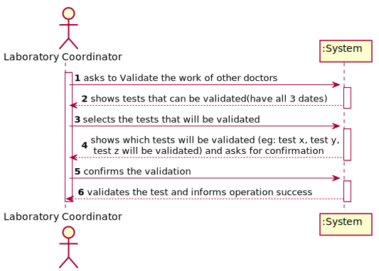
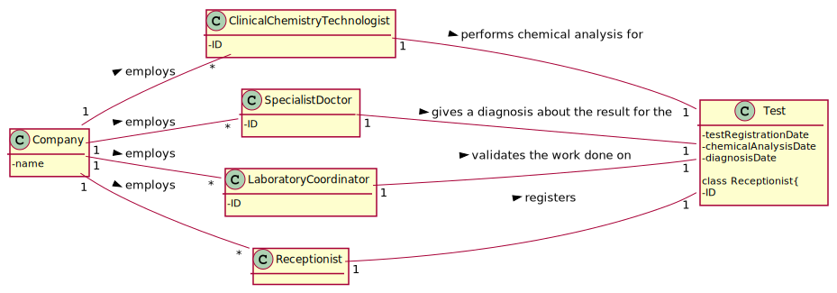
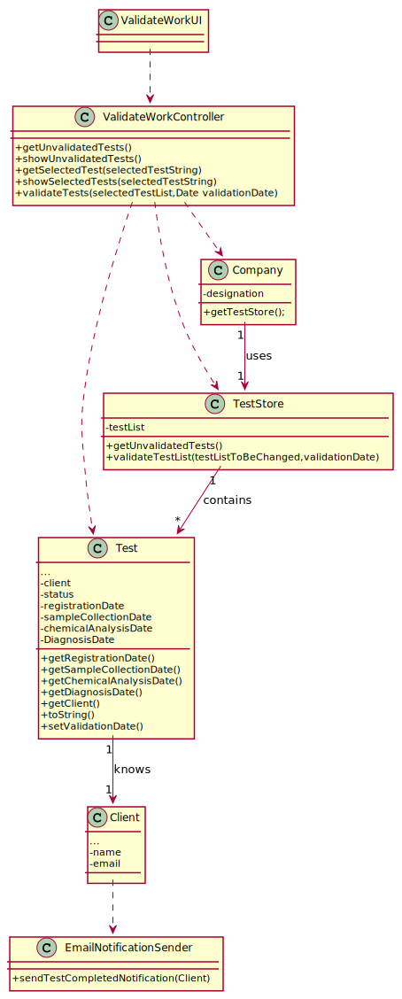

# US 15 - To validate the work done.

## 1. Requirements Engineering

### 1.1. User Story Description

5: As a laboratory coordinator, I want to validate the work done by the clinical chemistry technologist and specialist doctor.

### 1.2. Customer Specifications and Clarifications 

**From the specifications document:**

>	After the specialist doctor has completed the diagnosis, the results of the clinical analyses and the report become available in the system and must be validated by the laboratory coordinator. To validate the work done, the laboratory coordinator checks the chemical test/result and associated diagnosis made and confirms that everything was done correctly.

**From the client clarifications:**

> **Question:**Q: Regarding to US 15, what information does the laboratory coordinator needs to be able do validate a test? We got from the description that it's suposed to show all dates. Should the system provide any more information?
>  
> **Answer:** Only the dates. Moreover, the system should record the validation date.

-

> **Question:** When the laboratory coordinator wants to validate a test does all the tests available show up for him or does he search using a code that identifies a specific test?
>  
> **Answer:** The system shows all tests ready to validate (tests that already have the test registration date, the chemical analysys date and the diagnosis date registered in the system) and the laboratory coordinator selects one or more tests to mark as validated.

-

> **Question:** What should happen to a test if either the test report or the results are invalid? Should we prompt for a redo of either process or simply erase the test?
>  
> **Answer:** The laboratory coordinator only sees the test dates of tests that already have all dates registered in the system (test registration date, the chemical analysys date and the diagnosis date). The objective of this user story is only for the laboratory coordinator to be aware of the work developed in the chemical laboratory and to mark the job as done.
### 1.3. Acceptance Criteria

* **AC1:** The system does not show client personal information but shows all dates (test registration date, chemical analysis date and diagnosis date).

### 1.4. Found out Dependencies

* There is a dependency to "US012 Test results recording" since I need to create a validation for their results.
* There is a dependency to "US014 Diagnosis and Report Writing" since I need to create a validation for their diagnosis.
* There is a dependency to "US004 Test Registration" since the laboratory coordinator needs the test registration date.

### 1.5 Input and Output Data

**Input Data:**

* Typed data:
	* Confirmation requests answer (?)
	* Review notes (?)
	
* Selected data:
	* Client to confirm.

**Output Data:**

* Client's test registration date.
* Client's diagnosis.(and its date)
* Client's test results.(and its date)

### 1.6. System Sequence Diagram (SSD)

**Alternative 1**

**Other alternatives might exist.**

### 1.7 Other Relevant Remarks

* There should be an option to validate all the work at once.

## 2. OO Analysis

### 2.1. Relevant Domain Model Excerpt 

### 2.2. Other Remarks

n/a

## 3. Design - User Story Realization 

### 3.1. Rationale

**SSD - Alternative 1 is adopted.**

| Interaction ID | Question: Which class is responsible for... | Answer  | Justification (with patterns)  |
|:-------------  |:--------------------- |:------------|:---------------------------- |
| Step 1  		 |	... interacting with the actor? | ValidateWorkUI   |  Pure Fabrication: there is no reason to assign this responsibility to any existing class in the Domain Model.           |
| 			  		 |	... coordinating the US? | ValidateWorkController | Controller                             |
|                    | ... knowing the user using the system?  | UserSession  | IE: Auth component documentation.  |
| Step 2  		 |	...knowing the tests to show? | Company  | IE: The Company class has a TestStore that contains the tests to be validated. |
|                | ...knowing the test that can be validated | Test | IE: The Test class has a parameter that is used to determine its status and it knows its own data.|
| Step 3  		 |	... validating the selected tests. | Test  | IE: The Test Classes inside the TestStore will change their status to a validated status  |
| Step 4  		 |	... saving the validated tests.|TestStore| IE: The TestStore Class contains the Test objects.						 |                                           |              
| Step 5  		 |	... informing operation success?| ValidateWorkUI | IE: is responsible for user interactions.|  
### Systematization ##

This software only uses and manipulates classes that already exist.

Other software classes (i.e. Pure Fabrication) identified: 

 * ValidateWorkUI  
 * ValidateWorkController

## 3.2. Sequence Diagram (SD)

**Alternative 1**

## 3.3. Class Diagram (CD)

**From alternative 1**

# 4. Tests 

**Test 1:** Check that it is not possible to create an instance of the Task class with null values. 

	@Test(expected = IllegalArgumentException.class)
		public void ensureNullIsNotAllowed() {
		Task instance = new Task(null, null, null, null, null, null, null);
	}
	

**Test 2:** Check that it is not possible to create an instance of the Task class with a reference containing less than five chars - AC2. 

	@Test(expected = IllegalArgumentException.class)
		public void ensureReferenceMeetsAC2() {
		Category cat = new Category(10, "Category 10");
		
		Task instance = new Task("Ab1", "Task Description", "Informal Data", "Technical Data", 3, 3780, cat);
	}

*It is also recommended to organize this content by subsections.* 

# 5. Construction (Implementation)

## Class CreateTaskController 

		public boolean createTask(String ref, String designation, String informalDesc, 
			String technicalDesc, Integer duration, Double cost, Integer catId)() {
		
			Category cat = this.platform.getCategoryById(catId);
			
			Organization org;
			// ... (omitted)
			
			this.task = org.createTask(ref, designation, informalDesc, technicalDesc, duration, cost, cat);
			
			return (this.task != null);
		}

## Class Organization

		public Task createTask(String ref, String designation, String informalDesc, 
			String technicalDesc, Integer duration, Double cost, Category cat)() {
		
	
			Task task = new Task(ref, designation, informalDesc, technicalDesc, duration, cost, cat);
			if (this.validateTask(task))
				return task;
			return null;
		}

# 6. Integration and Demo 

* A new option on the Employee menu options was added.

* Some demo purposes some tasks are bootstrapped while system starts.

# 7. Observations

Platform and Organization classes are getting too many responsibilities due to IE pattern and, therefore, they are becoming huge and harder to maintain. 

Is there any way to avoid this to happen?

