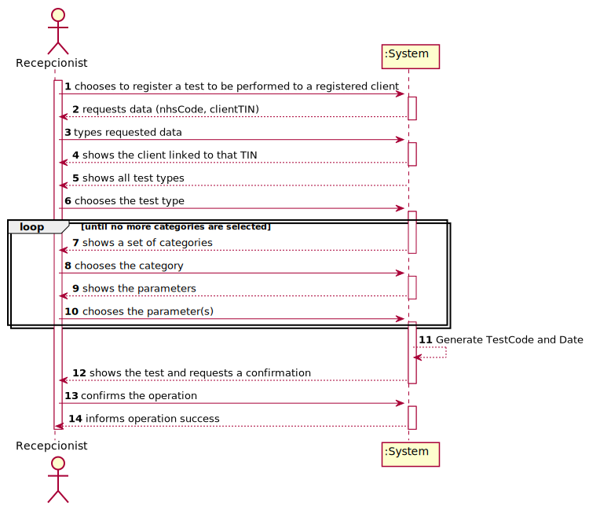
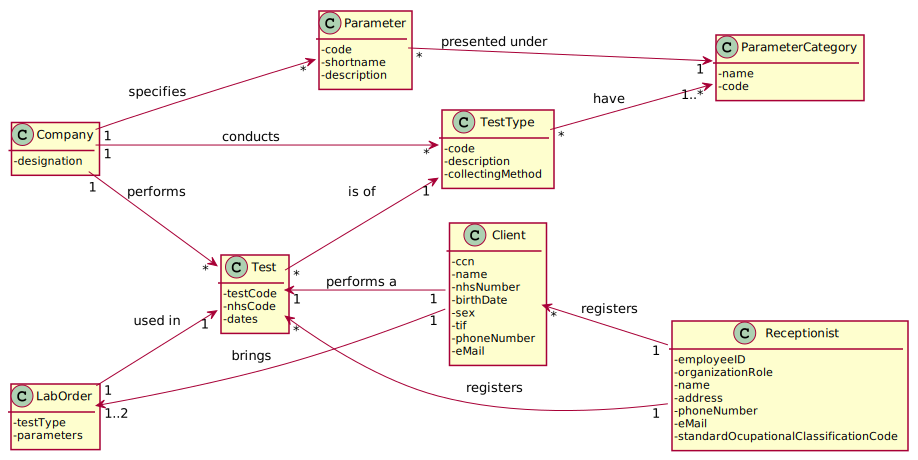

# US 004 - Register a test to be performed to a registered client

## 1. Requirements Engineering

### 1.1. User Story Description

As a receptionist of the laboratory, I intend to register a test to be performed to a registered client.

### 1.2. Customer Specifications and Clarifications 

**From the specifications document**

"Typically, the client arrives at one of the clinical analysis laboratories with a lab order prescribed by
a doctor. Once there, a receptionist asks the client’s citizen card number, the lab order (which
contains the type of test and parameters to be measured), and registers in the application the test to
be performed to that client. Then, the client should wait until a medical lab technician calls him/her
to collect the samples required to perform a given test."

"Many Labs performs two types of tests. Each test is characterized by an internal code, an NHS
code, a description that identifies the sample collection method, the date and time when the samples
were collected, the date and time of the chemical analysis, the date and time of the diagnosis made
by the specialist doctor, the date and time when the laboratory coordinator validated the test, and the
test type (whether it is blood test or Covid test)."

**From the client clarifications**

**Q1:** When the receptionist chooses the test type, should the categories appear, and then when selecting the category, the receptionist can choose the parameters for the test? Or when the Receptionist chooses the test type, should appear all the parameters that it includes immediately?

**A1:** Firstly, the receptionist should choose a test type. Then choose a category from a set of categories. Last, the receptionist should choose a parameter.

**Q2:**What are the attributes of a test and the acceptance criteria?

**A2:** A test has the following attributes: 
Test code : Sequential number with 12 digits.The code is automatically generated. 
NHS code : 12 alphanumeric characters.

**Q3:** Since the Client has a Lab Order which contains the type of test and all the parameters to be measured, all the parameters selected by the Receptionist need to be equal to the Lab Order's parameters?

**A3:** Yes.

### 1.3. Acceptance Criteria

**AC1:** The receptionist must select the parameters to be analysed from all possible parameters in accordance with the test type.

**AC2:** NHS code has 12 alphanumeric characters.

**AC3:** Test code is a sequential number with 12 digits. The code is automatically generated.

**AC4:** All test attributes are mandatory.

### 1.4. Found out Dependencies

This US has dependency with US3 (register the client) and to US9, US10 e US11 (related to test types and parameters, used in test registration).

### 1.5 Input and Output Data

**Typed Data** (nhsCode, clientCcn).

**Selected Data** (testType, category, parameter(s)).

### 1.6. System Sequence Diagram (SSD)

### 1.7 Other Relevant Remarks

This US is performed very frequently.

## 2. OO Analysis

### 2.1. Relevant Domain Model Excerpt 

### 2.2. Other Remarks

No other remarks.

## 3. Design - User Story Realization 

### 3.1. Rationale

**The rationale grounds on the SSD interactions and the identified input/output data.**

| Interaction ID | Question: Which class is responsible for... | Answer  | Justification (with patterns)  |
|:-------------  |:--------------------- |:------------|:---------------------------- |
| Step 1  		 |							 |             |                              |
| Step 2  		 |							 |             |                              |
| Step 3  		 |							 |             |                              |
| Step 4  		 |							 |             |                              |
| Step 5  		 |							 |             |                              |
| Step 6  		 |							 |             |                              |              

### Systematization ##

According to the taken rationale, the conceptual classes promoted to software classes are: 

 * Class1
 * Class2
 * Class3

Other software classes (i.e. Pure Fabrication) identified: 
 * xxxxUI  
 * xxxxController

## 3.2. Sequence Diagram (SD)

*In this section, it is suggested to present an UML dynamic view stating the sequence of domain related software objects' interactions that allows to fulfill the requirement.* 

## 3.3. Class Diagram (CD)

*In this section, it is suggested to present an UML static view representing the main domain related software classes that are involved in fulfilling the requirement as well as and their relations, attributes and methods.*

# 4. Tests 
*In this section, it is suggested to systematize how the tests were designed to allow a correct measurement of requirements fulfilling.* 

**_DO NOT COPY ALL DEVELOPED TESTS HERE_**

**Test 1:** Check that it is not possible to create an instance of the Example class with null values. 

	@Test(expected = IllegalArgumentException.class)
		public void ensureNullIsNotAllowed() {
		Exemplo instance = new Exemplo(null, null);
	}

*It is also recommended to organize this content by subsections.* 

# 5. Construction (Implementation)

*In this section, it is suggested to provide, if necessary, some evidence that the construction/implementation is in accordance with the previously carried out design. Furthermore, it is recommeded to mention/describe the existence of other relevant (e.g. configuration) files and highlight relevant commits.*

*It is also recommended to organize this content by subsections.* 

# 6. Integration and Demo 

*In this section, it is suggested to describe the efforts made to integrate this functionality with the other features of the system.*

# 7. Observations

*In this section, it is suggested to present a critical perspective on the developed work, pointing, for example, to other alternatives and or future related work.*

