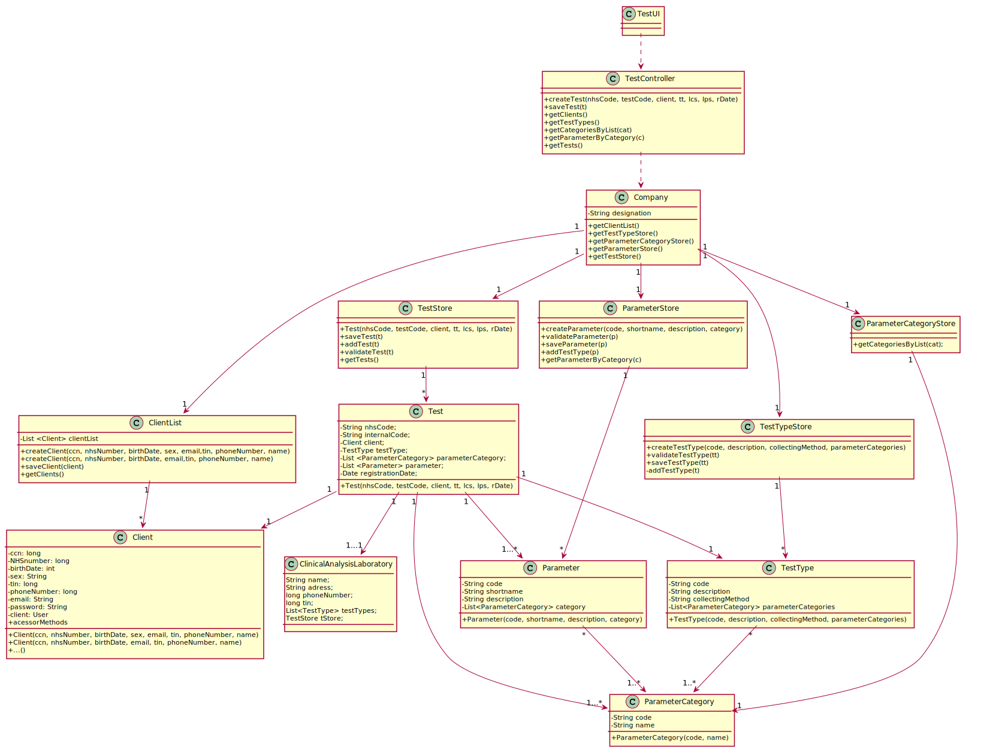

# US 004 - Register a test to be performed to a registered client

## 1. Requirements Engineering

### 1.1. User Story Description

As a receptionist of the laboratory, I intend to register a test to be performed to a registered client.

### 1.2. Customer Specifications and Clarifications 

**From the specifications document**

"Typically, the client arrives at one of the clinical analysis laboratories with a lab order prescribed by
a doctor. Once there, a receptionist asks the client’s citizen card number, the lab order (which
contains the type of test and parameters to be measured), and registers in the application the test to
be performed to that client. Then, the client should wait until a medical lab technician calls him/her
to collect the samples required to perform a given test."

"Many Labs performs two types of tests. Each test is characterized by an internal code, an NHS
code, a description that identifies the sample collection method, the date and time when the samples
were collected, the date and time of the chemical analysis, the date and time of the diagnosis made
by the specialist doctor, the date and time when the laboratory coordinator validated the test, and the
test type (whether it is blood test or Covid test)."

**From the client clarifications**

**Q1:** When the receptionist chooses the test type, should the categories appear, and then when selecting the category, the receptionist can choose the parameters for the test? Or when the Receptionist chooses the test type, should appear all the parameters that it includes immediately?

**A1:** Firstly, the receptionist should choose a test type. Then choose a category from a set of categories. Last, the receptionist should choose a parameter.

**Q2:**What are the attributes of a test and the acceptance criteria?

**A2:** A test has the following attributes: 
Test code : Sequential number with 12 digits.The code is automatically generated. 
NHS code : 12 alphanumeric characters.

**Q3:** Since the Client has a Lab Order which contains the type of test and all the parameters to be measured, all the parameters selected by the Receptionist need to be equal to the Lab Order's parameters?

**A3:** Yes.

**Q4:** I wanted to ask if the NHS code of which test is unique or not.

**A4:** Yes.

**Q5:** When the receptionist is registering a test for a client, the test can have more than one category and many parameters of the chosen categories or it only can have one category?

**A5:** Each test can have more than one category.

**Q6:** You've said on previous questions that the NHS code contains 12 characters and is alphanumeric, so this will be different from the NHS number from the client, am I right? If so, how do we know a certain test is associated to a client?

**A6:** A test has a NHS code and a client has a NHS number. In US4 the receptionist of the laboratory should ask the client to get his TIN number. Using the TIN number the receptionist of the laboratory can find all information about the client. Do not forget that a client should be registered in the system to make a test.

**Q7:** Should we show the list of all clients available or just introduce the client's CCN?

**A7:** The TIN number should be used to find a client and associate the client with the test.

**Q8:** Shouldn't the receptionist locate the Client by the Citizen Card Number instead of TIN Number?

**A8:** The receptionist should use the TIN number to find the client.

**Q9:** How is it possible to know in which laboratory the test is being registered? Should the Receptionist select the Laboratory before selecting the Test Type?

**A9:** After login the receptionist should select the laboratory where she is working. Then, the receptionist has access to the system's features/functionalities.

### 1.3. Acceptance Criteria

**AC1:** The receptionist must select the parameters to be analysed from all possible parameters in accordance with the test type.

**AC2:** NHS code has 12 alphanumeric characters and is unique.

**AC3:** Test code is a sequential number with 12 digits. The code is automatically generated.

**AC4:** All test attributes are mandatory.

### 1.4. Found out Dependencies

This US has dependency with US3 (register the client) and to US9, US10 e US11 (related to test types and parameters, used in test registration).

### 1.5 Input and Output Data

**Typed Data** (nhsCode, clientTIN).

**Selected Data** (testType, category(ies), parameter(s)).

### 1.6. System Sequence Diagram (SSD)

### 1.7 Other Relevant Remarks

This US is performed very frequently.

## 2. OO Analysis

### 2.1. Relevant Domain Model Excerpt 

### 2.2. Other Remarks

No other remarks.

## 3. Design - User Story Realization 

### 3.1. Rationale

**The rationale grounds on the SSD interactions and the identified input/output data.**

| Interaction ID | Question: Which class is responsible for... | Answer  | Justification (with patterns)  |
|:-------------  |:--------------------- |:------------|:---------------------------- |
| Step 1  		 |	...interacting with the actor? | TestUI   |  Pure Fabrication: there is no reason to assign this responsibility to any existing class in the Domain Model.           |
| 			  	 |	...coordinating the US? | TestController | Controller.                             |
| 			  	 |	...registering a new Test? | TestStore | Creator: in the DM Company has a TestStore and the store has the Test.   |
|				 |			                       | Company   | IE: knows/has its own ParameterStore.|
| Step 2  		 | 	...requesting the needed data?|	TestUI | Interacts with the actor.	  |
| Step 3 		 |	...saving the inputed data? | Test  | IE: object created in step 1 has its own data.  |
| Step 4  		 |	...knowing the Client to show? | ClientStore  | IE: Client is defined by TestStore. |
| Step 5  		 |	...saving the linked Client? | Client | IE: object created in step 1 has a Client.  |
| Step 6 		 |	...knowing the Test Types to show? | TestTypeStore  | IE: Test Type is defined by the TestTypeStore. |
| Step 7  		 |	...saving the selected Test Type ? | TestType | IE: object created in step 1 has a TestType.  |
| Step 8 		 |	...knowing the Categories to show? | ParameterCategoryStore  | IE: Parameter Category is defined by the ParameterCategoryStore. |
| Step 9  		 |	...saving the selected Category ? | ParameterCategory | IE: object created in step 1 has a ParameterCategory.  |
| Step 10		 |	...knowing the Parameters to show? | ParameterStore  | IE: Parameter is defined by the ParameterStore. |
| Step 11 		 |	...saving the selected Parameter ? | Parameter | IE: object created in step 1 has a Parameter.  |
| Step 12        |  ...generate test code and date | TestUI | System responsabilty at the moment.|
| Step 13        |  ...confirmating | TestUI | Interacts with the actor.|
| Step 14		 |	...validating all data (local validation)? | Test | IE: owns its data.| 
| 			  	 |	...validating all data (global validation)? | TestStore | IE: knows all its Tests.| 
| 	             |	...saving the created Test? | TestStore | IE: owns all its Tests.| 
| Step 15 		 |	...informing operation success?| TestUI  | Interacts with the actor.  |                 

### Systematization ##

According to the taken rationale, the conceptual classes promoted to software classes are: 

 * Company
 * Client
 * ClientList
 * TestType
 * TestTypeStore
 * ParameterCategory
 * ParameterCategoryStore
 * Parameter
 * ParameterStore
 * Test
 * TestStore
 
Other software classes (i.e. Pure Fabrication) identified: 
 
 * TestUI  
 * TestController

## 3.2. Sequence Diagram (SD)

## 3.3. Class Diagram (CD)

# 4. Tests 

**Test 1:** Check that it is not possible to create an instance of the Test class with null values. 

	@Test(expected = IllegalArgumentException.class)
    public void ensureNullIsNotAllowed() {
        Test t = new Test(null, null, null, null, null, null, null);
    }

   *Only some examples have been exposed in this section.*
    
   **Test 2:** Check that it is possible to get the test code of a test 
   
    @Test
    public void getInternalCode() {
        ...
        app.domain.model.Test t = ts.createTest("abcdefghijkl", "900000000000", client, testType, category, parameter, data);
        String expected ="900000000000";
        assertEquals(expected,t.getInternalCode());
    }
    
# 5. Construction (Implementation)

## class Test
    private String nhsCode;
    private String internalCode;
    private Client client;
    private List<ParameterCategory> parameterCategory;
    private TestType testType;
    private String sampleCollectionMethod;
    private List<Parameter> parameter = new ArrayList<>();
    private Date registrationDate;
    private List<Sample> samples;
    private Date samplesCollectionDate;
    private Date chemicalAnalysisDate;
    private Date diagnosisDate;
    private Date validationDate;
    private Report report;
    private final ResultOfTestStore resultOfTestStore = new ResultOfTestStore();

    public Test(String nhsCode, String internalCode, Client client, TestType testType, List<ParameterCategory>
            parameterCategory, List<Parameter> parameter, Date registrationDate) {
        this.nhsCode = nhsCode;
        this.internalCode = internalCode;
        this.client = client;
        this.testType = testType;
        this.sampleCollectionMethod = this.testType.getCollectingMethod();
        this.parameterCategory = parameterCategory;
        this.parameter = parameter;
        this.registrationDate = registrationDate;
        ...
        }
        ...
     }
    
## class TestStore    
    
    public Test createTest(String nhsCode, String internalCode, Client client, TestType testType, List<ParameterCategory>
            parameterCategory, List<Parameter> parameter, Date registrationDate) {

        return new Test(nhsCode, internalCode, client, testType,
                parameterCategory, parameter, registrationDate);
    }

    public void saveTest(Test t) {
        validateTest(t);
        addTest(t);
    }

    private void validateTest(Test t) {
        checkNhsCode(t.getNhsCode());
    }

    private void checkNhsCode(String nhsCode) {
        if (!nhsCode.matches("[A-Za-z0-9]+")) {
            throw new IllegalArgumentException("Code must be alphanumeric.");
        }
        if (nhsCode.length() != 12)
            throw new IllegalArgumentException("Code must have 12 chars.");
    }

    private void addTest(Test t) {
        this.tests.add(t);
    }

    ...
    }
    
## class TestController

    public class TestController {
    private Company company;
    private Test test ;

    public TestController() {
        this.company = App.getInstance().getCompany();
    }
    ...
    }
    
# 6. Integration and Demo 

*A new option on the Recepcionist menu options was added.*

*Test has interactions with almost all the others classes implemented.*

# 7. Observations

*Most likely, some changes to this US will have to be made when JavaFX is introduced.*

