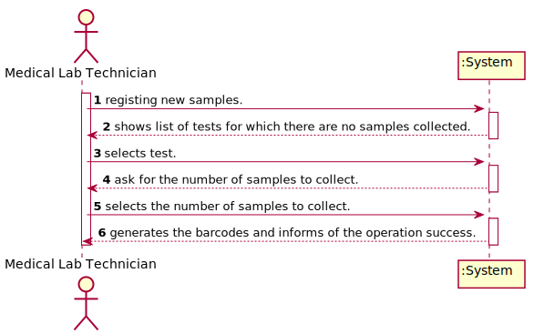
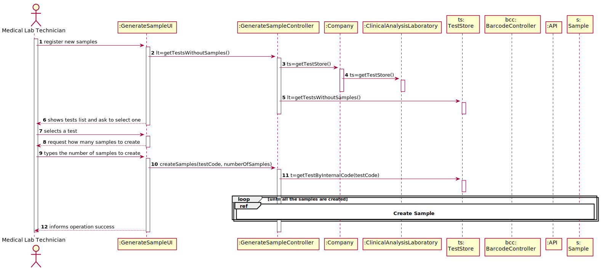

# US 5 - Record the samples collected in the scope of a given test.

## 1. Requirements Engineering

### 1.1. User Story Description

 As a medical lab technician, I want to record the samples collected in the scope of a given test.

### 1.2. Customer Specifications and Clarifications 

### From the Specifications Document:

* "When sampling (blood or swab) the medical lab technician records the samples in the system, associating the samples with the client/test, and identifying each sample with a barcode that is automatically generated using an external API."   

### From the client clarifications:

> * What information does the medical lab technician needs to input to record a new sample? 
  > 	* Answer: The medical lab technician checks a list of tests and selects one. Then, the application generates barcodes (one or more). After printing the barcodes (one or more) the use case ends..  
>
> * Question: What kind of attributes should a sample have?   
  > 	* Answer: Each sample is associated with a test. A sample has only one attribute, a barcode number (UPC) that is a sequential number and is automatically generated by the system. Each sample has a unique barcode number. 
>
> * Question: Can a test have more than one sample? 
  > 	* Answer: Yes. 
>
> * Question: We didn't fully understand what will the API do in this US, so here's out interpretation from the US, correct us if we're wrong please: The API will be generated randomly and the API is an attribute from the sample. 
  > 	* Answer: The API will be used to generate/print barcodes. 
> * Question: What kind of attributes should a sample have? 
  > 	* Answer: Each sample is associated with a test. A sample has only one attribute, a barcode number (UPC) that is a sequential number and is automatically generated by the system. Each sample has a unique barcode number. In US5, the medical lab technician checks the system and see all tests for which there are no samples collected. The medical lab technician selects a test and the system asks for the number of samples to collect.

### 1.3. Acceptance Criteria

* AC1: The sample barcode should be unique.
* AC2: The sample barcode number should have 11 digits.
* AC3: The system should support several barcode APIs. The API to use is defined by configuration.

### 1.4. Found out Dependencies

* Barcode generation depends on an external API. For the moment the API used is Barbecue. Usage of other API's is subject to the conditions identified in the topic 5. Construction (Implementation).

### 1.5 Input and Output Data

* ### Input Data
	* Selected Data: Test.
* ### Output Data
	* Image of the barcode generated.
	* (In)Success of the operation.

### 1.6. System Sequence Diagram (SSD)

### 1.7 Other Relevant Remarks

* As imposed by the barcode type UPCA, barcode length was limited to 11 digits as the total barcode size is 12 digits, were the last digit is a check digit generated by the API.
* Although it was not limited by the customer, we introduced a limit of 100 on the number of samples to be generated. This limit should be discussed with the client at later meetings.

## 2. OO Analysis

### 2.1. Relevant Domain Model Excerpt 

### 2.2. Other Remarks

No relevant remarks.

## 3. Design - User Story Realization 

### 3.1. Rationale

**The rationale grounds on the SSD interactions and the identified input/output data.**

| Interaction ID | Question: Which class is responsible for... | Answer  | Justification (with patterns)  |
|:-------------  |:--------------------- |:------------|:---------------------------- |
| Step 1  		 |	... interacting with the actor? | GenerateSampleUI   |  Pure Fabrication: there is no reason to assign this responsibility to any existing class in the Domain Model.           |
| 			  		 |	... coordinating the US? | GenerateSampleController | Controller                             |
| 			  		 |	... instantiating a new Sample? | TestStore | Creator: in the DM Company has a TestStore for the selected ClinicalAnalysisLaboratory and the TestStore will manage the Samples for the Test.   |
| 			  		 |	 ... knowing the user using the system?  | UserSession  | IE: cf. A&A component documentation.  |
| 			  		 |	... knowing to which company the user belongs to? | App  | IE: has registed all Companies.  |
| 			  		 |							 | Company   | IE: knows/has its own Employees.|
| 			  		 |							 | Employee  | IE: knows its own data (e.g. name). |
| 			  		 |	... knowing to which laboratory the user is working? | App  | IE: has registed all Companies.  |
| 			  		 |							 | Company   | IE: knows/has its own Laboratories.|
| 			  		 |							 | ClinicalAnalysisLaboratory | IE: knows its own data (e.g. name). |
| Step 2  		 |	...knowing the tests to show? | ClinicalAnalysisLaboratory | IE: knows/has its own Laboratories. |
| 			  		 |							 | TestStore  | IE: Tests are defined by the TestStore.|
| Step 3  		 |	...saving the selected test? | GenerateSampleUI| IE: UI saves the test code for later use when saving object created in step 1. |
| Step 4 		 |  |  |  |    
| Step 5  		 |	... generating requested barcodes? | GenerateSampleController | Controller.| 
| 			  		 |	... who will generate the barcode number?  | Company| IE: it controls the last generated barcode.|
| 			  		 |	... who will generate the barcode image?  | API | IE: it will generate a image from the barcode number.|
| 			  		 |	... who will control the API to use?  | BarcodeController| IE: based on configuration will load the requested API.|   
| 			  		 |	... validating all data (global validation)?  | TestStore | IE: owns all its Samples.| 
| 			  		 |	... saving the created Samples? | TestStore | IE: owns all its Samples.| 
| 			  		 |	... who will update the sample collecting date?  | TestStore | IE: updates the samples collecting date.| 
| Step 6  		 |	... informing operation success?| GenerateSampleUI  | IE: is responsible for user interactions.  |              

### Systematization ##

According to the taken rationale, the conceptual classes promoted to software classes are: 

 * Company
 * ClinicalAnalysisLaboratory
 * TestStore
 * Test
 * Sample

Other software classes (i.e. Pure Fabrication) identified:

 * GenerateSampleUI  
 * GenerateSampleController
 * BarcodeController
 * API

## 3.2. Sequence Diagram (SD)

#### Create Sample

## 3.3. Class Diagram (CD)

# 4. Tests 
**Test 1:** Check that it is possible to create an instance of TestType. 

	@Test
	public void createAndSaveTestType() {
		Company cmp = App.getInstance().getCompany();
		TestTypeStore tsStore = cmp.getTestTypeStore();
		ParameterCategoryStore csStore = cmp.getParameterCategoryStore();
		ParameterCategory pc = new ParameterCategory("12345", "Um nome");
		csStore.saveParameterCategory(pc);
		
		String code = "54321";
		String description = "uma descricao";
		String collectingMethod = "colheita";
		String categoryCode = pc.getCode();
		List<String> parameterCategoryCodes = new ArrayList<String>();
		parameterCategoryCodes.add(categoryCode);
		
		int count = tsStore.getTestTypes().size();
		
		TestTypeController ttController = new TestTypeController();
		ttController.createTestType(code, description, collectingMethod, parameterCategoryCodes);
		ttController.saveTestType();
    	
		List<TestType> testTypes = tsStore.getTestTypes();
		
        assertEquals(count + 1, testTypes.size());
        
	 	TestType tt = testTypes.get(count);        
        assertEquals(code, tt.getCode());
        assertEquals(description, tt.getDescription());
        assertEquals(collectingMethod, tt.getCollectingMethod());
        
        List<ParameterCategory> pcList = tt.getParameterCategories();
        assertEquals(1, pcList.size());
        assertEquals(categoryCode, pcList.get(0).getCode());
   	}

Also have been implemente methods related to the TestType, the controller and the store:

**Test 2:** Check that it is possible to get the code of TestType.

    @Test
    public void getCode() {

        List<ParameterCategory> parameterCategories = new ArrayList<ParameterCategory>();
        ParameterCategory pc = new ParameterCategory("54321","HEMOGRAM");
        parameterCategories.add(pc);
        
        TestType tt = new TestType("54321","uma descrição", "colheita", parameterCategories);
        String code = "54321";
        assertEquals(tt.getCode(), code);
    } 

**Test 3:** Check that it is possible to get the paremeter categories for the TestType. 

    @Test
    public void getParameterCategories() {

        ParameterCategoryStore categoryStore = new ParameterCategoryStore();
        ParameterCategory pc = new ParameterCategory("54321","HEMOGRAM");
        categoryStore.saveParameterCategory(pc);
    	
        List<ParameterCategory> pcList = categoryStore.getParameterCategories();
    	
        assertEquals(pcList.size(), 1);
        assertEquals(pcList.get(0), pc);
    }

# 5. Construction (Implementation)

No relevant remarks.

# 6. Integration and Demo 

This use case is related to the US11 in which categories are created. There had to be a relationship in which TestType could access category data in order to select them. In addition, he said, a way had to be created afterwards, if necessary, there is the possibility to come and get the TestTypes. 

# 7. Observations

I believe that the code is well developed and according to the request. However, in the future there is the possibility of improvement making everything more cohesive. Certain methods at the moment may be being overloaded without simplifying it in the future. 

