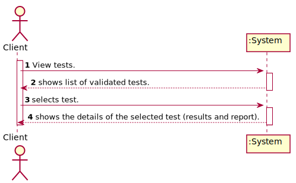
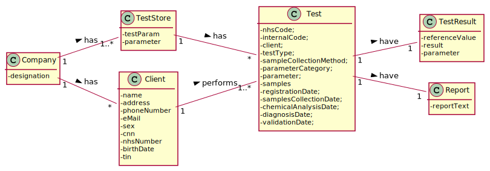

# US 1 - View the results of the tests I have performed.

## 1. Requirements Engineering

### 1.1. User Story Description

As a client, I want to access the application to view the results of the tests I have 
performed.

### 1.2. Customer Specifications and Clarifications 

### From the Specifications Document:

* "Once the laboratory coordinator confirms that everything was done correctly, the client receives a notification alerting that the results are  ready available in the central application and informing that he/she must access the application to view those results."   

### From the client clarifications:

> * My group is assuming that the client only wants to see the validated tests. Do you want to see tests in other states and if that's the case say the state of the test and show only the information available for that state? 
  > 	* Answer: The client should only see tests that have already been validated. 
>
> * Question: Which date should be used to arrange the tests in order?The date the test is done or the validation date?   
  > 	* Answer: The test registration date. 
>
> * Question: What are the data to show the customer? and in what way do we have to show? Do you have any examples you can give us? 
  > 	* Answer: I want to access the application to view the results of the tests I have performed. This includes the report made by the specialist doctor. The client tests must be shown ordered from the most recent to the oldest one. The test results are shown only after the client has selected a test.


### 1.3. Acceptance Criteria

* AC1: The client tests must be shown ordered from the most recent to the oldest one. The test results are shown only after the client has selected a test.
* AC2: Only shows the validated tests.

### 1.4. Found out Dependencies

No dependencies were found.

### 1.5 Input and Output Data

* ### Input Data
	* None.
* ### Output Data
	* List of the clientes tests.
	* Details of a test (results, report, etc.).


### 1.6. System Sequence Diagram (SSD)




### 1.7 Other Relevant Remarks

No relevant remarks.


## 2. OO Analysis

### 2.1. Relevant Domain Model Excerpt 



### 2.2. Other Remarks

No relevant remarks.



## 3. Design - User Story Realization 

### 3.1. Rationale

**The rationale grounds on the SSD interactions and the identified input/output data.**

| Interaction ID | Question: Which class is responsible for... | Answer  | Justification (with patterns)  |
|:-------------  |:--------------------- |:------------|:---------------------------- |
| Step 1  		 |	... interacting with the actor? | GenerateSampleUI   |  Pure Fabrication: there is no reason to assign this responsibility to any existing class in the Domain Model.           |
| 			  		 |	... coordinating the US? | GenerateSampleController | Controller                             |
| 			  		 |	... instantiating a new Sample? | TestStore | Creator: in the DM Company has a TestStore for the selected ClinicalAnalysisLaboratory and the TestStore will manage the Samples for the Test.   |
| 			  		 |	 ... knowing the user using the system?  | UserSession  | IE: cf. A&A component documentation.  |
| 			  		 |	... knowing to which company the user belongs to? | App  | IE: has registed all Companies.  |
| 			  		 |							 | Company   | IE: knows/has its own Employees.|
| 			  		 |							 | Employee  | IE: knows its own data (e.g. name). |
| 			  		 |	... knowing to which laboratory the user is working? | App  | IE: has registed all Companies.  |
| 			  		 |							 | Company   | IE: knows/has its own Laboratories.|
| 			  		 |							 | ClinicalAnalysisLaboratory | IE: knows its own data (e.g. name). |
| Step 2  		 |	...knowing the tests to show? | ClinicalAnalysisLaboratory | IE: knows/has its own Laboratories. |
| 			  		 |							 | TestStore  | IE: Tests are defined by the TestStore.|
| Step 3  		 |	...saving the selected test? | GenerateSampleUI| IE: UI saves the test code for later use when saving object created in step 1. |
| Step 4 		 |  |  |  |    
| Step 5  		 |	... generating requested barcodes? | GenerateSampleController | Controller.| 
| 			  		 |	... who will generate the barcode number?  | Company| IE: it controls the last generated barcode.|
| 			  		 |	... who will generate the barcode image?  | API | IE: it will generate a image from the barcode number.|
| 			  		 |	... who will control the API to use?  | BarcodeController| IE: based on configuration will load the requested API.|   
| 			  		 |	... validating all data (global validation)?  | TestStore | IE: owns all its Samples.| 
| 			  		 |	... saving the created Samples? | TestStore | IE: owns all its Samples.| 
| 			  		 |	... who will update the sample collecting date?  | TestStore | IE: updates the samples collecting date.| 
| Step 6  		 |	... informing operation success?| GenerateSampleUI  | IE: is responsible for user interactions.  |              

### Systematization ##

According to the taken rationale, the conceptual classes promoted to software classes are: 

 * Company
 * Client
 * TestStore
 * Test
 * Report
 * TestResults

Other software classes (i.e. Pure Fabrication) identified:

 * GenerateSampleUI  
 * GenerateSampleController
 * BarcodeController
 * API

## 3.2. Sequence Diagram (SD)



#### Create Sample


## 3.3. Class Diagram (CD)



# 4. Tests 

Have been implemente methods related to the controller and the store:

**Test 2:** Controller.

    @Test
	public void gestTestsWithoutSamples() {
		List<app.domain.model.Test> lt = App.getInstance().getCompany().getTestStore().getTestsWithoutSamples();
		GenerateSampleController sController = new GenerateSampleController();
		
		List<app.domain.model.Test> tList = sController.getTestsWithoutSamples();
		
        assertArrayEquals(lt.toArray(), tList.toArray());
	}

**Test 3:** Store. 

    @Test
    public void createSample() {
    	String code = "98765432191";
    	TestStore tStore = new TestStore();
    	
    	Sample s = tStore.createSample(code);
    	
    	assertNotNull(s);
    	assertEquals(code, s.getBarcode());
    }

# 5. Construction (Implementation)

## 5.1 Barcode generation API

Corresponding to the requirement defined by the client, the barcode generation API to be used must be identified using a configuration file, called config.properties, which must be present in the same directory where the solution jar is placed.  
This file is composed of a set of lines of text in the format <keyword> = <value>.  
For the configuration of the barcode API, the following keywords must be identified:  

* BarcodeApi.jarPath  
Location on the disk of the path and jar file that contains the barcode generation API. The path can be relative to the directory where the solution is installed or absolute.

* BarcodeApi.BarcodeCreator  
Full class name for the barcode creator static class.

* BarcodeApi.BarcodeObject  
Full class name for the barcode object created by the barcode creator.

* BarcodeApi.BarcodeImage  
Full class name for the barcode image saving static class.

* BarcodeApi.BarcodeCreatorMethod  
Method name to create an UPCA barcode. Should receive an String with the barcode number and return an barcode object.

* BarcodeApi.BarcodeObjectSize  
Method name to change barcode height. Should receive an int with the barcode height.

* BarcodeApi.BarcodeImageSaving  
Method name to save barcode image to disk. Should receive an barcode object and a File to save on disk.

# 6. Integration and Demo 

This use case is related to all the US given in the Sprint C. There had to be a relationship in which Test could be added the samples. In addition, with was created a way to get the samples for the next US's. 


# 7. Observations

I believe that the code is well developed and according to the request. However, in the future there is the possibility of improvement making everything more cohesive. Certain methods at the moment may be being overloaded without simplifying it in the future. 

























