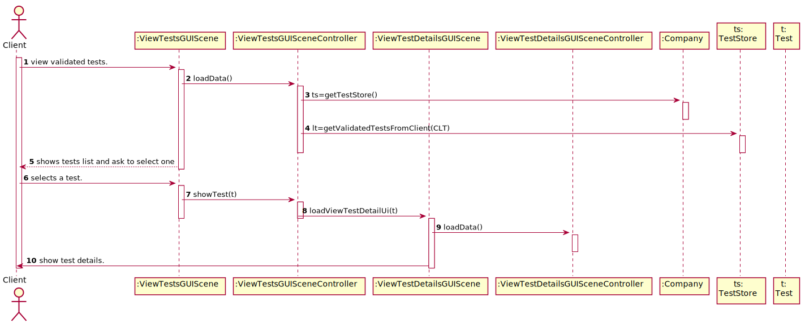
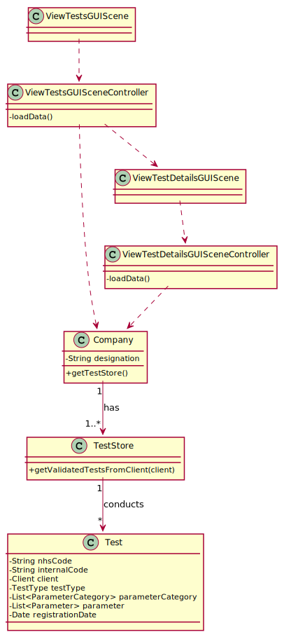

# US 1 - View the results of the tests I have performed.

## 1. Requirements Engineering

### 1.1. User Story Description

As a client, I want to access the application to view the results of the tests I have 
performed.

### 1.2. Customer Specifications and Clarifications 

### From the Specifications Document:

* "Once the laboratory coordinator confirms that everything was done correctly, the client receives a notification alerting that the results are  ready available in the central application and informing that he/she must access the application to view those results."   

### From the client clarifications:

> * My group is assuming that the client only wants to see the validated tests. Do you want to see tests in other states and if that's the case say the state of the test and show only the information available for that state? 
  > 	* Answer: The client should only see tests that have already been validated. 
>
> * Question: Which date should be used to arrange the tests in order?The date the test is done or the validation date?   
  > 	* Answer: The test registration date. 
>
> * Question: What are the data to show the customer? and in what way do we have to show? Do you have any examples you can give us? 
  > 	* Answer: I want to access the application to view the results of the tests I have performed. This includes the report made by the specialist doctor. The client tests must be shown ordered from the most recent to the oldest one. The test results are shown only after the client has selected a test.


### 1.3. Acceptance Criteria

* AC1: The client tests must be shown ordered from the most recent to the oldest one. The test results are shown only after the client has selected a test.
* AC2: Only shows the validated tests.

### 1.4. Found out Dependencies

No dependencies were found.

### 1.5 Input and Output Data

* ### Input Data
	* None.
* ### Output Data
	* List of the clientes tests.
	* Details of a test (results, report, etc.).


### 1.6. System Sequence Diagram (SSD)




### 1.7 Other Relevant Remarks

No relevant remarks.


## 2. OO Analysis

### 2.1. Relevant Domain Model Excerpt 



### 2.2. Other Remarks

No relevant remarks.



## 3. Design - User Story Realization 

### 3.1. Rationale

**The rationale grounds on the SSD interactions and the identified input/output data.**

| Interaction ID | Question: Which class is responsible for... | Answer  | Justification (with patterns)  |
|:-------------  |:--------------------- |:------------|:---------------------------- |
| Step 1  		 |	... interacting with the actor? | ViewTestsGUIScene  |  Pure Fabrication: there is no reason to assign this responsibility to any existing class in the Domain Model.           |
| 			  		 |  | ViewTestDetailsGUIScene |  Pure Fabrication: there is no reason to assign this responsibility to any existing class in the Domain Model.                            |
| 			  		 |	... coordinating the US? | ViewTestsGUISceneController | Controller                             |
| 			  		 |	... coordinating the US? | ViewTestDetailsGUISceneController | Controller                             |
| 			  		 |	 ... knowing the user using the system?  | UserSession  | IE: cf. A&A component documentation.  |
| 			  		 |	... knowing to which company the user belongs to? | App  | IE: has registed all Companies.  |
| 			  		 |							 | Company   | IE: knows/has its own Clients.|
| 			  		 |							 | Employee  | IE: knows its own data (e.g. name). |
| Step 2  		 |	...knowing the tests to show? | TestStore | IE: knows/has its own Tests. |
| Step 3  		 |	...selecting the test? | ViewTestsGUISceneController | IE: Saves the test to be used when showing the test details. |
| Step 4  		 |	... knowing the test to show the details? | ViewTestDetailsGUISceneController | Controller.| 
|   		 |	... showing the test details? | ViewTestsGUIScene | UI.|    

### Systematization ##

According to the taken rationale, the conceptual classes promoted to software classes are: 

 * Company
 * Client
 * TestStore
 * Test
 * Report
 * TestResults

Other software classes (i.e. Pure Fabrication) identified:

 * ViewTestsGUIScene
 * ViewTestDetailsGUIScene
 * ViewTestsGUISceneController
 * ViewTestDetailsGUISceneController


## 3.2. Sequence Diagram (SD)



## 3.3. Class Diagram (CD)



# 4. Tests 

The added code is mostly UI, so there are no tests.

# 5. Construction (Implementation)

No relevant remarks.

# 6. Integration and Demo 

This use case is not related to any US. 


# 7. Observations

I believe that the code is well developed and according to the request. This UC is so simple and straightforward that cant be much to improvement. 

























