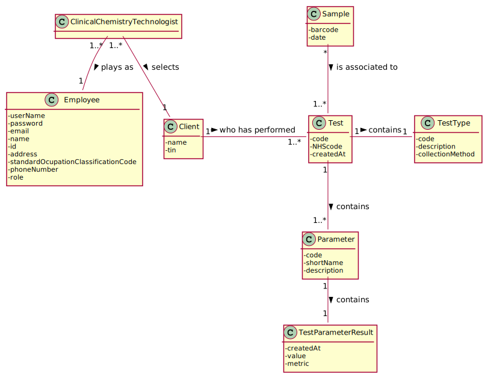
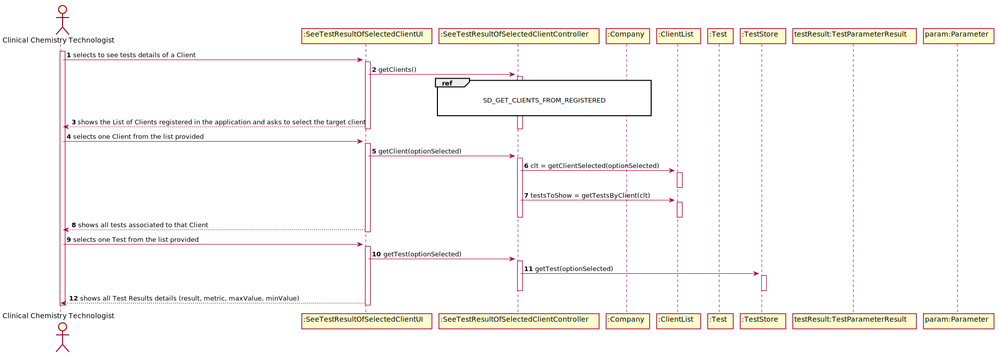

# US 012 - Record the Results of a given test

## 1. Requirements Engineering

### 1.1. User Story Description

 "As a clinical chemistry technologist, I intend to consult the historical tests performed by a particular client and to be able to check tests details/results."

### 1.2. Customer Specifications and Clarifications 

**From the specifications document:**

> "To facilitate the access to the results, the application must allow ordering the clients by TIF and by name. The ordering algorithm to be used by the application must be defined through a configuration file. It is intended that the choice of the ordering algorithm is based on the algorithm complexity (mainly the execution time). Therefore, at least two sorting algorithms should be evaluated and documented in the application user manual (in the annexes) that must be delivered with the application."

> My interpretation:

> For the purpose of improving readability when the clinical chemistry technologist wants to select a client to see his test results, the application should allow for him to order the information about the clients by TIN and by Name to simplify the choosing of the target client. Furthermore the application ordering algorithm to be used should be defined through a configuration file and at least 2 algorithms should be available.

**From the client clarifications:**

> **Question1:** 
> [Link]()
> > **Answer:** 

### 1.3. Acceptance Criteria

Acceptance Criteria: The application must allow ordering the clients by TIN and by name to help the clinical chemistry technologist choose the target client. The ordering algorithm to be used by the application must be defined through a configuration file. At least two sorting algorithms should be available.

### 1.4. Found out Dependencies

There is a dependency on the US-3: "As a receptionist of the laboratory, I want to register a client.", since without clients registered it is impossible to sort them out by TIN/Name. Moreover, the fact that the Clinical Chemistry Technologist wants to see the details of the tests makes it so that there is a dependency on US4: As a receptionist of the laboratory, I intend to register a test to be performed to a registered client, since the samples needs to have a barcode which is defined in this US.  Furthermore, there is a dependency with the US-4 "As a receptionist of the laboratory, I intend to register a test to be performed to a registered client", since it is only possible to see tests if there are tests created and associated to the client. Finally, it also has a dependency on US-13 "As a clinical chemistry technologist, I intend to record the results of a given test", because if there is not any test results, there will not also be the test results details the clinical chemistry technologist is looking for.

### 1.5 Input and Output Data

**Input Data:**

* Typed data:

	none.

	
* Selected data:

	*The client whose tests will be shown*
	*The test that that the clinical chemistry technologist wants to see details of*

**Output Data:**

*  List of Clients Registered
*  List Of Tests performed by a selected Client
*  Details about the test select by the Clinical Chemistry Technologist

### 1.6. System Sequence Diagram (SSD)

### 1.7 Other Relevant Remarks

This US will be held from time to time, when the clinical chemistry technologist feels the need to see the history of tests performed from a target client.

## 2. OO Analysis

### 2.1. Relevant Domain Model Excerpt 

### 2.2. Other Remarks

none.

## 3. Design - User Story Realization 

### 3.1. Rationale

**The rationale grounds on the SSD interactions and the identified input/output data.**

| Interaction ID | Question: Which class is responsible for... | Answer  | Justification (with patterns)  |
|:-------------  |:--------------------- |:------------|:---------------------------- |
| Step 1  		 |	... interacting with the actor? | SeeTestResultOfSelectedClientUI   |  **Pure Fabrication**: there is no reason to assign this responsibility to any existing class in the Domain Model.           |
| 			  		 |	... coordinating the US? | SeeTestResultOfSelectedClientController | **Controller**                             |
| 			  		 | ... knowing the user using the system?  | AuthFacade  | **IE:** cf. A&A component documentation.  |
| 			  		 |	... knowing to which company the user belongs to? | App  | **IE:** has registed all Companies  |
| Step 2  		 | 	|	 |	  |
| Step 3 		 |	...saving the inputted data? | Client  | **IE:** the object Client knows its own details about itself.  |
| 			  		 | ... knowing if the client exists?  | ClientList | **IE:** knows all the clients registered in the system.  |
| Step 4  		 |	...knowing the tests associated to the client to show? | TestStore  | **IE:** A test is associated to a client and therefore it is him who is the IE |
| Step 5  		 |	... saving the selected test? | Test  | **IE:** The test knows all its test details.  | 
| Step 6  		 | ... knowing where to collect the data from? | Test  | **IE:** The test knows all its test details and all its parameter results| 

            

### Systematization ##

According to the taken rationale, the conceptual classes promoted to software classes are: 

 * Test
 * TestResult

Other software classes (i.e. Pure Fabrication) identified: 

 * SeeTestResultOfSelectedClientUI
 * SeeTestResultOfSelectedClientController
 * TestStore
 * App
 
 Other software classes of external systems/components:

* AuthFacade

## 3.2. Sequence Diagram (SD)

## 3.3. Class Diagram (CD)

# 4. Tests 

**Class **

**Test 1:** Check that it is not possible to create an instance of the Test class with null values. 

# 5. Construction (Implementation)

**Class **

	

# 6. Integration and Demo 

This US contains some integrations with other US. All things considered, there were efforts to integrate this US13 - " As a clinical chemistry technologist, I intend to consult the historical tests performed by a particular client and to be able to check tests details/results" with the US-4 and US-12 which have critical information for the implementation of the US-13. The tests are provided by US-4 and the test results are provided by the US-12.

# 7. Observations

This US at the moment does not support the usage of DTOs since the USs being handled with in this US do not apply the DTO pattern. The integration of DTOs is a route for further improving this US and the other US which this one is dependent with.

