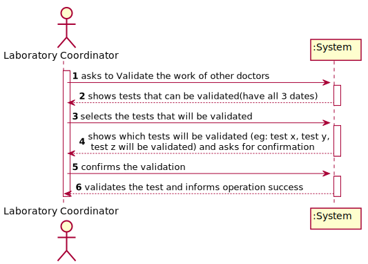
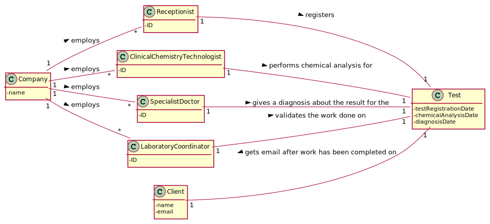
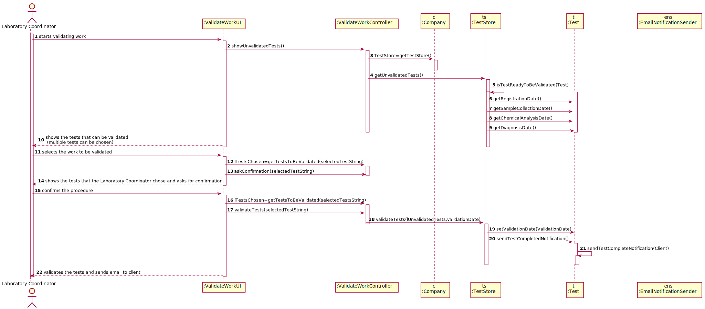
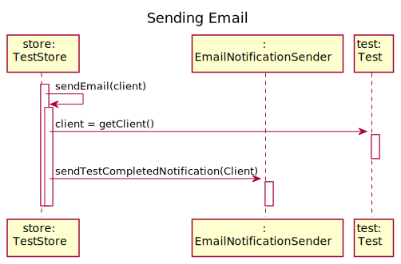
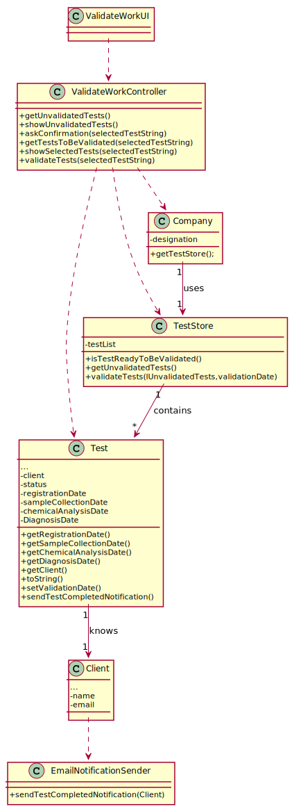

# US 15 - To validate the work done.

## 1. Requirements Engineering

### 1.1. User Story Description

5: As a laboratory coordinator, I want to validate the work done by the clinical chemistry technologist and specialist doctor.

### 1.2. Customer Specifications and Clarifications 

**From the specifications document:**

>	After the specialist doctor has completed the diagnosis, the results of the clinical analyses and the report become available in the system and must be validated by the laboratory coordinator. To validate the work done, the laboratory coordinator checks the chemical test/result and associated diagnosis made and confirms that everything was done correctly.

**From the client clarifications:**

> **Question:**Q: Regarding to US 15, what information does the laboratory coordinator needs to be able do validate a test? We got from the description that it's suposed to show all dates. Should the system provide any more information?
>  
> **Answer:** Only the dates. Moreover, the system should record the validation date.

-

> **Question:** When the laboratory coordinator wants to validate a test does all the tests available show up for him or does he search using a code that identifies a specific test?
>  
> **Answer:** The system shows all tests ready to validate (tests that already have the test registration date, the chemical analysys date and the diagnosis date registered in the system) and the laboratory coordinator selects one or more tests to mark as validated.

-

> **Question:** What should happen to a test if either the test report or the results are invalid? Should we prompt for a redo of either process or simply erase the test?
>  
> **Answer:** The laboratory coordinator only sees the test dates of tests that already have all dates registered in the system (test registration date, the chemical analysys date and the diagnosis date). The objective of this user story is only for the laboratory coordinator to be aware of the work developed in the chemical laboratory and to mark the job as done.

-

> **Question:** After we validate, we send the email saying they can check the app for the results. But what happens to the test ifself? Does it stay within the system or is deleted?
>  
> **Answer:** The tests should not be eliminated.

-

> **Question:** As soon as a test is validated should the system send the notification to a txt file like in sprint B?
>  
> **Answer:**... During the development of the Integrative Project we will not use any e-mail or SMS API services to send messages. All the e-mail and SMS messages should be written to a file with the name emailAndSMSMessages.txt. This file simulates the use of e-mail and SMS API services. 
### 1.3. Acceptance Criteria

* **AC1:** The system does not show client personal information but shows all dates (test registration date, chemical analysis date and diagnosis date).

* **AC2:** The Laboratory Coordinator should be able to select one or more tests to validate at the same time.

* **AC3:** The client should receive a notification after the laboratory coordinator finishes his work.

* **AC4:** After the test is validated by the laboratory coordinator , the test has to have its validation date marked and it also should not be eliminated.

### 1.4. Found out Dependencies

* There is a dependency to "US012 Test results recording" since I need to create a validation for their results.
* There is a dependency to "US014 Diagnosis and Report Writing" since I need to create a validation for their diagnosis.
* There is a dependency to "US004 Test Registration" since the laboratory coordinator needs the test registration date.

### 1.5 Input and Output Data

**Input Data:**

* Typed data:
	* Confirmation requests answer (?)
	
* Selected data:
	* Tests that the laboratory coordinator wishes to validate work on.

**Output Data:**

* Client's test registration date.
* Test's chemical analysis date.
* Test's diagnosis date

### 1.6. System Sequence Diagram (SSD)

**Alternative 1**

**Other alternatives might exist.**

### 1.7 Other Relevant Remarks

* There should be an option to validate all the work at once.

## 2. OO Analysis

### 2.1. Relevant Domain Model Excerpt 

### 2.2. Other Remarks

n/a

## 3. Design - User Story Realization 

### 3.1. Rationale

**SSD - Alternative 1 is adopted.**

| Interaction ID | Question: Which class is responsible for... | Answer  | Justification (with patterns)  |
|:-------------  |:--------------------- |:------------|:---------------------------- |
| Step 1  		 |	... interacting with the actor? | ValidateWorkUI   |  **Pure Fabrication:** there is no reason to assign this responsibility to any existing class in the Domain Model.           |
| 			  		 |	... coordinating the US? | ValidateWorkController | **Controller**                             |
| Step 2  		 |	...knowing the tests to show? | Company  | IE: The Company class has a TestStore that contains the tests to be validated. |
|                | ...knowing the test that can be validated | TestStore | **IE:** The TestStore class has access to a parameter(from the Test Object) that is used to determine its status and it knows its own data.|
| Step 3  		 |	... validating the selected tests. | Test  | **IE:** The Test Classes inside the TestStore will change their status to a validated status  |
| Step 4  		 |	... saving the validated tests.|TestStore| **IE:** The TestStore Class contains the Test objects.						 |                                           |              
| Step 5  		 |	... informing operation success?| ValidateWorkUI | **IE:** is responsible for user interactions.| 
| Step 5  		 |	... sendingEmail| EmailNotificationSender | **IE** and **Pure Fabrication:** has all the required information and means to send the email (IE)|

### Systematization ##

This software only uses and manipulates classes that already exist.

Other software classes (i.e. Pure Fabrication) identified: 

 * ValidateWorkUI  
 * ValidateWorkController
 * TestStore
 * **EmailNotificationSender**

Other software classes of external systems/components:

* AuthFacade

## 3.2. Sequence Diagram (SD)

**Alternative 1**

## 3.3. Class Diagram (CD)

**From alternative 1**

# 4. Tests 

**Test 1:** getTests. Ensure that all get method tests return the proper list.

	@Test(expected = expectedListWithCorrectTests)
		public void getTests() {
		TestStore ts= new TestStore;
		List<Test> = ts.getTests();
		...
	}
	

**Test 2:** setTests. Ensure that all set methods alter the correct values correctly

	@Test(expected = testWithDifferentValues)
		public void setTestValue() {
		Test t= new Test(...);
		Value v= new Value();
		t.setValue(...);
		...
		
		
	}

**Test 3:** Ensure that the toString method returns the proper string in the proper occasion.

	@Test(expected= correctFormatString)
		public void toStringTest(){
		Test t= new Test(...);
		...
		assertEquals(correctFormatString,t.toString())
 }

*It is also recommended to organize this content by subsections.* 

# 5. Construction (Implementation)

## Class validateWorkController

		public class ValidateWorkController {
          private Company company;
          public ValidateWorkController(){
        this.company=App.getInstance().getCompany();
		}
		public void showUnvalidatedTests(){
		...
		}
			
		public void askConfirmation(String selectedTestString){
		 ... 
		}
		
		public List<Test> getTestsToBeValidated(String selectedTestString){
        List<Test> lTests=App.getInstance().getCompany().getTestStore().getUnvalidatedTests();
        ...
        return lTestsToBeValidated;
         }
		 

## Class Test

	public class Test{
	     ...
		  	private Date samplesCollectionDate;
    		private Date chemicalAnalysisDate;
    		private Date diagnosisDate;
    		private Date validationDate;
			@Override
			public String toString(){
				...
			 	if (registrationDate!=null && samplesCollectionDate!=null && chemicalAnalysisDate!=null && diagnosisDate!= null && validationDate==null){
            	str= internalCode + " Registration Date:"+registrationDate+" Chemical Analysis Date:"+chemicalAnalysisDate + "Diagnosis Date:"+diagnosisDate;
        		}
				...
				return str;
			}
			public void setValidationDate(Date newDate){
        		this.validationDate=newDate;
    		}
			public void sendTestCompletedNotification()throws InterruptedException, IOException {
         		EmailNotificationSender ens= new EmailNotificationSender(this.client);
         		ens.sendTestCompletedNotification();
    		}
			public Date getDiagnosisDate() {
        		return diagnosisDate;
    		}
	 		public Date getChemicalAnalysisDate() {
        		return chemicalAnalysisDate;
    		}
	 		public Date getRegistrationDate() {
        		return registrationDate;
    		}
	 		public Date getSamplesCollectionDate() {
        		return samplesCollectionDate;
    		}

## Class TestStore
	public class TestStore{
	...
	 List<Test> tests;
	 
	  public TestStore() {
        tests = new ArrayList<>();
      }
	  ...
	  private boolean isUnvalidatedTest(Test t) {
        return t.getRegistrationDate() != null && t.getSamplesCollectionDate() != null && t.getChemicalAnalysisDate() != null && t.getDiagnosisDate() != null && t.getValidationDate() == null;
      }
	  public List<Test> getUnvalidatedTests() {
        List<Test> lUnvalidatedTests = new ArrayList<>();
        ...
        return lUnvalidatedTests;
     }
	 public void validateTests(List<Test> lUnvalidatedTests, Date validationDate) {
        for (int i = 0; i < lTests.size(); i++) {
            lTests.get(i).setValidationDate(newDate);
            ...
        }
    }
## Class EmailNotificationSender
	private Client client;
    public EmailNotificationSender(Client client){
        this.client=client;
    }
	public boolean sendTestCompletedNotification()throws  IOException,InterruptedException{
	   String nomeficheiro = "TestCompletedNotification.txt";
	   ...
	}

# 6. Integration and Demo 

* The Laboratory Coordinator can now validate tests.

# 7. Observations

N/A so far.

