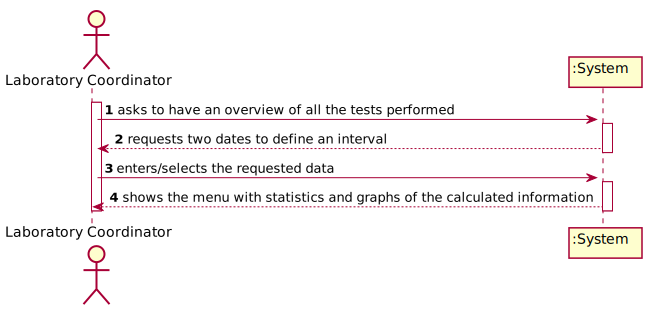

# US 16 - Have an overview of all the tests performed by Many Labs and analyse the overall performance of the company.

## 1. Requirements Engineering

### 1.1. User Story Description

As a laboratory coordinator, I want to have an overview of all the tests performed by Many Labsand analyse the overall  performance of the company(for instance, check the sub-intervals in which there were more samples waiting for the result). To facilitate overall analysis,  the application should also display statistics and graphs.

### 1.2. Customer Specifications and Clarifications 

**From the specifications document**

"...the company wants to decrease the number of tests waiting for its result. To evaluate this, it proceeds as following: for
any interval of time, for example one week (6 working days with 12 working hours per day), the
difference between the number of new tests and the number of results available to the client during
each half an hour period is computed . In that case, a list with 144 integers is obtained, where a
positive integer means that in such half an hour more test s were process ed than results were
obtained, and a negative integer means the opposite. Now, the problem consists in determining what
th e contiguous subsequence of the initial sequence is, whose sum of their entries is maximum. This
will show the time interval, in such week, when the company was less effective in responding. So,
the application should implement a brute force algorithm (an algorithm which examines each
subsequence) to determine the contiguous subsequence with maximum sum, for any interval of time
registered. The implemented algorithm should be analysed in terms of its worst case time complexity, and it should be compared to a provided benchmark algorithm."

**From the client clarifications**

* **Question:** Should the interval of time considered for the evaluation be asked to the Laboratory Coordinator?
[Link](https://moodle.isep.ipp.pt/mod/forum/discuss.php?d=8831)
	* **Answer:** Yes. 

* **Question:** How should we ask him the interval of time to be considered? Should we ask him to type a number of days? A number of weeks? Should we give general options like: last week, last month..., for him to select from? In case the Laboratory Coordinator chooses, for example, one week, should we consider the last 7 days, or should we consider, for example, the data from monday to sunday?
[Link](https://moodle.isep.ipp.pt/mod/forum/discuss.php?d=8831)
	* **Answer:** The laboratory coordinator should introduce two dates that define an interval, the beginning date and the end date. This interval will be used to find the contiguous subsequence with maximum sum.

* **Question:** In the User Story Description, it reads: "As a laboratory coordinator, I want to have an overview of all the tests performed by Many Labs[...]". What is the meaning of "overview" here? Should the laboratory coordinator see the number of tests waiting for samples, the number of tests waiting for results, the number of tests waiting for diagnoses... Or should he see the information available for each one of the tests in the application?
[Link](https://moodle.isep.ipp.pt/mod/forum/discuss.php?d=8831)
	* **Answer:** The laboratory coordinator should be able to check the number of clients, the number of tests waiting for results, the number of tests waiting for diagnosis and the total number of tests processed in the laboratory in each day, week, month and year. Moreover, the laboratory coordinator should be able to check the contiguous subsequence with maximum sum. 

* **Question:** When referring to "the application should also display statistics and graphs" is it up to the team to decide which API or resource should be used to generate graphs and statistics, or do you prefer something specific?
[Link](https://moodle.isep.ipp.pt/mod/forum/discuss.php?d=8869)
	* **Answer:** With JavaFX you can draw high quality graphs and there is no need to use other tools. 

* **Question:** After the Laboratory Coordinator types the requested data and views the analysis of the company performance, should he be able to re-type different data and view the results for a different interval of time and/or algorithm? To make the re-type of the data easier, should there be a "clear" button, that is responsible for clearing the text fields for data entry?
[Link](https://moodle.isep.ipp.pt/mod/forum/discuss.php?d=8901)
	* **Answer:** The laboratory coordinator should be able to explore different parameter values (settings) and check the results. Each team should prepare a simple and intuitive interface that requires a minimum number of interactions with the user.

* **Question:** Can we assume that every day in the interval defined by the coordinator is a working day with 12 working hours each?
[Link](https://moodle.isep.ipp.pt/mod/forum/discuss.php?d=8906)
	* **Answer:** Yes.

* **Question:** If Saturday or Sunday are in the interval should we skip them or count them also as working days?
[Link](https://moodle.isep.ipp.pt/mod/forum/discuss.php?d=8906)
	* **Answer:** Sunday is not a working day. All the other days of the week are working days.

* **Question:** "For example one week (6 working days with 12 working hours)". In this case, is there any specifc hour to start filling the 144 integers list?
[Link](https://moodle.isep.ipp.pt/mod/forum/discuss.php?d=8906)
	* **Answer:** A working day is from 8h00 to 20h00.

* **Question:** What are the statistics that require a graph? 
[Link](https://moodle.isep.ipp.pt/mod/forum/discuss.php?d=9204)
	* **Answer:** The laboratory coordinator should be able to check the number of clients, the number of tests waiting for results, the number of tests waiting for diagnosis and the total number of tests processed (tests validated) in the laboratory in each day, week, month and year. The system should show these statistics for a given interval that should be selected/defined by the user.
The application should present these statistics using four graphs/charts, one for each time resolution (day, week, month and year). Moreover, the application should also show to the laboratory coordinator the total number of clients and the total number of validated tests that exist in the system. There is no need to show these information using a graph/chart.

* **Question:** When the laboratory coordinator "analyses the overall performance of the company", is the analysis purely looking at the results? Or should he write any type of report based on the results for the interval he is seeing?
[Link](https://moodle.isep.ipp.pt/mod/forum/discuss.php?d=8963)
	* **Answer:** You should only identify the time interval where there was a delay in the response (the maximum subsequence).

### 1.3. Acceptance Criteria

* AC1: While evaluating the performance the laboratory coordinator should have the ability to dynamically select the algorithm to be applied from the ones available on the system (the benchmark algorithm provided in moodle and the brute-force algorithm to be developed). Support for easily adding other similar algorithms is required

### 1.4. Found out Dependencies

This US has dependency with the US04 - (As a receptionist  of the  laboratory,  I intend  to  register  a test  to  be performed  to a registered  client.), US05 - (As a medical lab technician,  I want to record the samples collected  in the scope of a given test.), US12 - (As a clinical chemistry technologist, I intend to record the results of a given test.), US14 - (As a specialist  doctor, I intend to make the diagnosis  and write a report for a given test.), US15 - (As a laboratory coordinator, I want to validate the work done by the clinical chemistry technologist and specialist doctor.) because de Laboratory coordinator needs the information obtained in these US, mainly the dates. It has dependency also with US03 - (As a receptionist of the laboratory, I want to register a client) because it's important to have the number of clients registered in the app.

### 1.5 Input and Output Data

**Input Data**

* Typed data (Two dates)

* Selected data (Algorithm and charts)

**Output data:**

* (In)Success of the operation.

### 1.6. System Sequence Diagram (SSD)

### 1.7 Other Relevant Remarks

No other relevant remarks.

## 2. OO Analysis

### 2.1. Relevant Domain Model Excerpt 

### 2.2. Other Remarks

No other relevant remarks.

## 3. Design - User Story Realization 

### 3.1. Rationale

**The rationale grounds on the SSD interactions and the identified input/output data.**

| Interaction ID | Question: Which class is responsible for... | Answer  | Justification (with patterns)  |
|:-------------  |:--------------------- |:------------|:---------------------------- |
| Step 1		 |...interacting with the actor |UI|Pure Fabrication: there is no reason to assign this responsability to any existing class in the Domain Model. |
|			 |...coordenating the US        |Controller |Controller |
| 			  		 | ... knowing the user using the system?  | UserSession  | IE: knows who is logged in.  |
| Step 2  		 |...asking two dates |UI|IE: is responsible for user interactions. |
|			 |...Knowing which algorithms are available |LabCoordinatorStore |IE: has the algorithms ready to be used|
| Step 3  		 |	...saving the two dates?| DateInterval|IE:  has its own data.  |
| Step 4  		 |	...calculate the statistics? | LabCoordinatorStore| IE: LabCoordinatorStore has the methods to do it. |
|   		         |	...make the charts? | MaxSum| IE: MaxSum is the JavaFx scene that create the charts. |		 
             
             
### Systematization ##

According to the taken rationale, the conceptual classes promoted to software classes are: 

 * TestStore
 * LabCoordinatorStore
 * Company
 * Test

Other software classes (i.e. Pure Fabrication) identified: 
 * TwoDatesInterval 
 * MaxSum
 * IntervalController

## 3.2. Sequence Diagram (SD)

## 3.3. Class Diagram (CD)

# 4. Tests 

**Test 1:** Check that it is possible to get the number of tests by year. 

@Test
    public void testGetNumberTestsByYear() {
    Client c = new Client(1234567890123456L, 1234567890, "22-01-2002", "jorge@gmail.com", 1111111111L, 22222222222L, "Jorge Ferreira");
    List<ParameterCategory> pc = new ArrayList<>();
    ParameterCategory p1 = new ParameterCategory("CAT00", "Category00");
    pc.add(p1);
    TestType tt1 = new TestType("BLT00", "Blood Test", "Venipuncture", pc);
    TestStore ts = new TestStore();
    List<Parameter> par = new ArrayList<>();
    Parameter par1= new Parameter("HB000", "HB", "Haemoglobin", pc);
    par.add(par1);
	...
}

# 5. Construction (Implementation)

## Class TwoDatesInterval

public class TwoDatesInterval implements Initializable {

    private MenuLabCooGUISceneController menu;
    private App app;
    private List<Test> tests;
    private IntervalController controller;

    @FXML
    private Label lblTest;
    @FXML
    private Label lblAlert;
    @FXML
    private TextField txtStart;
    @FXML
    private Button btn;
    @FXML
    private TextField txtEnd;
    @FXML
    private Button cancel;
    @FXML
    private DatePicker startDate;
    @FXML
    private DatePicker endDate;

    /**
     * Initializes the UI class.
     */
    @Override
    public void initialize(URL url, ResourceBundle rb) {
        //       lblTest.setText(String.format("Introduce two dates"));

    }
}

## Class MaxSum

public class MaxSum {

    private Calendar dStart;

    private Calendar dEnd;

    @FXML
    private Label lblTestView;
    @FXML
    private TextField txtBrute;
    @FXML
    private TextField txtBench;

    @FXML
    private TextField txtNumberClients;

    @FXML
    private TextField txtNumberTestsValidated;

    @FXML
    private TextField txtInterval;

    @FXML
    private CategoryAxis xAxis;
    @FXML
    private NumberAxis yAxis;

    @FXML
    private LineChart<?, ?> lineChart;

    private App app;

    List<Test> tests = App.getInstance().getCompany().getAllTest();

    private final IntervalController intervalController;

    public MaxSum() {
        this.intervalController = new IntervalController();
    }

    public void loadGraphDataYear() {
        if (this.dStart != null && this.dEnd != null) {
            this.lineChart.getData().clear();
            Map<String, Integer> testsReady = this.intervalController.getReadyTestsByYear(dStart, dEnd);
            Map<String, Integer> testsDiagnosis = this.intervalController.getDiagnosisTestsByYear(dStart, dEnd);
            Map<String, Integer> testsMissingResults = this.intervalController.getMissingResultsTestsByYear(dStart, dEnd);
            Map<String, Integer> testsClients = this.intervalController.getClientsByYear(dStart, dEnd);

            this.xAxis.setLabel("Years");
            this.fillLineChart(testsReady, testsDiagnosis, testsMissingResults, testsClients);
        }

    }

    public void loadGraphDataMonth() {
        if (this.dStart != null && this.dEnd != null) {
            this.lineChart.getData().clear();
            Map<String, Integer> testsReady = this.intervalController.getReadyTestsByMonth(dStart, dEnd);
            Map<String, Integer> testsDiagnosis = this.intervalController.getDiagnosisTestsByMonth(dStart, dEnd);
            Map<String, Integer> testsMissingResults = this.intervalController.getMissingResultsTestsByMonth(dStart, dEnd);
            Map<String, Integer> testsClients = this.intervalController.getClientsByMonth(dStart, dEnd);

            this.xAxis.setLabel("Months");
            this.fillLineChart(testsReady, testsDiagnosis, testsMissingResults, testsClients);
        }
    }

}

## Class IntervalController

public class IntervalController {

    List<Test> tests = App.getInstance().getCompany().getAllTest();

    LabCoordinatorStore lcs;

    private Company company;

    public IntervalController(){
        this.company=App.getInstance().getCompany();
        this.lcs = this.company.getLabCoorStore();
    }

    public int[] getArrayBeforeMax(String dStart, String dEnd){
        Calendar sDate = tStringToCalendar(dStart);
        Calendar eDate = tStringToCalendar(dEnd);
        int[] list = this.lcs.listMax(sDate, eDate, tests);
        return list;
    }

    public int[] getArrayMax(int [] array){
        return LabCoordinatorStore.maxSubArray(array);
    }

    public Map<String,Integer> getReadyTestsByDay(Calendar dStart,Calendar eStart){
        return this.lcs.getNumberTestsByDay(this.tests,dStart, eStart,"readyTests");
    }
}

# 6. Integration and Demo 

As mentioned earlier, this US has relationship with several US made throughout this project, such as us04 and US15.

# 7. Observations

As this US needs other US to function properly and yet to be held on javafx, and still be asked for a report from the mathematics part, it was difficult to achieve the imposed goals. 

