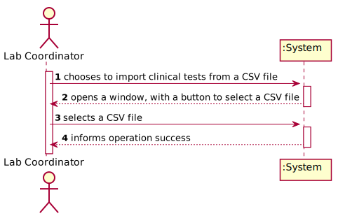
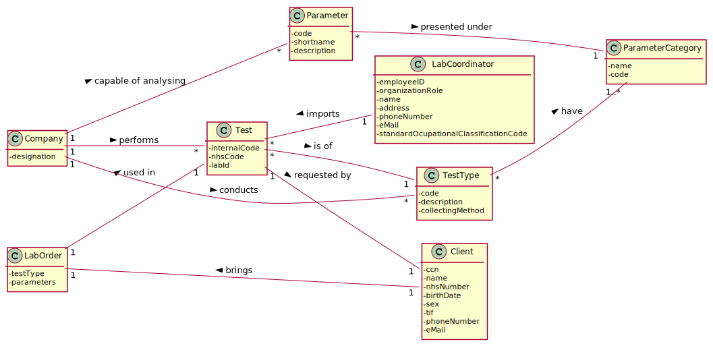
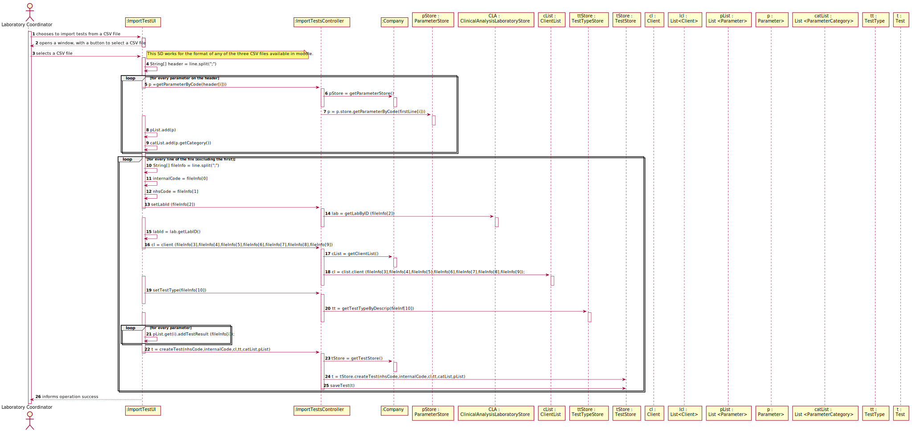
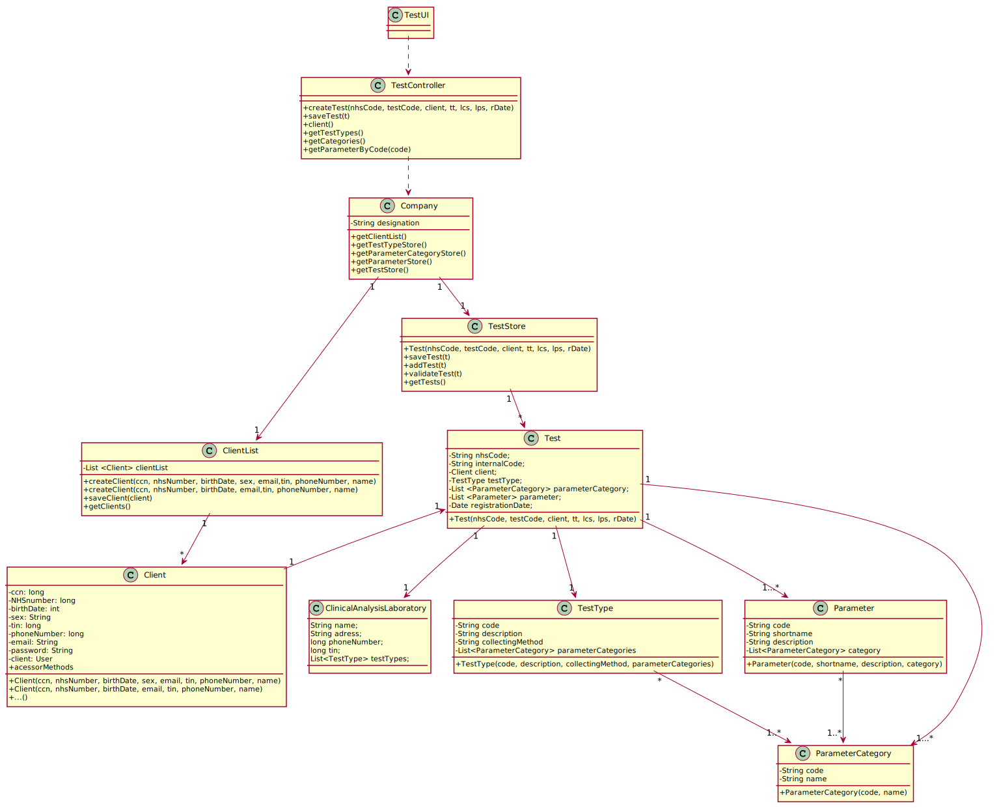

# US 017 - Import clinical tests from a CSV file

## 1. Requirements Engineering

### 1.1. User Story Description

As a laboratory coordinator, I want to import clinical tests from a CSV file.

### 1.2. Customer Specifications and Clarifications 

**In what folder should the CSV file be when we want to use the application through the console?**

In this sprint each team should develop a graphical user interface. The file to import can be located in any folder. The user should specify the path of the file.

**In the CSV, there is a parameter category that has 11 characters (Cholesterol). How do you suggest we should proceed?**

Please modify your application to accept category names with a maximum of 15 characters.

**Also, how should we fill the remaining data that's not mentioned in the CSV? Should it go as null or should we insert some random value?**

Please specify what information are you referring to.

**But during the last Sprint you mentioned a registration date also. Considering we could have more clients than the number that a Many Labs specific laboratory could deal in a day, then the registration date could be different than the sample collection date. My question is thus: Should the tests have a registration date plus sample collection date?**
 
You should use the Test_Reg_DateHour as the sample collection date.

**Will the CSV files always have the same format as the ones available on moodle?**

Yes. But we can have more categories and parameters for each type of test.

**In the CSV files provided for this sprint we can find a parameter with code HDL00 which belongs to the Cholesterol category and to the blood test type, but by searching the external modules for the blood test type the team could not find a match for the said parameter. What can we as a team do to resolve such issue?**

If the API does not have reference values for this parameter, than you should not present the reference values to the application user.

**If a labID on the CSV file isn't found on the system, should we consider it "invalid data"?**

Yes. To import tests of any laboratory (with a given Lab_ID), it is required that a laboratory having the given Lab_ID exists in the system.
Therefore, if you want to import data from a given laboratory, you should use the application to create that laboratory in the system. Then you should import the data.
When creating a laboratory in the system, you should use the given Lab_ID (available in the CSV file) and define the other attributes using valid data. In this project, we are NOT going to import data from laboratories (or other entities) to reduce the amount of hours required to develop and deliver a working application to the client.
What I say in this message is valid for the laboratories and for other entities that appear in the CSV files.

### 1.3. Acceptance Criteria

**AC1** If the file contains invalid data (e.g., a parameter not
defined in the system), that data should not be load into the system. 
An exception should be thrown.

**AC2** To import tests of any laboratory (with a given Lab_ID), it is required that a laboratory having the given Lab_ID exists in the system.

### 1.4. Found out Dependencies

*This US as dependency with US4 (Register a test), because when we import the file, the data needs to be registered .*

### 1.5 Input and Output Data

**Input Data:**

* Selected data

CSV file with the tests to import.
	
**Output Data:**

(In)success of the operation.

### 1.6. System Sequence Diagram (SSD)

### 1.7 Other Relevant Remarks
 
No other relevant remarks.

## 2. OO Analysis

### 2.1. Relevant Domain Model Excerpt 

### 2.2. Other Remarks

No other remarks.

## 3. Design - User Story Realization 

### 3.1. Rationale

**The rationale grounds on the SSD interactions and the identified input/output data.**

| Interaction ID | Question: Which class is responsible for... | Answer  | Justification (with patterns)  |
|:-------------  |:--------------------- |:------------|:---------------------------- |
| Step 1  		 |	...interacting with the actor? | ImportTestsUI   |  Pure Fabrication: there is no reason to assign this responsibility to any existing class in the Domain Model.           |
| 			  	 |	...coordinating the US? | ImportTestsController | Controller.                             |
| 			  	 |	...registering a new Test? | TestStore | Creator: In the DM Company has a TestStore and the store has the Test.   |
|				 |			                       | Company   | IE: Knows/has its own TestStore. |
| Step 2  		 | 	...requesting the needed data?|	ImportTestsUI | Interacts with the actor. |
| Step 3 		 |	...saving the selected data? | TestUI  | IE: Momentary save. |
| Step 4  		 |	...knowing if the Lab exists? | ClinicalAnalysisLaboratoryStore  | IE: Knows all the labs registered in the system. |
| Step 5  		 |	...saving the Client? | Client | IE: The object Client knows its own details about itself. |
| Step 6  		 |	...saving the Test Type ? | TestType | IE: The object TestType knows its own details about itself. |
| Step 7  		 |	...saving the Categories ? | ParameterCategory | IE: The object ParameterCategory knows its own details about itself. |
| Step 8 		 |	...saving the Parameters ? | Parameter | IE: The object Parameter knows its own details about itself. |
| Step 9         |  ...saving the Registration Date  | ImportTestsUI | There is no need to delegate this task to other classes.|
| Step 10        |  ...creating Test | Test | IE: Owns its data. |
| Step 11        |  ...adding the other Dates | Test | IE: Owns its data. |
| Step 12		 |	...validating all data (local validation)? | ImportTestsUI | Has validation methods. | 
| 			  	 |	...validating all data (global validation)? | TestStore | IE: Knows all its Tests. | 
| 	             |	...saving the created Test? | TestStore | IE: Owns all its Tests. | 
| Step 13 		 |	...informing operation success?| ImportTestUI  | Interacts with the actor.  |              

### Systematization ##

According to the taken rationale, the conceptual classes promoted to software classes are: 
 
 * ClinicalAnalysisLaboratoriesStore
 * Client
 * TestType
 * ParameterCategory
 * Parameter
 * Test
 * TestStore
 * Company

Other software classes (i.e. Pure Fabrication) identified: 

 * ImportTestsUI  
 * ImportTestsController

## 3.2. Sequence Diagram (SD)

*In this section, it is suggested to present an UML dynamic view stating the sequence of domain related software objects' interactions that allows to fulfill the requirement.* 

## 3.3. Class Diagram (CD)

*In this section, it is suggested to present an UML static view representing the main domain related software classes that are involved in fulfilling the requirement as well as and their relations, attributes and methods.*

# 4. Tests 
*In this section, it is suggested to systematize how the tests were designed to allow a correct measurement of requirements fulfilling.* 

**_DO NOT COPY ALL DEVELOPED TESTS HERE_**

**Test 1:** Check that it is not possible to create an instance of the Example class with null values. 

	@Test(expected = IllegalArgumentException.class)
		public void ensureNullIsNotAllowed() {
		Exemplo instance = new Exemplo(null, null);
	}

*It is also recommended to organize this content by subsections.* 

# 5. Construction (Implementation)

*In this section, it is suggested to provide, if necessary, some evidence that the construction/implementation is in accordance with the previously carried out design. Furthermore, it is recommeded to mention/describe the existence of other relevant (e.g. configuration) files and highlight relevant commits.*

*It is also recommended to organize this content by subsections.* 

# 6. Integration and Demo 

*This US contains some integrations with other US4 (Register a Test) because this one does the same, but info comes from a CSV file.*

*Some menu option were added.*

# 7. Observations

*In this section, it is suggested to present a critical perspective on the developed work, pointing, for example, to other alternatives and or future related work.*

