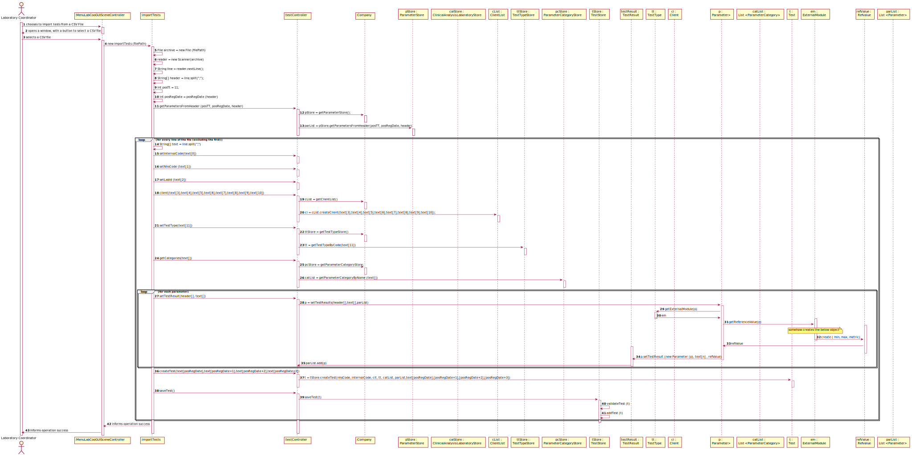
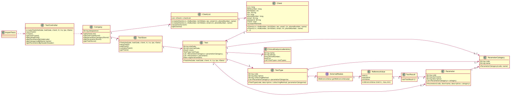

# US 017 - Import clinical tests from a CSV file

## 1. Requirements Engineering

### 1.1. User Story Description

As a laboratory coordinator, I want to import clinical tests from a CSV file.

### 1.2. Customer Specifications and Clarifications 

**In what folder should the CSV file be when we want to use the application through the console?**

In this sprint each team should develop a graphical user interface. The file to import can be located in any folder. The user should specify the path of the file.

**In the CSV, there is a parameter category that has 11 characters (Cholesterol). How do you suggest we should proceed?**

Please modify your application to accept category names with a maximum of 15 characters.

**Also, how should we fill the remaining data that's not mentioned in the CSV? Should it go as null or should we insert some random value?**

Please specify what information are you referring to.

**But during the last Sprint you mentioned a registration date also. Considering we could have more clients than the number that a Many Labs specific laboratory could deal in a day, then the registration date could be different than the sample collection date. My question is thus: Should the tests have a registration date plus sample collection date?**
 
You should use the Test_Reg_DateHour as the sample collection date.

**Will the CSV files always have the same format as the ones available on moodle?**

Yes. But we can have more categories and parameters for each type of test.

**In the CSV files provided for this sprint we can find a parameter with code HDL00 which belongs to the Cholesterol category and to the blood test type, but by searching the external modules for the blood test type the team could not find a match for the said parameter. What can we as a team do to resolve such issue?**

If the API does not have reference values for this parameter, than you should not present the reference values to the application user.

**If a labID on the CSV file isn't found on the system, should we consider it "invalid data"?**

Yes. To import tests of any laboratory (with a given Lab_ID), it is required that a laboratory having the given Lab_ID exists in the system.
Therefore, if you want to import data from a given laboratory, you should use the application to create that laboratory in the system. Then you should import the data.
When creating a laboratory in the system, you should use the given Lab_ID (available in the CSV file) and define the other attributes using valid data. In this project, we are NOT going to import data from laboratories (or other entities) to reduce the amount of hours required to develop and deliver a working application to the client.
What I say in this message is valid for the laboratories and for other entities that appear in the CSV files.

**Regarding the CSV files provided the citizen card number doesn't contain 16 digits, as you specified before. Should we change the restriction for the citizen card number length?**

This is not an error. Please open the csv file with an editor like notepad.

**Previously you said that “we can have more categories and parameters for each type of test.” regarding the format of the .csv files. Then, my understanding is that between the TestType and Test_Reg_DateHour columns, the number of columns is dynamic, correct? Could we end up seeing a Category_3, a Category_4, and so on?**

Yes.

**Up until now, we haven’t had any need to assign an address to a client. Seeing that there is now an Address column, that for us is somewhat left unused, would you advise us to add it as an attribute to the Client entity?**

Yes. The address should have no more than 90 characters. Please consider the address of the Employee to have the same format that I am suggesting now for the client's address. In the beginning of the project I said that the address of the Employee should have no more than 30 characters but with this size we can not write a normal UK address.

**When importing a test and associating it to the client, should the client exist beforehand or should we import the client with the information given on the CSV file?**

Different from what I asked for the other entities (like the lab), when importing the CSV data, if the client does not exist in the system, then the client should be created using the data available in the CSV file.

**When loading a .csv file after another .csv has been loaded beforehand, do we keep the tests that were loaded previously or do we replace them with the new tests being loaded from the new .csv?**

The tests should not be deleted after being loaded.

**When you say tests waiting results are you referring to tests with samples collected but not analyzed yet? If so, and considering the csv file does not have an explicit date for when the sample is collected, which date should we use?**

You should use the test registration date (Test_Reg_DateHour).

### 1.3. Acceptance Criteria

**AC1** If the file contains invalid data (e.g., a parameter not
defined in the system), that data should not be load into the system. 
An exception should be thrown.

**AC2** To import tests of any laboratory (with a given Lab_ID), it is required that a laboratory having the given Lab_ID exists in the system.

### 1.4. Found out Dependencies

*This US as dependency with US4 (Register a test), because when we import the file, the data needs to be registered .*

### 1.5 Input and Output Data

**Input Data:**

* Selected data

CSV file with the tests to import.
	
**Output Data:**

(In)success of the operation.

### 1.6. System Sequence Diagram (SSD)

### 1.7 Other Relevant Remarks
 
No other relevant remarks.

## 2. OO Analysis

### 2.1. Relevant Domain Model Excerpt 

### 2.2. Other Remarks

No other remarks.

## 3. Design - User Story Realization 

### 3.1. Rationale

**The rationale grounds on the SSD interactions and the identified input/output data.**

| Interaction ID | Question: Which class is responsible for... | Answer  | Justification (with patterns)  |
|:-------------  |:--------------------- |:------------|:---------------------------- |
| Step 1  		 |	...interacting with the actor? | ImportTests   |  Pure Fabrication: there is no reason to assign this responsibility to any existing class in the Domain Model.           |
| 			  	 |	...coordinating the US? | TestController | Controller.                             |
| 			  	 |	...showing the scene? | MenuLabCooGUISceneController | SceneController.                             |
| 			  	 |	...registering a new Test? | TestStore | Creator: In the DM Company has a TestStore and the store has the Test.   |
|				 |			                       | Company   | IE: Knows/has its own TestStore. |
| Step 2  		 | 	...requesting the needed data?|	ImportTests | Interacts with the actor. |
| Step 3 		 |	...saving the selected data? | ImportTests  | IE: Momentary save. |
| Step 4  		 |	...knowing if the Lab exists? | ClinicalAnalysisLaboratoryStore  | IE: Knows all the labs registered in the system. |
| Step 5  		 |	...saving the Client? | Client | IE: The object Client knows its own details about itself. |
| Step 6  		 |	...saving the Test Type ? | TestType | IE: The object TestType knows its own details about itself. |
| Step 7  		 |	...saving the Categories ? | ParameterCategory | IE: The object ParameterCategory knows its own details about itself. |
| Step 8 		 |	...saving the Parameters ? | Parameter | IE: The object Parameter knows its own details about itself. |
| Step 9         |  ...saving the Registration Date  | ImportTests | There is no need to delegate this task to other classes.|
| Step 10        |  ...creating Test | Test | IE: Owns its data. |
| Step 11        |  ...adding the other Dates | Test | IE: Owns its data. |
| Step 12		 |	...validating all data (local validation)? | ImportTests | Has validation methods. | 
| 			  	 |	...validating all data (global validation)? | TestStore | IE: Knows all its Tests. | 
| 	             |	...saving the created Test? | TestStore | IE: Owns all its Tests. | 
| Step 13 		 |	...informing operation success?| ImportTest  | Interacts with the actor.  |              

### Systematization ##

According to the taken rationale, the conceptual classes promoted to software classes are: 
 
 * ClinicalAnalysisLaboratoriesStore
 * Client
 * TestType
 * ParameterCategory
 * Parameter
 * Test
 * TestStore
 * Company

Other software classes (i.e. Pure Fabrication) identified: 

 * ImportTests  
 * TestController
 * MenuLabCooGUISceneController

## 3.2. Sequence Diagram (SD)

## 3.3. Class Diagram (CD)

# 4. Tests  

**_DO NOT COPY ALL DEVELOPED TESTS HERE_**

**Test 1:** Check that it is not possible to create an instance of the Test class with null values. 

	@Test(expected = IllegalArgumentException.class)
		public void ensureNullIsNotAllowed() {
		Test instance = new Test(null, null, null, null, null, null, null);
	}

**Test 2:** Check that it is not possible to create an instance of the Client class with null values. 

	@Test(expected = IllegalArgumentException.class)
		public void ensureNullIsNotAllowed2() {
		Client instance = new Client(null, null, null, null, null, null, null);
	}

(I haven't done much tests because I utilized the stores that already had tests done)

# 5. Construction (Implementation)
 
## TestController 

    public class TestController {
     public Test createTest(String nhsCode, String internalCode, Client client, TestType testType, List<ParameterCategory>
            parameterCategory, List<Parameter> parameter, Calendar registrationDate) throws IllegalArgumentException {

        TestStore tStore = this.company.getTestStore();
        Test t = tStore.createTest(nhsCode, internalCode, client, testType, parameterCategory, parameter, registrationDate);
        this.test = t;
        return this.test;
    }

    public void saveTest(Test t) {
        TestStore testStore = this.company.getTestStore();
        testStore.saveTest(t);
    }
      public List<ParameterCategory> getCategoriesByName(String[] text) {
        List<ParameterCategory> categoriesList = this.company.getParameterCategoryStore().getParameterCategories();
        List<ParameterCategory> catList = new ArrayList<>();
        for (int i = 0; i < categoriesList.size(); i++) {
            ParameterCategory c = categoriesList.get(i);
            for (int j = 0; j < text.length; j++) {
                if (text[j].equals(c.getName())) {
                    catList.add(c);
                }
            }
        }
        this.catList = catList;
        return catList;
    }
    public void saveClient(Client clt) {
        ClientList cList = this.company.getClientList();
        cList.saveClient(clt);
    }

    public Client client(long ccn, long nhsNumber, String birthDate,
                               long tin, long phoneNumber, String email, String name) {
        ClientList cl = this.company.getClientList();

        this.clt = cl.createClient(ccn, nhsNumber, birthDate, email, phoneNumber, tin, name);
        return this.clt;
    }
    }

## MenuLabCooGUISceneController
      ...
      private Stage loadTestsUi() {
        try{
        FXMLLoader loader = new FXMLLoader(getClass().getResource("/fxml/ShowImpTestsScene.fxml"));
        Parent root = loader.load();

        Scene scene = new Scene(root);

        Stage novoViewTestsStage = new Stage();
        novoViewTestsStage.initModality(Modality.APPLICATION_MODAL);
        novoViewTestsStage.setTitle("Imported Tests");
        novoViewTestsStage.setResizable(false);
        novoViewTestsStage.setScene(scene);

        ShowImportedTestsController novoViewTestsUI = loader.getController();
        novoViewTestsUI.associarParentUI(this);

        return novoViewTestsStage;
    } catch (IOException ex) {
        Utils.createAlert(Alert.AlertType.ERROR, "Erro", ex.getMessage());
        return null;
    }
    
    
## ImportTests

     public ImportTests(String path)  {
        this.importTestsController = new TestController();
        this.path = path;
        this.app = App.getInstance();
        File arquivoCSV = new File(this.path);
        int j = 1;
        int a = App.getInstance().getCompany().getTestCode();
        String lines;
        Scanner leitor2 = null;
        try {
            leitor2 = new Scanner(arquivoCSV);
        } catch (FileNotFoundException e) {
            e.printStackTrace();
        }

        assert leitor2 != null;
        String l = leitor2.nextLine();
        String[] header = l.split(";");
        int posTt = 0;
        int posRegDate = posRegDate (header);
        ...
        while (leitor2.hasNextLine()) {
            lines = leitor2.nextLine();
            j++;
            ...
            this.importTestsController.client(Long.parseLong(ccnFormatted), Long.parseLong(nhsNumber), bDay,
                    Long.parseLong(tin), Long.parseLong(phoneNumber), email, name);
        ...
        }
    }
    

# 6. Integration and Demo 

*This US contains some integrations with other US4 (Register a Test) because this one does the same, but info comes from a CSV file.*

*Some menu options were added.*

# 7. Observations

*This US was well developed, the import test fuction is correctly working.* 

