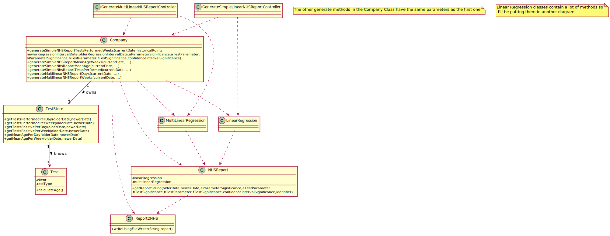

# US 18 - To send the NHS a covid-19 report with varying inputs.

## 1. Requirements Engineering

### 1.1. User Story Description

As an Administrator I want to send the Covid-19 report to the NHS at any time. I want to define the interval of dates to fit the regression model, the number of historical  points (number of days or number of weeks) that must be sent to the NHS, the regression model to use and select the independent variables to use. 

### 1.2. Customer Specifications and Clarifications 

**From the specifications document:**

>	Considering that Many Labs has the exclusivity to perform Covid-19 tests, and that the contract
with the NHS in England requires Many Labs to summarize and report Covid-19 data, the company
needs to: identify the number of Covid-19 tests performed, identify all positive results to Covid-19
tests, report the total number of Covid-19 cases per day, per week and per month of the year, and
send the forecasts for these same time horizons (the number of Covid-19 cases for the following
day, next week and next month). The company is also required to generate daily (automatic) reports
with all the information demanded by the NHS and should send them to the NHS using their API.
To make the predictions, the NHS contract defines that a linear regression algorithm should be used.
The NHS required that both simple linear and multiple linear regression algorithms should be
evaluated to select the best model.

**From the client clarifications:**

> **Question:**From the covid report example you gave us we can see that is missing two dates(16/05/2021 and 23/05/2021) in the predictions table. Is there any specific reason?
>  
> **Answer:** These days of the week are two Sundays and the laboratory does not work on Sundays.

-

> **Question:** If on a certain day or week there aren't any Covid 19 tests realized and therefore no clients, should we consider the mean age to be 0?
>  
> **Answer:** Yes, you should consider the mean age to be zero. Sundays should not be considered in your analysis.

-

> **Question:**  In US 18, should we ask the user to select which parameter he/she wants be analyzed for the hypothesis tests (a or b)?
>  
> **Answer:** Yes.

-

> **Question:** Also, should we ask for the prevision interval level or should we just use 95% like it's shown in the example report?
>  
> **Answer:** The user should introduce the confidence level value.

-

> **Question:**In US18 you said " ..the number of historical points (number of days or number of weeks) that must be sent to the NHS .." what exactly is this ? Is this a interval of dates ? 
>
> **Answer:** Yes, you must allow the client to choose days of weeks.

-

> **Question:**If the admin selects the multilinear regression he/she can select more than one independent variable. Should he select from a checklist the ones that he/she want? If so, what are the supposed independent variables we need to include in the checklist?From Sprint D requirements we also get "Administrator should be able to choose the independent variable to use with the simple linear regression model (either the number of tests realized or the mean age)." 
>
> **Answer:**  To apply mlr you need two independent variables- daily number tests and mean age person tested daily. Also you need the same records per week.

-

> **Question:**The acceptance criteria have "When the system is configured to use the simple linear regression model, the performance of each model should be used to select the best model (the one that uses the number of tests realized or the one that uses the mean age as the independent variable)." And a doubt came to my mind...How it is supposed to evaluate the performance of the Simple Linear Regression for the different independent variables?
>
> **Answer:** You should apply anova and from the best r2 you can conclude which fits better.

-

> **Question:**From Sprint D requirements we get "I want to define... the number of historical points (number of days or number of weeks) that must be sent to the NHS". Is the Administrator who must choose between days or weeks? If so, how should he make this choice?
>
> **Answer:** Yes. The Administrator should select between days and weeks using the user interface.

-

> **Question:** From the project description it is known "send the forecasts for these same time horizons (the number of Covid-19 cases for the following day, next week and next month)." In the example report we have in moodle, there is a line that says "// Prediction values". Does this mean that after this line we should put our predictions or it refers to the following table?
>
> **Answer:** Yes, the prediction values are the ones available in the table that we include in the example.

-

> **Question:** Regarding US18 and US19, it is only one report containing all the tests performed by Many Labs to be sent each time, correct? Or is it one report per laboratory, for example? Or other option?
>
> **Answer:** The report should contain all the tests made by Many Labs.

-

> **Question:** Should the report contain the data of all the tests with results (with or without report, with or without validation) or contain only the validated tests? (Or other option?)
>
> **Answer:** The NHS Covid report should include statistics computed only from validated tests.

-

> **Question:** Which significance level should we use for the hypothesis tests?
>
> **Answer:** The application should allow the user to choose the significance level.

### 1.3. Acceptance Criteria

* **AC1:** The system should allow the Administrator to select between a simple linear and multilinear regression model to fit the data. Moreover, the Administrator should be able to choose the independent variable to use with the simple linear regression model (either the number of tests realized or  the mean age). The system should send the report using the NHS API (available in moodle). 
* **AC2:** The user should be able to select the signifance.
* **AC3:** The user should be able to select between weeks and days as historical points.
* **AC4:** The report should contain all the tests made by Many Labs.
* **AC5:** The NHS Covid report should include statistics computed only from validated tests.
* **AC6:** The application should allow the user to choose the significance level.
* **AC7:** Sundays should not be counted as the laboratories do not work on Sundays.

### 1.4. Found out Dependencies

* There is a dependency regarding US15 as the tests need to be validated in order to be used for the regression model.
* There is a dependency regarding US3 as we need to know the age of the clients in order to calculate the mean age.
* There is a dependency regarding US12 as we need to know if a Covid-19 test is positive or not.

### 1.5 Input and Output Data

**Input Data:**

* Typed data:
	* Number of historical points(number of days or number of weeks)
	* Number of the interval of dates to fit the regression model.
	* Significance of the tests.
	
* Selected data:
	* Which type of linear regression to use.
	* Which independent variables to use.(if it's a simple regression model)

**Output Data:**

* Operation Success(or Insuccess).
* NHS Report .

### 1.6. System Sequence Diagram (SSD)

**Alternative 1**

**Other alternatives might exist.**

### 1.7 Other Relevant Remarks

* None so far

## 2. OO Analysis

### 2.1. Relevant Domain Model Excerpt 

### 2.2. Other Remarks

n/a

## 3. Design - User Story Realization 

### 3.1. Rationale

**SSD - Alternative 1 is adopted.**

| Interaction ID | Question: Which class is responsible for... | Answer  | Justification (with patterns)  |
|:-------------  |:--------------------- |:------------|:---------------------------- |
| Step 1  		 |	... interacting with the actor? | CreateAReportUI  |  **Pure Fabrication:** there is no reason to assign this responsibility to any existing class in the Domain Model.           |
| 			  		 |	... coordinating the US? | CreateAReportController | **Controller**                             |
| Step 2  		 |... "translating" the input used to create the report into data that can be used by the system.| CreateAReportController | **IE:** The controller class knows which inputs to expect and translates them accordingly.|
|                |... knowing if the inputs are valid  | CreateAReportController | **IE:** The controller class will check each input to see if the data is valid and show the user if there is something wrong.|
|                |... getting the data asked by the client (mean age of clients that performed tests or positive cases and tests performed) |Company| **IE:** The Company class has a TestStore that contains Test Objects that have attributes to measure the requested data.|
| Step 3         | ... performing the calculations to create the report.|LinearRegression\MultiLinearRegression| **IE:** and **Pure Fabrication** These classes receive the necessary date and perform the calculations needed to create the report.|
| Step 4  		 |	... Creating the proper String used for the API | GenerateNHSReport  | **Pure Fabrication** This Class will be used to structure the string used in the NHS API |
| Step 5  		 |	... creating the file to show the user the file to later ask for confirmation |GenerateNHSReport| **IE:** This class has the String of the report and will make a file and show it to have the user know what they are sending.	
|               					 | ... showing the user the file     |CreateAReportController| **IE:** It Gets the current report and shows it to the user.|
|                |... asking for confirmation| CreateAReportGUI | **IE:** is responsible for user interactions.|
| Step 6  		 |	... sending the report to the NHS?| Report2NHS | **Pure Fabrication** its the API given to us.| 
| Step 7  		 |	... informing operation success?| CreateAReportGUI | **IE:** is responsible for user interactions.| 

### Systematization ##

According to the taken rationale, the conceptual classes promoted to software classes are: 
* NHSReport

Other software classes (i.e. Pure Fabrication) identified: 

 * CreateAReportGUI
 * GenerateSimpleLinearReportController
 * GenerateMultiLinearReportController
 * LinearRegression\MultiLinearRegression
 * GenerateNHSReport

Other software classes of external systems/components:

* Company
* TestStore
* Test
* AuthFacade
* Report2NHS (API)

## 3.2. Sequence Diagram (SD)

**Alternative 1**

**Alternative 2**

## 3.3. Class Diagram (CD)

**From alternative 1**

![US_18_CD_LINEARREGRESSION] (US_18_CD_LINEARREGRESSION.svg)

# 4. Tests 

**Test 1:** getTests. Ensure that all get method tests return the proper list.

	@Test(expected = expectedListWithCorrectTests)
		public void getTestsPerformedPerDay() {
		TestStore ts= new TestStore;
		List<Test> tl= ts.getTestsPerformedPerDay();
		...
		assertEquals(expected,tl)
	}
	

**Test 2:** nhsReport. Ensure that the reports always return the proper String even with variations.

	@Test(expected = properNhsReportString)
		public void getReportString() {
		NHSReport  nhsReport= new NHSReport(...);
		...
		assertEquals(expected,nhsReport.getReportString(...);
		
		
	}

**Test 3:** Ensure that the linear regression calculations are properly made.

	@Test(expected= linearRegressionResult)
		public void toStringTest(){
		linearRegression lr= new LinearRegression(...)
		...
		assertEquals(linearRegressionResult,lr.method())
 }

# 5. Construction (Implementation)

## Class GenerateSimpleLinearNHSReportController
**JavaFX**
		public class GenerateSimpleLinearNHSReportController {
          private Company company;
          public GenerateSimpleLinearNHSReportController(){
        this.company=App.getInstance().getCompany();
		}
		 void generateReportButton(ActionEvent event){
		 
		...
		txaShowReport.setText(resultString)
		}
			
		void btnYesClick(ActionEvent event){
		company.sendReport2NHS(txaShowReport.getText());
		}
	
## Class GenerateMultiLinearNHSReportController
**JavaFX**
		public class GenerateMultiLinearNHSReportController {
          private Company company;
          public GenerateMultiLinearNHSReportController(){
        this.company=App.getInstance().getCompany();
		}
		 void generateReportButton(ActionEvent event){
		 
		...
		txaShowReport.setText(resultString)
		}
			
		void btnYesClick(ActionEvent event){
		company.sendReport2NHS(txaShowReport.getText());
		}		 

## Class Test

	public class Test{
	     ...
		  	private Client client;
			public double calculateAge(){
			birthDate=client.getBirthDate()
			...
			return age;
	}
## Class TestStore
	public class TestStore{
	...
	 private List<Test> getValidatedTests(){
        List<Test> resultList=new ArrayList<>();
        ...
        return resultList;
    }

   private List<Test> getTestsInDayInterval(Calendar olderDate, Calendar newerDate) {
        List<Test> lTestsInInterval = new ArrayList<>();
        ...
        return lTestsInInterval;
    }

    private List<Test> getTestsInWeekListInterval(Calendar olderDate,Calendar newerDate) {
        if (olderDate.get(Calendar.DAY_OF_WEEK) != Calendar.MONDAY || olderDate.get(Calendar.DAY_OF_WEEK) != Calendar.MONDAY) {
            throw new IllegalArgumentException("o dia da semana so pode ser segunda feira");
        ...
        return lTestsInInterval;
    }

   private List<Calendar> getTotalDateList(Calendar olderDate,Calendar newerDate){
      ...
       return totalDates;
   }

    private   List<Calendar> getTotalWeekList(Calendar olderDate,Calendar newerDate){
      ...
        return totalDates;
    }
	
    public double[] getTestsPerformedPerDay(Calendar olderDate,Calendar newerDate){
        int cont=0;
        ...
        return arrDouble;
    };
        public double[] getTestsPerformedPerWeek(Calendar olderDate,Calendar newerDate){
            int cont=0;
            ...
            return arrDouble;
    }
    public double[] getTestsPositivePerWeek(Calendar olderDate,Calendar newerDate){
        int cont=0;
        ...
        return arrDouble;

    }
    public double[] getMeanAgePerWeek(Calendar olderDate,Calendar newerDate){
        ...
        return arrDouble;
    }

    public double[] getPositiveCovidTestsPerformedOnDay(Calendar olderDate,Calendar newerDate){
        ...
        return arrDouble;
    }
    public double[] getMeanAgeOfTestsPerformedPerDay(Calendar olderDate,Calendar newerDate){
        ....
        return arrDouble;
    }
    }
## Class Company
	public String generateSimpleNhsReportTestsPerformed(Calendar currentDate, int historicalPoints, Calendar newerRegressionIntervalDate, Calendar olderRegressionIntervalDate, double aParameterSignificance, double aTestParameter, double bParamatereSignificance, double bTestParameter, double fTestSignificance, double confidenceIntervalSignificance) {
       ...
        return report.getReportString(getHistoricalPointDayOlderDate(currentDate, historicalPoints), currentDate, aParameterSignificance, aTestParameter, bParamatereSignificance, bTestParameter, fTestSignificance, confidenceIntervalSignificance, "days");
    }

    public String generateSimpleNhsReportMeanAge(Calendar currentDate, int historicalPoints, Calendar newerRegressionIntervalDate, Calendar olderRegressionIntervalDate, double aParameterSignificance, double aTestParameter, double bParamatereSignificance, double bTestParameter, double fTestSignificance, double confidenceIntervalSignificance) {
        ...
        return report.getReportString(getHistoricalPointDayOlderDate(currentDate, historicalPoints), currentDate, aParameterSignificance, aTestParameter, bParamatereSignificance, bTestParameter, fTestSignificance, confidenceIntervalSignificance, "days");
    }

    public String generateSimpleNHSReportTestsPerformedWeeks(Calendar currentDate, int historicalPoints, Calendar newerRegressionIntervalDate, Calendar olderRegressionIntervalDate, double aParameterSignificance, double aTestParameter, double bParamatereSignificance, double bTestParameter, double fTestSignificance, double confidenceIntervalSignificance) {
        ...
        return report.getReportString(getHistoricalPointWeekOlderDate(currentDate, historicalPoints), currentDate, aParameterSignificance, aTestParameter, bParamatereSignificance, bTestParameter, fTestSignificance, confidenceIntervalSignificance, "weeks");
    }

    public String generateSimpleNHSReportMeanAgeWeeks(Calendar currentDate, int historicalPoints, Calendar newerRegressionIntervalDate, Calendar olderRegressionIntervalDate, double aParameterSignificance, double aTestParameter, double bParamatereSignificance, double bTestParameter, double fTestSignificance, double confidenceIntervalSignificance) {
        ...
        return report.getReportString(getHistoricalPointWeekOlderDate(currentDate, historicalPoints), currentDate, aParameterSignificance, aTestParameter, bParamatereSignificance, bTestParameter, fTestSignificance, confidenceIntervalSignificance, "weeks");
    }

    public String generateMultilinearNHSReportDays(Calendar currentDate, int historicalPoints, Calendar newerRegressionIntervalDate, Calendar olderRegressionIntervalDate, double b0ParameterSignificance, double b1ParamaterSignificance, double b2ParameterSignificance, double fTestSignificance, double confidenceIntervalSignificance){
	...
	return report.getReportString(getHistoricalPointDayOlderDate(currentDate,historicalPoints),currentDate,b0ParameterSignificance,b1ParamaterSignificance,b2ParameterSignificance,0,fTestSignificance,confidenceIntervalSignificance,"days");
	}

public String generateMultilinearNHSReportWeeks(Calendar currentDate, int historicalPoints, Calendar newerRegressionIntervalDate, Calendar olderRegressionIntervalDate, double b0ParameterSignificance, double b1ParamaterSignificance, double b2ParameterSignificance, double fTestSignificance, double confidenceIntervalSignificance){
       ...
        return report.getReportString(getHistoricalPointWeekOlderDate(currentDate,historicalPoints),currentDate,b0ParameterSignificance,b1ParamaterSignificance,b2ParameterSignificance,0,fTestSignificance,confidenceIntervalSignificance,"weeks");

	}

	public void sendReportToNHS(String report){
        Report2NHS.writeUsingFileWriter(report);
    }
	private Calendar getHistoricalPointWeekOlderDate(Calendar currentDate, int historicalPointAmount) {
        ...
        return (Calendar) olderDate.clone();
    }
	private Calendar getHistoricalPointDayOlderDate(Calendar currentDate, int historicalPointAmount) {
        int i = historicalPointAmount;
        ...
        return (Calendar) olderDate.clone();
    }

## Class LinearRegression
    private final double slope;
    private final double r2;
    private final double svar0, svar1;
    private final double n;
    private final double[] arrayX;
    private final double[] arrayY;
    private final static double k = 1;
    private final static double SR_DEGREES_OF_FREEDOM=1;
    private final double sEDegreesOfFreedom;
	
	public LinearRegression(double[] arrayX ,double[] arrayY){
	this.arrayX=arrayX;
	this.arrayY=arrayY;
	...
	}
	public double intercept() {
        return intercept;
    }
	public double slope() {
        return slope;
    }
	 public double r2() {
        return r2;
    }
	public double interceptStdErr() {
        return Math.sqrt(svar0);
    }
	 public double slopeStdErr() {
        return Math.sqrt(svar1);
    }
	public double predict(double x) {
        return slope * x + intercept;
    }
	 public String toString() {
	 StringBuilder s = new StringBuilder();
	 ...
	 return s.toString();
	 }
	  public double R2Adjusted() {
	  ...
	  return 1 - (topRow / bottomRow);
	 }
	  public double R(){
        return Math.sqrt(this.R2());
    }
	private double[] arrayYthroughRegressionModel() {
        double[] yThroughRegressionModel = new double[this.arrayY.length];
        ...
        return yThroughRegressionModel;
    }
	private double calculateS() {
        double total = 0;
        ...
        return Math.sqrt((double) 1 / (this.arrayX.length - 2) * (total));
    }
	public double testCalculationforAparameter(double aParameter) {
	...
	return Math.abs((this.intercept - aParameter) / (this.calculateS() * (Math.sqrt((double) 1 / this.arrayX.length + (Math.pow(arrayAverage(arrayX), 2) / xxbar)))));
	}
	 public double testCalculationforBparameter(double bParameter) {
        ...
        return Math.abs((this.slope - bParameter) / this.calculateS() * (Math.sqrt(xxbar)));
    }
	public double getTStudentFromTable(double significance) {
        ....
        return critTD;
    }
	private double arrayAverage(double[] arr) {
        double total = 0;
        ...
        return total / arr.length;
    }
	public double calculateAnovaSR() {
        ...
        return SRValue;
    }
	public double calculateAnovaSE() {
        ...
        return SEValue;
    }
	public double calculateAnovaST(){
        return  calculateAnovaSR()+calculateAnovaSE();
    }
    public double calculateAnovaMSR(){
        return  calculateAnovaSR()/1;
    }
    public double calculateAnovaMSE(){
        return calculateAnovaSE()/(arrayX.length-2);
    }
    public double calculateTestF(){
        return calculateAnovaMSR()/calculateAnovaMSE();
    }
	public double getFSnedcorFromTable(double significance){
       ...
        return critFD;
	public int getResidualDF(){
        return arrayX.length-2;
    }
    public double delta(double significance,double x){
        return getTStudentFromTable(significance)*calculateS()*Math.sqrt(((double) 1/arrayX.length)+(Math.pow(x-arrayAverage(arrayX),2)/xxBar()));
    }
    public int getRegressionDF(){
        return  1;
    }
    }
	
## Class MultiLinearRegression	

	public class MultiLinearRegression {
    private final double[] arrayX1;
    private final double[] arrayX2;
    private final double[] arrayY;
    private final double b0;
    private final double b1;
    private final double b2;
    private static final int NUMBER_OF_VARIABLES = 3;
    private final double[][] bColumn = new double[3][1];
    private final double[][] xMatrix;
    private final double[][] yVector;
    private double[][] xMatrixInverse;
    double[][] xMatrixTransposed;
    double[][] xMatrixTimesXMatrixTransposed;
    double[][] xMatrixTimesXMatrixTransposedInverse;

    public String toString() {
        StringBuilder s = new StringBuilder();
        ...
        return s.toString();
    }

    public MultiLinearRegression(double[] arrayX1, double[] arrayX2, double[] arrayY) {
        this.arrayX1 = arrayX1;
        this.arrayX2 = arrayX2;
        this.arrayY = arrayY;
        ...
    }

    private double[][] transposeMatrix(double[][] m) {
        double[][] temp = new double[m[0].length][m.length];
        ...
        return temp;
    }

    private double[][] invert(double[][] a) {
        int n = a.length;
        double[][] x = new double[n][n];
        ...
        return x;
    }

    private void gaussian(double[][] a, int[] index) {
        int n = index.length;
        double c[] = new double[n];
       ...
    }

    private double multiplyMatricesCell(double[][] firstMatrix, double[][] secondMatrix, int row, int col) {
        double cell = 0;
        ...
        return cell;
    }

    private double[][] multiplyMatrices(double[][] firstMatrix, double[][] secondMatrix) {
        double[][] result = new double[firstMatrix.length][secondMatrix[0].length];
		...
        return result;
    }

    private double arrayAverage(double[] arr) {
        double total = 0;
        ...
        return total / arr.length;
    }

    public double sqr() {
        ...
        return number - (arrayX1.length * Math.pow(arrayAverage(arrayY), 2));

    }

    public double sqe() {
        ...
        return firstNumber - secondNumber;
    }

    public double sqt() {
        return sqe() + sqr();
    }

    public double regressionDegreesOfFreedom() {
        return (double) NUMBER_OF_VARIABLES - 1;
    }

    public double errorDegreesOfFreedom() {
        return arrayY.length - regressionDegreesOfFreedom() - 1;
    }

    public double totalDegreesOfFreedom() {
        return regressionDegreesOfFreedom() + errorDegreesOfFreedom();
    }

    public double mqr() {
        return sqr() / regressionDegreesOfFreedom();
    }

    public double mqe() {
        return sqe() / errorDegreesOfFreedom();
    }

    public double testStatisticF() {
        return mqr() / mqe();
    }

    public double getFSnedcorFromTable(double significance) {
        FDistribution fd = new FDistribution(regressionDegreesOfFreedom(), errorDegreesOfFreedom());
        return fd.inverseCumulativeProbability(1 - significance);

    }

    public double r2() {
        return sqr() / sqt();
    }

    public double r2Adjusted() {
        return 1 - ((double) (arrayY.length - 1) / errorDegreesOfFreedom()) * (1 - r2());
    }

    public double coeficientRegressionTestAuxiliaryCalculus(double significance) {
        return getTStudentFromTable(significance) * Math.sqrt(mqe() * xMatrixInverse[xMatrixInverse.length - 1][xMatrixInverse.length - 1]);
    }

    public double getTStudentFromTable(double significance) {
        TDistribution td = new TDistribution(errorDegreesOfFreedom());
        ...
        return critTD;
    }

    public double predict(double x1, double x2) {
        ...
        return multiplyMatrices(auxiliaryLine, bColumn)[0][0];
    }

    public double expectedValueTestConfidenceIntervalAuxiliaryCalculus(double significance, double x1, double x2) {
        double[][] auxiliaryLine = new double[1][NUMBER_OF_VARIABLES];
        ...
        return t * Math.sqrt(mqe() * resultOfMatrixMultiplication);
    }

    public double hypothesisB0() {
        return b0 / Math.sqrt(mqe() * xMatrixTimesXMatrixTransposedInverse[0][0]);
    }

    public double hypothesisB1() {
        return b1 / Math.sqrt(mqe() * xMatrixTimesXMatrixTransposedInverse[1][1]);
    }

    public double hypothesisB2() {
        return b2 / Math.sqrt(mqe() * xMatrixTimesXMatrixTransposedInverse[2][2]);
    }

    public double r() {
        return Math.sqrt(this.r2());
    }

## Class NHSReport
public class NHSReport {
    private LinearRegression linearRegression = null;
    private MultiLinearRegression multiLinearRegression = null;
    private double[] receivedYData;
    private double[] receivedX1Data;
    private double[] receivedX2Data;

    public NHSReport(LinearRegression linearRegression, double[] receivedYData, double[] receivedXData) {
        this.receivedYData = receivedYData;
        this.linearRegression = linearRegression;
        this.receivedX1Data = receivedXData;
    }

    public NHSReport(MultiLinearRegression multiLinearRegression, double[] receivedX1Data, double[] receivedX2Data, double[] receivedYData) {
        this.multiLinearRegression = multiLinearRegression;
        this.receivedYData = receivedYData;
        this.receivedX1Data = receivedX1Data;
        this.receivedX2Data = receivedX2Data;

    }

    private String regressionModelLine() {
        ...
        return String.format("You have must introduce either Multilinear / Simple Linear Regression");
    }

    private String otherStatistics() {
	    String s ="";
        ...
        return s;
    }

    private String hypothesisTests(double aParemeterSignificance, double aTestParameter, double bParameterSignificance, double bTestParameter) {
        String s ="";
        ...
        return s;
    }

    private String Anova() {
        String s ="";
        ...
        return s;
    }

    private String decisionF(double fTestDecisionSignificance) {
        String s ="";
        ...
        return s;
    }

    private static String predictionValues(String date, int positiveCases, double estimatedCases, String intervals) {
        return String.format("%n%4s %15d  %43.4f %45s %n", date, positiveCases, estimatedCases, intervals);
    }

    private static String linePredictionValues(double confidenceIntervalSignificance) {
        return String.format("%n%n%s %40s %40s %30s", "Date", "Number of OBSERVED positive cases", "Number of ESTIMATED positive cases ", confidenceIntervalSignificance*100 + "% intervals \n");
    }

    private String isARejectedOrNot(double TestParameter, double TestSignificance) {
        String s ="";
        ...
        return s;
    }

    private String isBRejectedOrNot(double TestParameter, double TestSignificance) {
        String s ="";
        ...
        return s;
    }

    private String isFRejectedOrNot(double FTestSignificance) {
        String s ="";
        ...
        return s;
    }

    public String printFinalTable(Calendar olderDate, Calendar newerDate, double confidenceIntervalSignificance, String identifier) {
        String s ="";
        ...
        return s;
    }

    private void showDateWeeks(double confidenceIntervalSignificance, int i, StringBuilder resultString, Calendar olderDateUsed) {
        if (this.linearRegression==null&& this.multiLinearRegression!=null) {
            resultString.append(String.format("%d/%d/%d %30.2f %30.2f %30.2f-%.2f %n", olderDateUsed.get(Calendar.DAY_OF_MONTH), olderDateUsed.get(Calendar.MONTH) + 1, olderDateUsed.get(Calendar.YEAR), receivedYData[i - 1], multiLinearRegression.predict(receivedX1Data[i - 1],receivedX2Data[i-1]), multiLinearRegression.predict(receivedX1Data[i - 1],receivedX2Data[i-1]) - multiLinearRegression.expectedValueTestConfidenceIntervalAuxiliaryCalculus(confidenceIntervalSignificance, receivedX1Data[i - 1], receivedX2Data[i - 1]), multiLinearRegression.predict(receivedX1Data[i - 1],receivedX2Data[i-1]) + multiLinearRegression.expectedValueTestConfidenceIntervalAuxiliaryCalculus(confidenceIntervalSignificance, receivedX1Data[i - 1], receivedX2Data[i - 1])));
        }else  resultString.append(String.format("%d/%d/%d %30.2f %30.2f %30.2f-%.2f %n", olderDateUsed.get(Calendar.DAY_OF_MONTH), olderDateUsed.get(Calendar.MONTH) + 1, olderDateUsed.get(Calendar.YEAR), receivedYData[i - 1], linearRegression.predict(receivedX1Data[i - 1]), linearRegression.predict(receivedX1Data[i - 1]) - linearRegression.delta(confidenceIntervalSignificance,linearRegression.predict(receivedX1Data[i-1]))+linearRegression.delta(confidenceIntervalSignificance,linearRegression.predict(receivedX1Data[i-1]))));
    }

    private void showDate(double confidenceIntervalSignificance, int i, StringBuilder resultString, Calendar olderDateUsed) {
        if (this.linearRegression==null&&this.multiLinearRegression!=null) {
            resultString.append(String.format("%d/%d/%d %30.2f %30.2f %30.2f-%.2f %n", olderDateUsed.get(Calendar.DAY_OF_MONTH), olderDateUsed.get(Calendar.MONTH) + 1, olderDateUsed.get(Calendar.YEAR), receivedYData[i - 1],multiLinearRegression.predict(receivedX1Data[i - 1],receivedX2Data[i-1]), multiLinearRegression.predict(receivedX1Data[i-1],receivedX2Data[i-1]) - multiLinearRegression.expectedValueTestConfidenceIntervalAuxiliaryCalculus(confidenceIntervalSignificance,receivedX1Data[i-1],receivedX2Data[i-1]), multiLinearRegression.predict(receivedX1Data[i-1],receivedX2Data[i-1]) + multiLinearRegression.expectedValueTestConfidenceIntervalAuxiliaryCalculus(confidenceIntervalSignificance, receivedX1Data[i - 1],receivedX2Data[i-1])));
        }else resultString.append(String.format("%d/%d/%d %30.2f %30.2f %30.2f-%.2f %n", olderDateUsed.get(Calendar.DAY_OF_MONTH), olderDateUsed.get(Calendar.MONTH) + 1, olderDateUsed.get(Calendar.YEAR), receivedYData[i - 1],linearRegression.predict(receivedX1Data[i - 1]), linearRegression.predict(receivedX1Data[i-1]) - linearRegression.delta(confidenceIntervalSignificance,receivedX1Data[i-1]),linearRegression.predict(receivedX1Data[i-1])+linearRegression.delta(confidenceIntervalSignificance,receivedX1Data[i-1])));
    }

    private LocalDate getLocalDate(Calendar calendar) {
        return LocalDateTime.ofInstant(calendar.toInstant(), calendar.getTimeZone().toZoneId()).toLocalDate();
    }

    public String getReportString(Calendar olderDate, Calendar newerDate, double aParameterSignificance, double aTestParameter, double bTestSignificance, double bTestParameter, double fTestSignificance, double confidenceIntervalSignificance, String identifier) {

        String s ="";
        ...
        return s;
    }
    

}

# 6. Integration and Demo 

* The administrator can send reports to the NHS using test datas.

# 7. Observations

I should have used a DTO to transfer the significance values but i didn't have time to implement them.
The date used to select weeks can only be Mondays.

