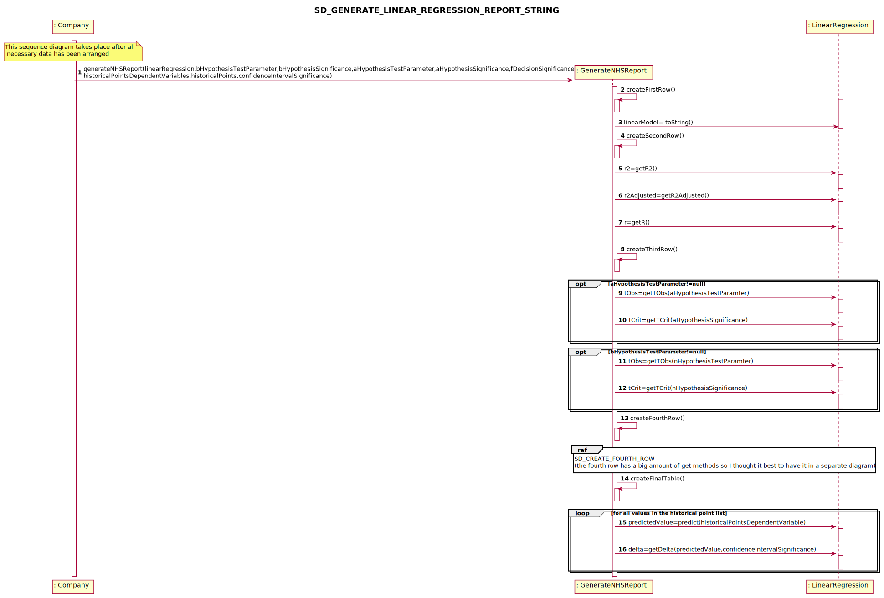

# US 019 - Send to the NHS daily reports of Covid-19 data

## 1. Requirements Engineering

### 1.1. User Story Description

"The Many Labs company wants to send to the NHS daily reports of Covid-19 data, including the number of observed values and estimated values. Reports should be generated automatically with historical data and must be sent every day at 6:00 am."

### 1.2. Customer Specifications and Clarifications 

**From the specifications document:**

> "The company is also required to generate daily (automatic) reports with all the information demanded by the NHS and should send them to the NHS using their API. To make the predictions, the NHS contract defines that a linear regression algorithm should be used. The NHS required that both simple linear and multiple linear regression algorithms should be evaluated to select the best model. The accuracy of the prediction models should be analysed and documented in the application user manual (in the annexes) that must be delivered with the application. The algorithm to be used by the application must be defined through a configuration file"

> My interpretation:

> ManyLabs has a contract with the NHS which grant the exclusivity to perform Covid-19 tests. With that ManyLabs has the responsibility to elaborate daily reports about the current Covid situation in England. This includes all the new positive covid tests and predictions in a defined time window. The report must be sent automatically everyday at 6pm.

**From the client clarifications:**

> **Question1:** Regarding US18 and US19, it is only one report containing all the tests performed by Many Labs to be sent each time, correct? Or is it one report per laboratory, for example? Or other option?
> [Link](https://moodle.isep.ipp.pt/mod/forum/discuss.php?d=8892)
> > **Answer:** The report should contain all the tests made by Many Labs.

> **Question2:**  In US19, in Sprint D Requirements, it says "The report should include day and week (observed and estimated) values..." and also "Reports...must be sent every day at 6:00 am". As the Report is to be automatically sent very early in the morning, do you wish the report to have the data concerning the day before and the last week starting at the day before?
> [Link](https://moodle.isep.ipp.pt/mod/forum/discuss.php?d=8892)
> > **Answer:** The format of the report should follow the report example that is available in moodle.

> **Question3:** Should the report contain the data of all the tests with results (with or without report, with or without validation) or contain only the validated tests? (Or other option?)
> [Link](https://moodle.isep.ipp.pt/mod/forum/discuss.php?d=8892)
> > **Answer:** The NHS Covid report should include statistics computed only from validated tests.

> **Question4:** General doubt: Are we going to be able to use more math libraries in order to facilitate the calculus (for example, for confidence intervals) or is the rest of the calculus to be developed by each team?
> [Link](https://moodle.isep.ipp.pt/mod/forum/discuss.php?d=8892)
> > **Answer:** Each team should implement the classes and methods needed.

> **Question5:** As the report is generated automatically, should the system generate a notication that the report was sent?
> [Link](https://moodle.isep.ipp.pt/mod/forum/discuss.php?d=8894)
> > **Answer:** The application should write the event into a log file.

> **Question6:** Which class is responsible for creating the scheduler(s)? Should we assume the report scope is Many Labs or is it each laboratory?
> [Link](https://moodle.isep.ipp.pt/mod/forum/discuss.php?d=8957)
> > **Answer:** Many Labs Many has exclusivity for doing Covid-19 tests and should send nationwide reports to NHS. The scope is Many Labs.

> **Question7:** In the context of sprint D US19 and US18. We are a group without MATCP and MATDISC. What parameters should we use in the config files if we dont have to implement things related to Math curricular units?
> [Link](https://moodle.isep.ipp.pt/mod/forum/discuss.php?d=9023)
> > **Answer:** US19 and US18 are US associated only with MATCP. Please check the requirements introduced in Sprint D and the NHS report example available in moodle. You can easily find the parameters required for these user stories.

> **Question8:** What about US19? Is the significance level, for example, defined in the configuration file?
> [Link](https://moodle.isep.ipp.pt/mod/forum/discuss.php?d=9096)
> > **Answer:** Yes the user could be choose the significance level for hip t and confidence level for IC

> **Question8:** What about US19? Is the significance level, for example, defined in the configuration file?
> [Link](https://moodle.isep.ipp.pt/mod/forum/discuss.php?d=9096)
> > **Answer:** Yes the user could be choose the significance level for hip t and confidence level for IC

### 1.3. Acceptance Criteria

The report should include day and week (observed and estimated) values, the regression model used to estimate each value, R(SLR), R2 and R2 adjusted for SLR and MLR, hypothesis tests for regression coefficients significance model with Anova. Simple linear and multilinear regression models can be used to compute the estimates and corresponding confidence intervals. When the system is configured to use the simple linear regression model, the performance of each model should be used to select the best model (the one that uses the number of tests realized or the one that uses the mean age as independent variable). The best model will be used to make the estimated/expected values that will be send to NHS. The interval of dates to fit the regression model and the number of historical points (number of days and number of weeks) must be defined through a configuration file. The system should send the report using the NHS API (available in moodle).

### 1.4. Found out Dependencies

There is not a dependency per se; however, US-18 and US-19 share the same report, in spite of that the way the information to create the report is gathered is different from one to another. For instance in the US-18 the Administrator introduces what the report should contain, whereas in US-19 what the report should contain is defined in a configuration file. Moreover, the report created in US-19 is automatically sent at 6 pm, whilst the report in US-18 is manually sent whenever the administrator wants. Aditionally this US has dependencies with all USs that contain information that is required to create the report which would be US4 - "As a receptionist of the laboratory, I intend to register a test to be performed to a registed client" and all its dependencies. Lastly, it has a dependency with US-17 since the importation of tests from a CSV file is related to the creation of reports to be sent to the NHS.

### 1.5 Input and Output Data

**Input Data:**

* Typed data (on configuration file when needed to change any configuration):
	* The type of data it shall send to the NHS (day data)
	* The number of historical day points
	* Dates interval to fit the model equal
	* The model to be used linear regression / multilinear regression

	
* Selected data:
	none.
 

**Output Data:**

*  Operation Success(or Insuccess).
*  Report containg the information required by the NHS, which is sent to the NHS.

### 1.6. System Sequence Diagram (SSD)

### 1.7 Other Relevant Remarks

It is natural to say that this US will be held daily, since recording the report is sent automatically each day at 6am.

## 2. OO Analysis

### 2.1. Relevant Domain Model Excerpt 

### 2.2. Other Remarks

none.

## 3. Design - User Story Realization 

### 3.1. Rationale

**The rationale grounds on the SSD interactions and the identified input/output data.**

| Interaction ID | Question: Which class is responsible for... | Answer  | Justification (with patterns)  |
|:-------------  |:--------------------- |:------------|:---------------------------- |
| Step 1  		 |	... where will the parameters to be used by the report defined | config.properties  |  **Pure Fabrication**: there is no reason to assign this responsibility to any existing class and therefore all the parameters will be defined by the configuration file.           |
| 			  		 |	... getting the parameters defined in the configuration file  | Configuration  | **IE** and **HCLC** the configuration file will have to be read and its values will be used by the domain model, therefore it needs to be imported by a class which has that task assigned to itself.                    |
| 			  		 |	... who sends this request | App  | **PureFabrication** since the final purpose of this US is to send it automatically at some time in the future it is fair to say that it needs this task needs to be defined at application startup and therefore in app                  |
| Step 2  		 |	... who is allocated to create the report | NHSReport  |  **Creator** and **HCLC**: the NHS Report needs to be created by some class. It is only fair it this task is allocated to a class name NHSReport which only has the task of creating the Report to be sent to the NHS. This clearly respects the High Cohesion Low Coupling pattern            |
| 		 |	... who provides calculations on the information asked by the NHS| LinearRegression/MultilinearRegression  |  **IE** and **HCLC**: Both this classes contain procedures on how to calculate the calculations asked by the NHS and consequently it should be allocated to them.          |
| Step 3  		 |	... who receives the report | SendReportToNHS  |  **Pure Fabrication**: We need to send the report to the NHS and therefore need it to be sent to a class which treats this kind of operation. Since there is yet exist one we can create a class to do this entitled SendReportToNHS         |
| 			  		 |	... defining the time window where the report will be sent to the NHS  | Timer  | **Pure Fabrication** We need to send the report to the NHS at a given time which currently is 6am and therefore it needs to be alocated to a class with that responsability                  |  
| 			  		 |	... who is going to send the report to the NHS  | NHSAPI  | **Pure Fabrication** This class uses the SendReportToNHS and Timer classes to send the information to the NHS               |  

### Systematization ##

According to the taken rationale, the conceptual classes promoted to software classes are: 

 * NHSReport
 * Task
 * TestResult
 * LinearRegression
 * MultilinearRegression

Other software classes (i.e. Pure Fabrication) identified: 

 * AutomaticSendNHSReportController
 * TestStore
 * App
 * SendReportToNHS
 
 Other software classes of external systems/components:

* NHSAPI

## 3.2. Sequence Diagram (SD)

**SD_GetParametersFromConfigFile**

**SD_GENERATE_LINEAR_REGRESSION_REPORT_STRING**

**SD_GENERATE_MULTI_LINEAR_REGRESSION_REPORT_STRING**

**SD_ScheduleOperation(date)**

.svg)

## 3.3. Class Diagram (CD)

# 4. Tests 

**MultiLinearRegression **

@Test(expected = IllegalArgumentException.class)
    public void differentSizeArrays() {
        double[] t = new double[]{80, 93, 100, 82, 90, 99, 81, 96, 94, 93, 97, 95};
        double[] t1 = new double[]{8, 9, 10, 12, 11, 8, 8, 10, 12, 11, 13};
        double[] s = new double[]{2256, 2368, 2250, 2409, 2364, 2379, 2440, 2364};
        MultiLinearRegression multiLinearRegression = new MultiLinearRegression(t, t1, s);
    }

    @Test
    public void testSqe() {
        MultiLinearRegression multiLinearRegression = new MultiLinearRegression(x, x1, y);
        double actual = multiLinearRegression.sqe();
        double expected = 3245.3561;
        assertEquals(expected, actual, 0.001);
    }

    @Test
    public void testSqt() {
        MultiLinearRegression multiLinearRegression = new MultiLinearRegression(x, x1, y);
        double actual = multiLinearRegression.sqt();
        double expected = 41468.9167;
        assertEquals(expected, actual, 0.001);
    }

    @Test
    public void testRegressionDegreesOfFreedom() {
        MultiLinearRegression multiLinearRegression = new MultiLinearRegression(x, x1, y);
        double actual = multiLinearRegression.regressionDegreesOfFreedom();
        double expected = 2;
        assertEquals(expected, actual, 0.001);
    }

    

    @Test
    public void predict() {
        MultiLinearRegression multiLinearRegression = new MultiLinearRegression(x, x1, y);
        double expected = 1597.3731541140326;
        double expected1 = 1625.0209611450946;

        double actual1 = multiLinearRegression.predict(1.5,5.2);

        assertEquals(expected1, actual1, 0.001);
    }

**LinearRegression **
@Test
    public void testIntercept() {
        LinearRegression linearRegression = new LinearRegression(x, y);
        double actual = linearRegression.intercept();
        double expected = 0.11812907401414696;
        Assert.assertEquals(expected, actual, 0.001);
    }

    @Test
    public void testTestCalculationforAparameter() {
        LinearRegression linearRegression = new LinearRegression(x, y);
        double actual = linearRegression.testCalculationforAparameter(2);
        double expected = 5.298840162845991;
        Assert.assertEquals(expected, actual, 0.001);
    }

    @Test
    public void testXxBar() {
        LinearRegression linearRegression = new LinearRegression(x, y);
        double actual = linearRegression.xxBar();
        double expected = 1297860.0;
        Assert.assertEquals(expected, actual, 0.001);
    }

    @Test
    public void testTestCalculationforBparameter() {
        LinearRegression linearRegression = new LinearRegression(x, y);
        double actual = linearRegression.testCalculationforBparameter(0.02);
        double expected = 38.95731489827892;
        Assert.assertEquals(expected, actual, 0.001);
    }

    @Test
    public void testGetTStudentFromTable() {
        LinearRegression linearRegression = new LinearRegression(x, y);
        double actual = linearRegression.getTStudentFromTable(0.05);
        double actual1 = linearRegression.getTStudentFromTable(1.05);
        double expected = 2.3060041352042036;
        double expected1 = 0.06470050272734236;
        Assert.assertEquals(expected, actual, 0.001);
        Assert.assertEquals(expected1, actual1, 0.001);
    }

# 5. Construction (Implementation)

** Class SendReportToNHSTask **
		
	public class SendReportToNHSTask extends TimerTask {

    /**
     * Default constructor of the SendReportToNHSTask
     */
    public SendReportToNHSTask() {
        //there is no need to initialize anything in the default constructor
    }

    /**
     * The string containing the report
     */
    private String report;

    /**
     * run method which is used to schedule the sending of the report to the NHS. This gets the properties defined in the configuration file and allocates to construct the respective report.
     */

    @Override
    public void run() {
        Calendar currentDate = Calendar.getInstance();
        int dayCurrentDate = Integer.parseInt(Configuration.getCurrentDate()[0]);
        int monthCurrentDate = Integer.parseInt(Configuration.getCurrentDate()[1]) - 1;
        int yearCurrentDate = Integer.parseInt(Configuration.getCurrentDate()[2]);
        int dayLowerInterval = Integer.parseInt(Configuration.getDateIntervalLower()[0]);
        int monthLowerInterval = Integer.parseInt(Configuration.getDateIntervalLower()[1]) - 1;
        int yearLowerInterval = Integer.parseInt(Configuration.getDateIntervalLower()[2]);
        int dayUpperInterval = Integer.parseInt(Configuration.getDateIntervalUpper()[0]);
        int monthUpperInterval = Integer.parseInt(Configuration.getDateIntervalUpper()[1]) - 1;
        int yearUpperInterval = Integer.parseInt(Configuration.getDateIntervalUpper()[2]);
        if (monthCurrentDate == -1) {
            monthCurrentDate = 0;
        }
        currentDate.set(yearCurrentDate, monthCurrentDate, dayCurrentDate);
        Calendar old = Calendar.getInstance();
        old.set(yearLowerInterval, monthLowerInterval, dayLowerInterval);
        Calendar newt = Calendar.getInstance();
        newt.set(yearUpperInterval, monthUpperInterval, dayUpperInterval);

        int historicalPoints = Integer.parseInt(Configuration.getHistoricalPoints());
        double significance = Double.parseDouble(Configuration.getSignificanceValue());

        Company company = App.getInstance().getCompany();
        try {
            if (Configuration.getTypeOfLinearRegression().equalsIgnoreCase("Multilinear")) {
                double[] x1 = App.getInstance().getCompany().getTestStore().getMeanAgeOfTestsPerformedPerDay(old, newt);
                double[] x2 = App.getInstance().getCompany().getTestStore().getPositiveCovidTestsPerformedOnDay(old, newt);
                double[] y = App.getInstance().getCompany().getTestStore().getTestsPerformedPerDay(old, newt);
                report = new NHSReport(new MultiLinearRegression(x1, x2, y), x1, x2, y).getReportString(old, newt, significance, 0, significance, 0, significance, significance, Configuration.getTypeOfDate());
            } else {

                String bestModelSLR = company.getTheBestModelSLR(currentDate, historicalPoints, newt, old, significance, 0, significance, 0, significance, significance);

                if (bestModelSLR.equalsIgnoreCase("meanAge")) {
                    if (Configuration.getTypeOfDate().equalsIgnoreCase("Weeks")) {
                        report = company.generateSimpleNHSReportMeanAgeWeeks(currentDate, historicalPoints, newt, old, significance, 0, significance, 0, significance, significance);
                    } else {
                        report = company.generateSimpleNhsReportMeanAge(currentDate, historicalPoints, newt, old, significance, 0, significance, 0, significance, significance);
                    }
                } else {
                    if (Configuration.getTypeOfDate().equalsIgnoreCase("Weeks")) {
                        report = company.generateSimpleNHSReportTestsPerformedWeeks(currentDate, historicalPoints, newt, old, significance, 0, significance, 0, significance, significance);
                    } else {
                        report = company.generateSimpleNhsReportTestsPerformed(currentDate, historicalPoints, newt, old, significance, 0, significance, 0, significance, significance);
                    }
                }
            }
            Report2NHS.writeUsingFileWriter(report);
        } catch (NotStrictlyPositiveException | ArrayIndexOutOfBoundsException exception) {
            System.out.println("You must insert an interval of dates superior than 2 days/weeks.");
        }

    }

	}
	
	
	** Class NHSReport **
	
	public class NHSReport {
    private LinearRegression linearRegression = null;
    private MultiLinearRegression multiLinearRegression = null;
    private double[] receivedYData;
    private double[] receivedX1Data;
    private double[] receivedX2Data;

    public NHSReport(LinearRegression linearRegression, double[] receivedYData, double[] receivedXData) {
        this.receivedYData = receivedYData;
        this.linearRegression = linearRegression;
        this.receivedX1Data = receivedXData;
    }

    public NHSReport(MultiLinearRegression multiLinearRegression, double[] receivedX1Data, double[] receivedX2Data, double[] receivedYData) {
        this.multiLinearRegression = multiLinearRegression;
        this.receivedYData = receivedYData;
        this.receivedX1Data = receivedX1Data;
        this.receivedX2Data = receivedX2Data;

    }

    private String regressionModelLine() {
        //lineEquation = getLine();
        if (this.multiLinearRegression == null && this.linearRegression != null) {
            return String.format("The regression model fitted using data from the interval %n %s%n", linearRegression);
        } else if (this.multiLinearRegression != null && this.linearRegression == null) {
            return String.format("The regression model fitted using data from the interval %n %s%n", multiLinearRegression);
        }
        return String.format("You have must introduce either Multilinear / Simple Linear Regression");
    }

    private String otherStatistics() {
        if (this.multiLinearRegression == null && this.linearRegression != null) {
            return String.format("%nOther statistics %n R2 = %s %n R2adjusted = %s %n R = %s %n ", this.linearRegression.R2(), this.linearRegression.R2Adjusted(), this.linearRegression.R());
        } else if (this.multiLinearRegression != null && this.linearRegression == null) {
            return String.format("%nOther statistics %n R2 = %s %n R2adjusted = %s %n R = %s %n ", this.multiLinearRegression.r2(), this.multiLinearRegression.r2Adjusted(), this.multiLinearRegression.r());
        }
        return "123123123";
    }

    private String hypothesisTests(double aParemeterSignificance, double aTestParameter, double bParameterSignificance, double bTestParameter) {
        if (this.multiLinearRegression == null && this.linearRegression != null) {
            return String.format("%nHypothesis tests for regression coefficients \n" +
                    "H0: a=%s (b=%s) H1: a<>%s (b<>%s) %n " +
                    "tobs(a)=%.4f tobs(b)=%.4f %n" +
                    "Decision:%n" +
                    "Regarding the test for the a parameter h0 is %s %n" +
                    "Regarding the test for the b parameter h0 is %s %n", aTestParameter, bTestParameter, aTestParameter, bTestParameter, this.linearRegression.testCalculationforAparameter(aTestParameter), this.linearRegression.testCalculationforBparameter(bTestParameter), isARejectedOrNot(aTestParameter, aParemeterSignificance), isBRejectedOrNot(aTestParameter, bParameterSignificance));

        } else if (this.multiLinearRegression != null && this.linearRegression == null) {
            return String.format("%nHypothesis tests for regression coefficients \n" +
                            "H0: b0=0 (x1=0) (x2=0) H1: b0<>0 (x1<>0) (x2<>0) %n " +
                            "tobs(b0)=%.4f tobs(b1)=%.4f tobs(b2)=%.4f  %n" +
                            "Decision:%n" +
                            "Regarding the test for the b0 parameter h0 is %s %n" +
                            "Regarding the test for the b1 parameter h0 is %s %n" +
                            "Regarding the test for the b2 parameter h0 is %s %n", this.multiLinearRegression.hypothesisB0()
                    , this.multiLinearRegression.hypothesisB1(), this.multiLinearRegression.hypothesisB2(), isMultiLinearRegressionRejected(multiLinearRegression.getTStudentFromTable(aParemeterSignificance), multiLinearRegression.hypothesisB0()), isMultiLinearRegressionRejected(bParameterSignificance, multiLinearRegression.hypothesisB1()), isMultiLinearRegressionRejected(aTestParameter, multiLinearRegression.hypothesisB2()));

        }
        return "1231321312";
    }

# 6. Integration and Demo 

There were efforts to integrate the same report as in US18 - "As an Administrator I want to send the Covid-19 report to the NHS at any time. (...)". Aditionally there is the need to send the report to the NHS.

# 7. Observations

none.

