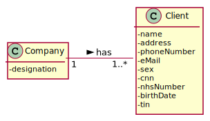

# US 2 - Update client's personal data.

## 1. Requirements Engineering

### 1.1. User Story Description

As a client, I want to update my personal data.

### 1.2. Customer Specifications and Clarifications 

### From the Specifications Document:

* There's no mention on the Specifications Document

### From the client clarifications:

> * Should the Client type in the attribute he/she wants to update or should he choose from a list?
  > 	* Answer: In this sprint each team should develop a graphical user interface for US2. The application should show the current user data and the client can update any attribute.

### 1.3. Acceptance Criteria

none.

### 1.4. Found out Dependencies

* It has dependency with US3 - As a receptionist of the laboratory, I want to register a client. Without any Clients there cannot be data being updated

### 1.5 Input and Output Data

* ### Input Data
	*Name
	*Phone Number
	*Address
	*Sex
* ### Output Data
	* (In)Success of the operation.

### 1.6. System Sequence Diagram (SSD)

### 1.7 Other Relevant Remarks

none.

## 2. OO Analysis

### 2.1. Relevant Domain Model Excerpt 

### 2.2. Other Remarks

No relevant remarks.

## 3. Design - User Story Realization 

### 3.1. Rationale

**The rationale grounds on the SSD interactions and the identified input/output data.**

| Interaction ID | Question: Which class is responsible for... | Answer  | Justification (with patterns)  |
|:-------------  |:--------------------- |:------------|:---------------------------- |
| Step 1  		 |	... interacting with the actor? | UpdateClientDataScene   |  Pure Fabrication: there is no reason to assign this responsibility to any existing class in the Domain Model.           |
| 			  		 |	... coordinating the US? | UpdateClientDataController | Controller                             |
| 			  		 |	 ... knowing the user using the system?  | UserSession  | IE: cf. A&A component documentation.  |
| 			  		 |	... knowing to which company the user belongs to? | App  | IE: has registed all Companies.  |
| 			  		 |							 | Company   | IE: knows/has its own Clients.|
| 			  		 |							 | Client  | IE: knows its own data (e.g. name). |
| 			  		 |							 | Company   | IE: knows/has its own Clients.|
| Step 2  		 |	...knowing the clients to show? | Client | IE: knows/has its own Clients. |
| 			  		 |							 | ClientList  | IE: Clients are defined by the ClientList.|
| Step 3  		 |	...saving the inputted data? | Client| IE: UI saves the data since he owns it and changes it. |
| Step 4  		 |	... saving the data? | Client | IE: knows all the clients| 

### Systematization ##

According to the taken rationale, the conceptual classes promoted to software classes are: 

 * Company
 * ClientList
 * Client

Other software classes (i.e. Pure Fabrication) identified:

 * UpdateClientDataController  
 * UpdateClientDataScene

## 3.2. Sequence Diagram (SD)

## 3.3. Class Diagram (CD)

# 4. Tests 

There are no tests developed, since we only expose information and change it. Changing it is already tested prior to this US.

# 5. Construction (Implementation)

## 5.1 UpdateClientDataController

	public class UpdateClientDataController implements Initializable {
    private MenuClientGUISceneController menuClientUI;
    private App app;

    public void associarParentUI(MenuClientGUISceneController menuClientGUISceneController) {
        this.menuClientUI = menuClientGUISceneController;
    }
    public UpdateClientDataController() {
        app = App.getInstance();
    }

    @FXML
    private TextField updateTwo;

    @FXML
    private TextField updateThree;

    @FXML
    private Button btnUpdate;

    @FXML
    private TextField updateFour;

    @FXML
    private TextField updateOne;

    @Override
    public void initialize(URL url, ResourceBundle resourceBundle) {
        String email = String.valueOf(app.getCurrentUserSession().getUserId());
        Client client = app.getCompany().getClientList().getClientByEmail(email);
        updateOne.setText(client.getName());
        updateTwo.setText(String.valueOf(client.getPhoneNumber()));
        updateThree.setText(client.getAddress());
        updateFour.setText(client.getSex());
    }

    @FXML
    public void updateInfo(javafx.event.ActionEvent actionEvent) throws IOException, InterruptedException {
        String name = updateOne.getText();
        String phoneNumber = updateTwo.getText();
        String address = updateThree.getText();
        String sex = updateFour.getText();
        String email = String.valueOf(app.getCurrentUserSession().getUserId());
        Client client = app.getCompany().getClientList().getClientByEmail(email);
        boolean validation = true;
        if (name.length() > 35 || name.length() == 0){
            validation = false;
        }
        if (phoneNumber.length() != 11){
            validation = false;
        }
        if ( address.length() > 90 || address.length() == 0){
            validation = false;
        }
            if (validation) {
                client.setName(name);
                client.setPhoneNumber(Long.parseLong(phoneNumber));
                client.setAddress(address);
                client.setSex(sex);
                JOptionPane.showMessageDialog(null, "Client Data has been updated.");
                Stage stage = (Stage) btnUpdate.getScene().getWindow();
                stage.close();
                new EmailNotificationSender(client).sendTestCompletedNotification2();
            } else {
                JOptionPane.showMessageDialog(null,"Client Data has not been updated." + '\n' + '\n'+
                        "Be aware that: " + '\n' + '\n' +
                        "Name can not have more than 35 characters." + '\n' +
                        "Phone number is a 11 digit number." + '\n' +
                        "Adress can not have more than 90 characters.");
            }

         }
        }

# 6. Integration and Demo 

 none.  

# 7. Observations

We believe that the code is well developed and according to the request. However, in the future there is the possibility of improvement making everything more cohesive. Certain methods at the moment may be being overloaded without simplifying it in the future. 

